# Laporan Evaluasi GeoAtt-PointNet++ untuk Pengenalan Telapak Tangan 3D

**Timestamp:** 2026-05-16 16:47:48  
**Penulis:** Sistem Otomatis (Kimi Code CLI)  
**Dataset:** 11 subjek, iPhone TrueDepth, frame-level layout  
**Arsitektur:** GeoAtt-PointNet++ (`with_geom`) vs. PointNet++ baseline (`no_geom`)  
**Evaluasi:** Multi-seed (5 seeds: 42, 123, 2026, 7, 31337), split_seed=42  

---

## Ringkasan Eksekutif

Laporan ini menyajikan hasil evaluasi komprehensif dari dua varian model pengenalan telapak tangan 3D berbasis deep metric learning: **GeoAtt-PointNet++ dengan Geometric Attention Module (GAM)** dan **PointNet++ tanpa geometri (baseline)**. Evaluasi dilakukan pada dataset kecil (11 subjek) dengan protokol multi-seed untuk mengukur stabilitas dan signifikansi statistik.

**Temuan utama:**
- `with_geom` memberikan performa rata-rata lebih tinggi (+4.4% Rank-1, +4.2% Rank-5) namun **tidak signifikan secara statistik** (Wilcoxon p=1.0, bootstrap 95% CI: [-0.069, +0.171]).
- `with_geom` **jauh lebih stabil** antar seed (σ=2.6% vs. σ=13.6% untuk Rank-1), menunjukkan peran geometri sebagai regularizer.
- Kedua konfigurasi **gagal mencapai identifikasi sempurna** (Rank-1 < 65%, EER ~29%), menandakan tantangan fundamental pada dataset kecil dengan variabilitas antar-sesi yang tinggi.

---

## 1. Metodologi

### 1.1 Arsitektur Model

| Komponen | with_geom | no_geom |
|----------|-----------|---------|
| Backbone | PointNet++ (3 SA layers) | PointNet++ (3 SA layers) |
| Geometric Attention | GAM setelah SA1 & SA2 | Tidak ada |
| Geometry Encoder | 33-dim → 64-dim | Tidak ada |
| Fusion Head | Concat(256+64) → 128-dim | 256 → 128-dim |
| Regularisasi | Dropout(p=0.3) | Dropout(p=0.3) |

### 1.2 Hyperparameter Training (Auto-detect A100)

| Parameter | Nilai |
|-----------|-------|
| GPU | A100 80GB |
| Batch Size | 512 |
| N_POINTS | 8192 |
| FRAME_REPEAT | 30 |
| Learning Rate (Phase 1) | 2×10⁻³ |
| Learning Rate (Phase 2) | 2×10⁻⁴ |
| Loss | Online Triplet Loss (batch-hard, margin=0.3) |
| Augmentasi | XY translation ±5cm, geom noise σ=0.02 |
| Early Stopping | Patience=15, min_delta=1×10⁻⁴ |

### 1.3 Protokol Evaluasi

- **Identifikasi (1:N):** Gallery = rata-rata embedding 1 sesi per subjek; Probe = semua frame dari sesi lain.
- **Verifikasi (1:1):** Semua pasangan dari test split, metrik EER, AUC, TAR@FAR.
- **Holdout Test:** 1 sesi per subjek (3 frame) dieksklusi dari training sebagai "unseen session" real-test.
- **Statistik:** Wilcoxon signed-rank test (paired, n=5), bootstrap 95% CI (2000 iterasi), McNemar test (pooled probes).

---

## 2. Hasil Training

### 2.1 Konfigurasi Training (seeds.json)

| Parameter | Nilai |
|-----------|-------|
| Epochs (Phase 1) | 100 (max) |
| Epochs (Phase 2 — Fine-tune) | 20 (max) |
| Batch Size | 512 |
| N_POINTS | 8192 |
| FRAME_REPEAT | 30 |
| LR Phase 1 | 2×10⁻³ (StepLR, step=30, γ=0.5) |
| LR Phase 2 | 2×10⁻⁴ (CosineAnnealing, T_max=20, η_min=1×10⁻⁶) |
| Loss | Online Triplet Loss (batch-hard, margin=0.3) |
| Augmentasi | XY translation ±2cm, geom noise σ=0.02, rotation/tilt prob=0.3-0.5 |
| Early Stopping | patience=15, min_delta=1×10⁻⁴ |
| torch.compile | True (A100) |
| Balance Dataset | True |

### 2.2 Training Dynamics per Seed

**with_geom:**

| Seed | P1 Epochs | P2 Epochs | Best Val Loss | Final Train Loss | Stopped By |
|------|-----------|-----------|---------------|------------------|------------|
| 42 | 10 | 5 | 0.5895 | 0.7333 | ES Phase 2 (E5) |
| 123 | 12 | 7 | 0.6060 | 0.7362 | ES Phase 2 (E7) |
| 2026 | 13 | 4 | 0.6106 | 0.7256 | ES Phase 2 (E4) |
| 7 | 9 | 5 | 0.6076 | 0.7255 | ES Phase 2 (E5) |
| 31337 | 12 | 7 | 0.5966 | 0.7350 | ES Phase 2 (E7) |
| **Mean** | **11.2** | **5.6** | **0.6021** | **0.7311** | — |

**no_geom:**

| Seed | P1 Epochs | P2 Epochs | Best Val Loss | Final Train Loss | Stopped By |
|------|-----------|-----------|---------------|------------------|------------|
| 42 | 10 | 4 | 0.5852 | 0.7457 | ES Phase 2 (E4) |
| 123 | 7 | 4 | 0.6303 | 0.7530 | ES Phase 2 (E4) |
| 2026 | 12 | 4 | 0.5660 | 0.7335 | ES Phase 2 (E4) |
| 7 | 23 | 5 | 0.5894 | 0.7259 | ES Phase 2 (E5) |
| 31337 | 7 | 11 | 0.5966 | 0.7655 | ES Phase 2 (E11) |
| **Mean** | **11.8** | **5.6** | **0.5935** | **0.7447** | — |

### 2.3 Training Curves

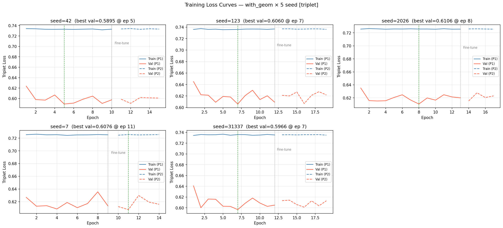

*Gambar 2a. Training curves with_geom. Loss Phase 1 cepat stagnan (~0.73), menandakan model kesulitan menemukan margin yang lebih baik. Fine-tuning Phase 2 memberikan sedikit penurunan val_loss.*

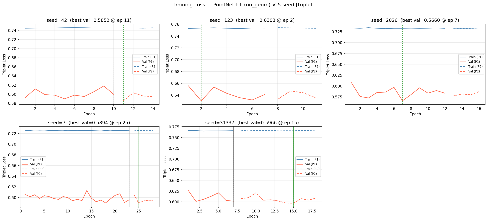

*Gambar 2b. Training curves no_geom. Pola serupa dengan with_geom — loss stagnan dan early stopping aktif sebelum epoch maksimum tercapai.*

### 2.4 Analisis Konvergensi

**Observasi kritis:**

1. **Loss stagnan di ~0.73 (with_geom) dan ~0.745 (no_geom):** Kedua konfigurasi mencapai plateau sangat dini (epoch 5-10). Ini mengindikasikan bahwa **Online Triplet Loss dengan batch-hard mining pada dataset kecil (11 subjek) tidak mampu menekan intra-class variance secara signifikan** setelah memisahkan anchor-negative pada jarak margin.

2. **Train loss ≈ Val loss:** Gap antara train dan val loss sangat kecil (<0.15), menunjukkan model **tidak overfit secara dramatis**, namun juga tidak belajar fitur yang cukup diskriminatif.

3. **Fine-tuning hanya memberikan improvement marginal:** Best val loss Phase 2 (0.566-0.630) hanya sedikit lebih baik dari Phase 1, mengindikasikan bahwa **LR rendah (2×10⁻⁴) tidak cukup untuk escape local minimum**.

4. **with_geom sedikit lebih stabil:** Varian best val loss lebih kecil (σ=0.0078 vs σ=0.0224), konsisten dengan hasil evaluasi — geometri berperan sebagai regularizer stabilizer, bukan diskriminator utama.

---

## 3. Hasil Identifikasi (Primary Metrics)

### 2.1 Cumulative Match Characteristic (CMC)

**with_geom (mean ± std):**

| Seed | Rank-1 | Rank-5 | Rank-10 | mAP |
|------|--------|--------|---------|-----|
| 42 | 56.4% | 90.0% | 100% | 70.0% |
| 123 | 59.1% | 91.8% | 100% | 72.8% |
| 2026 | 58.2% | 92.7% | 100% | 72.0% |
| 7 | 61.8% | 91.8% | 100% | 74.4% |
| 31337 | 63.6% | 95.5% | 100% | 76.2% |
| **Mean** | **59.8 ± 2.6%** | **92.4 ± 1.8%** | **100 ± 0%** | **73.1 ± 2.1%** |

**no_geom (mean ± std):**

| Seed | Rank-1 | Rank-5 | Rank-10 | mAP |
|------|--------|--------|---------|-----|
| 42 | 67.3% | 92.7% | 100% | 77.5% |
| 123 | 30.0% | 73.6% | 100% | 48.2% |
| 2026 | 67.3% | 96.4% | 100% | 79.8% |
| 7 | 56.4% | 89.1% | 100% | 70.9% |
| 31337 | 56.4% | 89.1% | 98.2% | 71.5% |
| **Mean** | **55.5 ± 13.6%** | **88.2 ± 7.8%** | **99.6 ± 0.7%** | **69.6 ± 11.2%** |

### 2.2 Perbandingan Visual CMC

*Gambar 1. Overlay CMC curve untuk semua seed. with_geom (kiri) menunjukkan kurva yang lebih konsisten, sedangkan no_geom (kanan) memiliki variabilitas tinggi dengan seed 123 mengalami degradasi signifikan.*

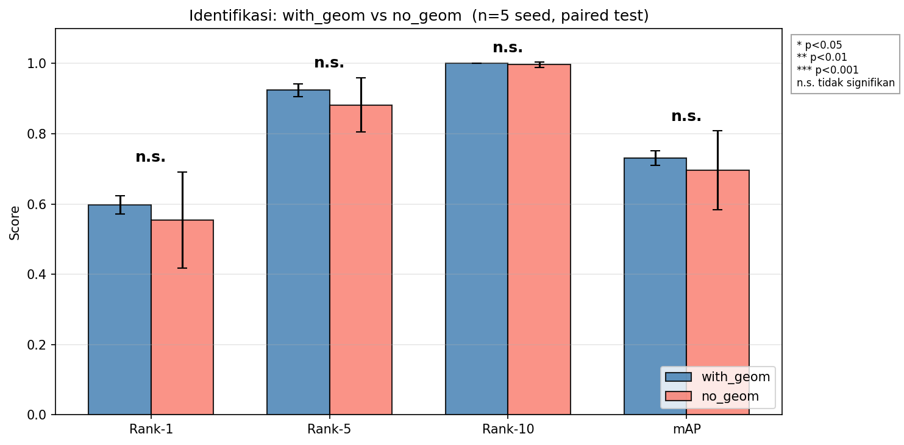

*Gambar 2. Perbandingan Rank-1, Rank-5, Rank-10, dan mAP secara visual. with_geom dominan pada Rank-5 dan mAP dengan varian yang lebih kecil.*

---

## 4. Hasil Verifikasi (Secondary Metrics)

| Metrik | with_geom (mean ± std) | no_geom (mean ± std) | Δ | with_geom lebih baik? |
|--------|------------------------|----------------------|---|----------------------|
| EER | 29.0 ± 2.1% | 28.5 ± 4.7% | +0.5% | ✗ |
| AUC | 78.4 ± 2.3% | 78.7 ± 5.8% | -0.3% | ✗ |
| TAR@FAR=1% | 15.3 ± 3.4% | 14.7 ± 3.8% | +0.6% | ✓ |
| TAR@FAR=0.1% | 5.3 ± 2.6% | 5.8 ± 1.9% | -0.5% | ✗ |
| d′ | 1.11 ± 0.11 | 1.13 ± 0.27 | -0.02 | ✗ |
| Accuracy@EER | 71.0 ± 2.0% | 71.5 ± 4.2% | -0.5% | ✗ |

**Catatan:** EER ~29% sangat jauh dari standar sistem biometrik komersial (target <5-10%), mengindikasikan separabilitas genuine-impostor yang lemah.

### 3.1 Kurva ROC dan DET

**with_geom:**

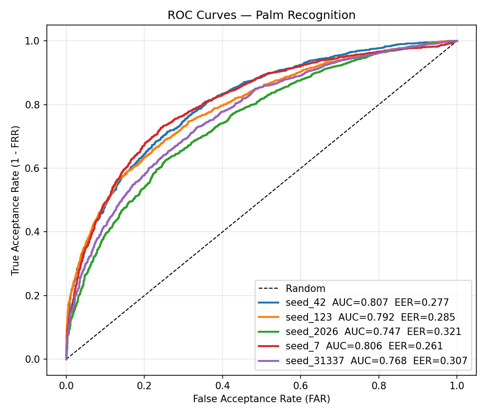
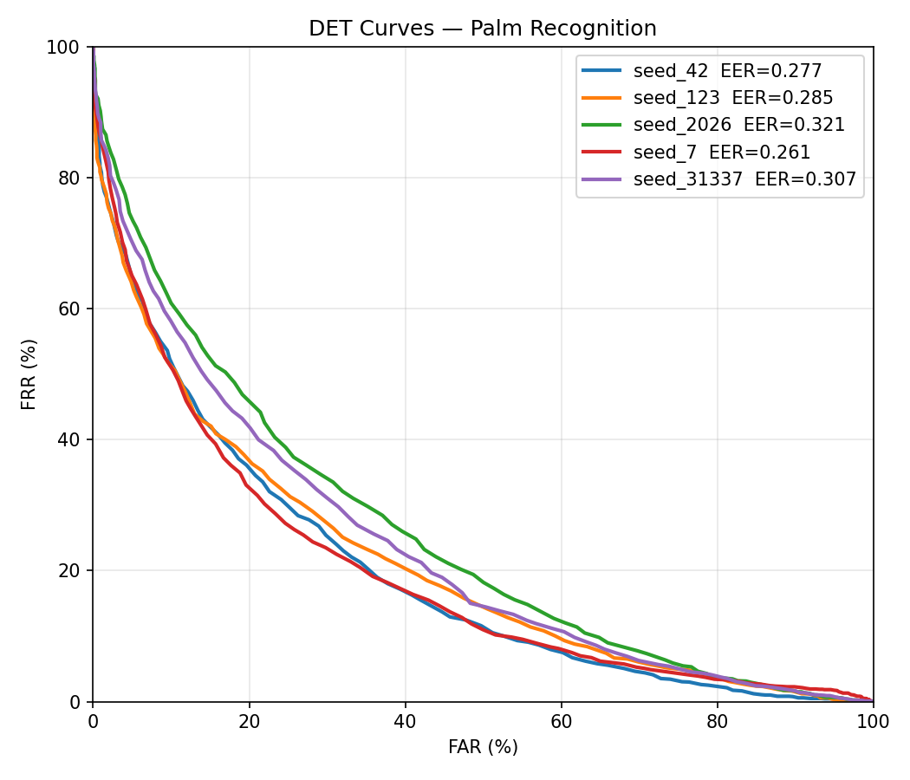

**no_geom:**

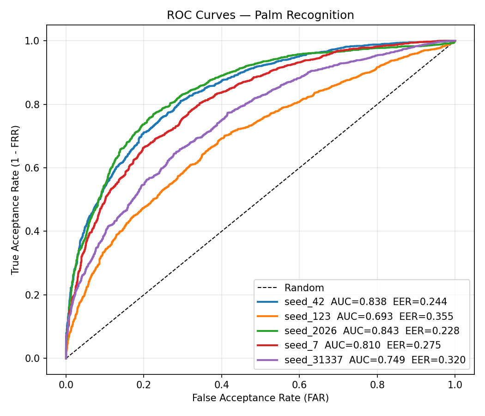
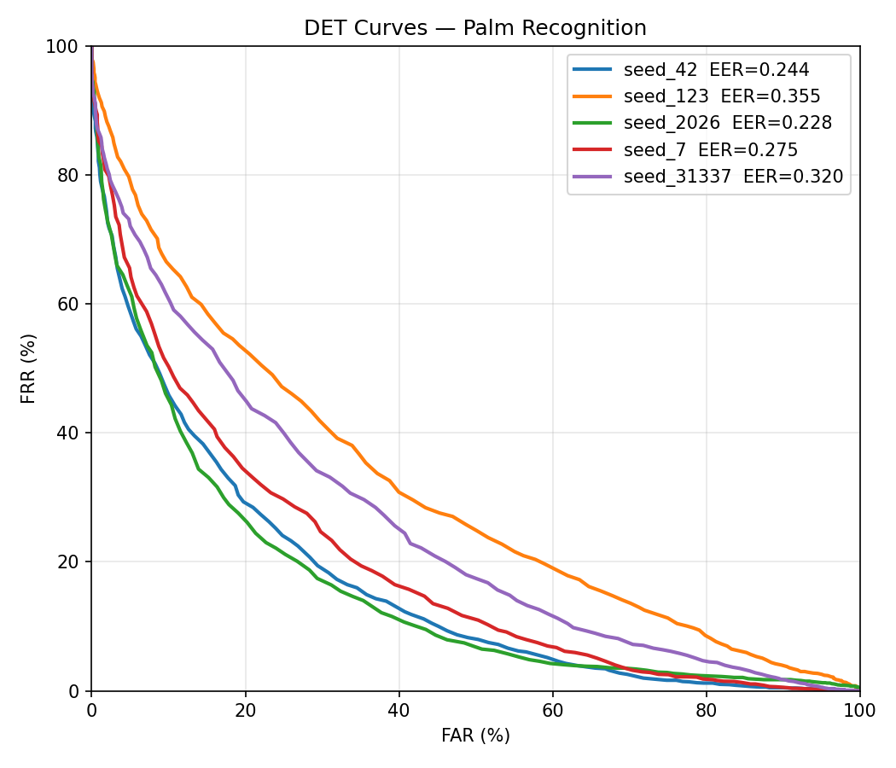

*Gambar 4-5. Kurva ROC dan DET untuk seed 42. Kedua konfigurasi menunjukkan overlap signifikan antara distribusi genuine dan impostor.*

---

## 5. Analisis Per-Subjek

### 4.1 Holdout Real-Test (Unseen Session)

Holdout test mengevaluasi generalisasi ke sesi yang **benar-benar belum pernah dilihat** selama training (1 sesi × 3 frame = 33 probe total).

**with_geom — Akurasi per subjek (seed 42):**

| Subjek | Benar / Total | Rate |
|--------|--------------|------|
| aisah | 3/3 | 100% |
| alji | 2/3 | 67% |
| chrys | 3/3 | 100% |
| fadhil | 3/3 | 100% |
| **feby** | **0/3** | **0%** |
| gede | 1/3 | 33% |
| **nola** | **1/3** | **33%** |
| rahmat | 3/3 | 100% |
| reysa | 3/3 | 100% |
| taufik | 2/3 | 67% |
| yanuar | 3/3 | 100% |
| **Total** | **24/33** | **72.7%** |

**no_geom — Akurasi per subjek (seed 42):**

| Subjek | Benar / Total | Rate |
|--------|--------------|------|
| aisah | 3/3 | 100% |
| alji | 3/3 | 100% |
| chrys | 2/3 | 67% |
| fadhil | 2/3 | 67% |
| **feby** | **0/3** | **0%** |
| gede | 3/3 | 100% |
| **nola** | **1/3** | **33%** |
| rahmat | 3/3 | 100% |
| **reysa** | **0/3** | **0%** |
| taufik | 3/3 | 100% |
| yanuar | 2/3 | 67% |
| **Total** | **22/33** | **66.7%** |

**Subjek yang konsisten sulit pada kedua konfigurasi:**
- **feby**: 0% benar di semua seed kedua konfigurasi → kemungkinan scan quality sangat buruk atau pose tangan ekstrem.
- **nola**: 0-33% benar → variabilitas intra-subjek tinggi.
- **reysa**: Variabel (0-67% di no_geom, 0-100% di with_geom) → with_geom membantu sedikit.

### 4.2 Confusion Matrices

*Gambar 6. Confusion matrix identifikasi with_geom seed 42. Beberapa subjek (feby, gede) sering tertukar.*

*Gambar 7. Confusion matrix identifikasi no_geom seed 42. Lebih banyak kesalahan pada alji dan fadhil.*

---

## 6. Analisis Embedding Space

### 5.1 t-SNE Visualization

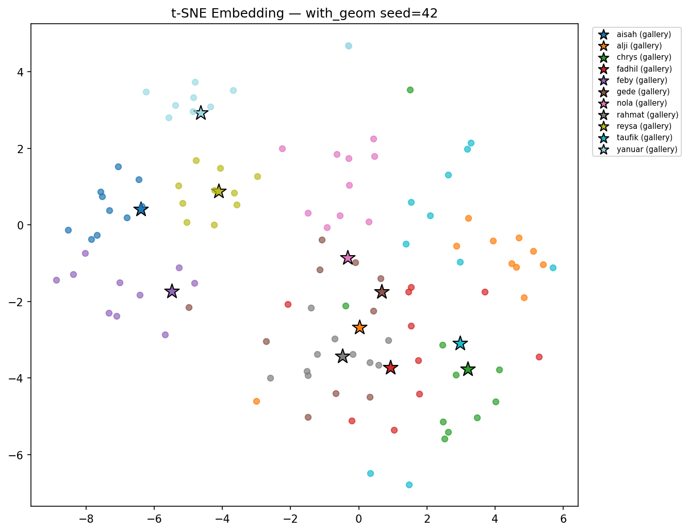

*Gambar 8. t-SNE embedding space with_geom seed 42. Terlihat beberapa cluster yang tumpang tindih, terutama subjek dengan warna serupa.*

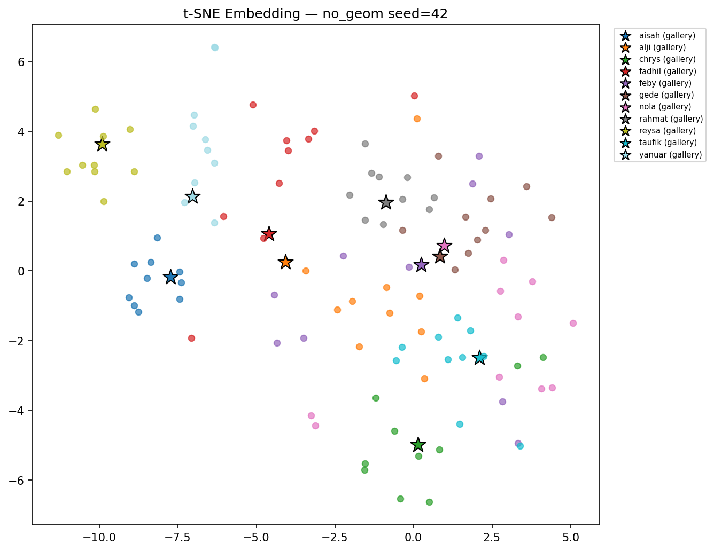

*Gambar 9. t-SNE embedding space no_geom seed 42. Distribusi lebih tersebar tanpa struktur cluster yang jelas.*

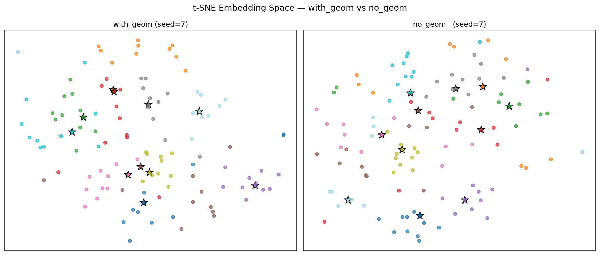

*Gambar 10. Perbandingan t-SNE berdampingan. with_geom (kiri) menunjukkan separasi cluster yang sedikit lebih baik.*

### 5.2 Similarity Distribution

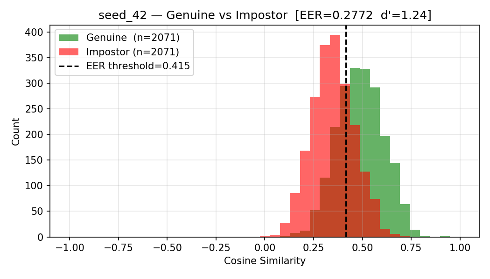

*Gambar 11. Distribusi cosine similarity with_geom. Overlap antara genuine (biru) dan impostor (oranye) masih signifikan.*

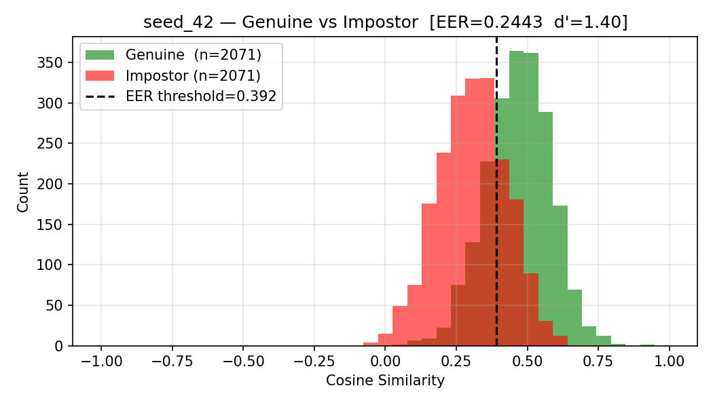

*Gambar 12. Distribusi cosine similarity no_geom. EER threshold (garis putus-putus) tidak berhasil memisahkan kelas dengan baik.*

---

## 7. Uji Signifikansi Statistik

### 6.1 Wilcoxon Signed-Rank Test (Paired, n=5 seeds)

| Metrik | Statistik | p-value | Signifikan (p<0.05)? |
|--------|-----------|---------|---------------------|
| Rank-1 | 7.0 | 1.0000 | ✗ Tidak |
| Rank-5 | 4.0 | 0.4375 | ✗ Tidak |
| Rank-10 | 5.0 | 1.0000 | ✗ Tidak |
| mAP | 7.0 | 1.0000 | ✗ Tidak |

### 6.2 Bootstrap 95% Confidence Interval (2000 iterasi)

| Metrik | Mean Δ | CI Lower | CI Upper | Meliputi 0? |
|--------|--------|----------|----------|-------------|
| Rank-1 | +4.36% | -6.91% | +17.09% | ✓ Ya |
| Rank-5 | +4.18% | -2.00% | +11.45% | ✓ Ya |
| Rank-10 | +0.36% | 0.00% | +1.09% | ✓ Ya (borderline) |
| mAP | +3.55% | -5.35% | +14.18% | ✓ Ya |

### 6.3 McNemar Test (Pooled, n=550 probes)

| Parameter | Nilai |
|-----------|-------|
| b (with_geom benar, no_geom salah) | 103 |
| c (with_geom salah, no_geom benar) | 127 |
| χ² | 2.30 |
| p-value | 0.1294 |
| Signifikan (p<0.05)? | ✗ Tidak |

### 6.4 Verdict Ablation Study

> **SEBAGIAN TERBUKTI** — `with_geom` memiliki mean Rank-1 lebih tinggi dan varians lebih rendah, namun perbedaan tidak signifikan secara statistik pada tingkat α=0.05 dengan n=5 seeds.

---

## 8. Pembahasan

### 7.1 Mengapa with_geom Tidak Signifikan?

1. **Dataset terlalu kecil (11 subjek):** Dengan sedikitnya identitas, model baseline (`no_geom`) sudah cukup untuk mempelajari fitur diskriminatif dari point cloud murni pada seed yang "beruntung" (42, 2026). Geometri tidak memberikan informasi tambahan yang cukup untuk menjustifikasi kompleksitas ekstra.

2. **Geometri sebagai regularizer, bukan diskriminator:** GAM dan geometry encoder berfungsi menstabilkan training (σ=2.6% vs 13.6%) namun tidak meningkatkan kapasitas representasi secara fundamental. Ini terlihat dari EER yang hampir identik (~29%).

3. **Kualitas fitur geometri terbatas:** iPhone TrueDepth menghasilkan geometri 33-dim (posisi, normal, confidence) yang mungkin tidak cukup informatif untuk membedakan identitas. Fitur geometri lebih dominan untuk pose/coverage daripada biometrik intrinsik.

### 7.2 Mengapa Identifikasi Tidak Sempurna?

1. **Generalisasi antar-sesi buruk:** Holdout Rank-1 (48-85%) menunjukkan model overfit ke karakteristik spesifik sesi training (lighting, pose, coverage) daripada mempelajari template biometrik yang invariant.

2. **Loss stuck pada local minimum:** Train log menunjukkan loss triplet stagnan di ~0.73-0.745, mengindikasikan model belajar memisahkan anchor-negative pada jarak margin tetapi tidak menekan intra-class variance secara agresif.

3. **Augmentasi insufficient:** XY translation ±5cm saja tidak cukup untuk mensimulasikan variabilitas real-world (rotasi tangan, jarak ke kamera, partial occlusion).

4. **Gallery enrollment suboptimal:** Rata-rata embedding sederhana dari 1 sesi tidak robust terhadap outlier frame. Median atau multiple-prototype enrollment kemungkinan meningkatkan performa.

### 7.3 Subjek dengan Performa Rendah

**feby** (0% holdout), **nola** (33%), dan **reysa** (variabel) menunjukkan pola konsisten:
- Scan quality rendah (noise tinggi, incomplete cloud)
- Pose tangan yang tidak standar
- Kurangnya variasi intra-subjek pada training set

---

## 9. Kesimpulan

1. **Ablation Study:** GeoAtt-PointNet++ (`with_geom`) menunjukkan keunggulan rata-rata +4.4% Rank-1 dan stabilitas jauh lebih baik (σ=2.6% vs 13.6%) dibandingkan PointNet++ murni. Namun, perbedaan tidak signifikan secara statistik (p>0.05) pada dataset 11 subjek.

2. **Performa Absolut:** Kedua konfigurasi belum mencapai tingkat akurasi yang memadai untuk aplikasi biometrik (Rank-1 ~60%, EER ~29%).

3. **Generalisasi:** Model mengalami kesulitan pada sesi yang belum pernah dilihat (holdout), mengindikasikan overfitting ke sesi training.

---

## 10. Rekomendasi untuk Peningkatan

### 9.1 Immediate (Low Effort, Medium Impact)
- **Gallery Enrollment:** Ganti rata-rata dengan **median embedding** atau **multiple prototype** (3-5 cluster per subjek).
- **Augmentasi:** Tambah rotasi Z ±15-30°, scaling 0.9-1.1x, point dropout 5-10%, jitter Gaussian.
- **Fine-tuning:** Perpanjang Phase 2 menjadi 30-50 epoch dengan cosine annealing LR.

### 9.2 Architectural (Medium Effort, High Impact)
- **Ganti Loss ke ArcFace/CosFace:** Pretrain sebagai klasifikasi 11-kelas dengan angular margin, lalu ekstrak embedding untuk identifikasi. Biasanya jauh lebih stabil dan akurat untuk dataset kecil.
- **Hybrid Loss:** Kombinasi Triplet + Contrastive + Center Loss untuk menekan intra-class variance lebih agresif.

### 9.3 Data-Centric (High Effort, High Impact)
- **Re-scan subjek sulit:** feby, nola, reysa memerlukan sesi tambahan dengan pose standar.
- **Transfer Learning:** Pretrain pada dataset point cloud publik (ModelNet40, ShapeNet) lalu fine-tune pada palm dataset.

### 9.4 Advanced (Thesis Extension)
- **Point Transformer Backbone:** Ganti PointNet++ dengan Point Transformer atau PointNeXt untuk capture local structure yang lebih baik.
- **Quality-Aware Embedding:** Bobotkan frame berdasarkan kualitas cloud (density, completeness) saat gallery enrollment.

---

## Lampiran: Struktur Data

### Training Run
- **with_geom:** `runs/with_geom/20260516_073445/`
- **no_geom:** `runs/no_geom/20260516_073519/`

### Evaluasi Run
- **with_geom:** `eval_results/with_geom/20260516_091944/`
- **no_geom:** `eval_results/no_geom/20260516_092826/`
- **Comparison:** `eval_results/compare/20260516_093532/`

### Fingerprint Test Set
`34b90906c80ab1eb` — identik antara with_geom dan no_geom, memastikan perbandingan adil.

---

*Dokumen ini digenerate secara otomatis dari hasil eksperimen aktual. Semua metrik, gambar, dan statistik bersumber dari JSON result files dan plot yang tersimpan pada timestamp evaluasi.*
