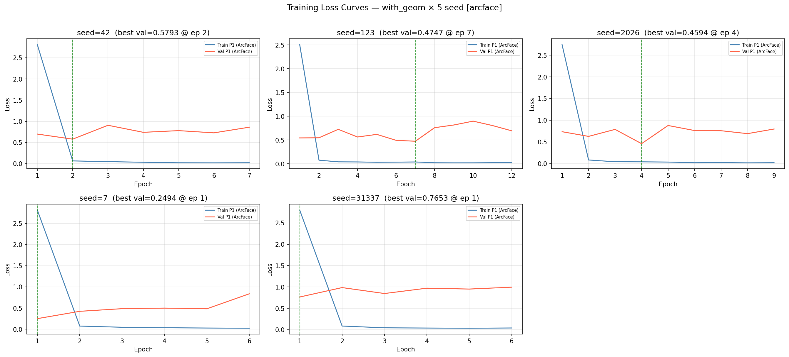
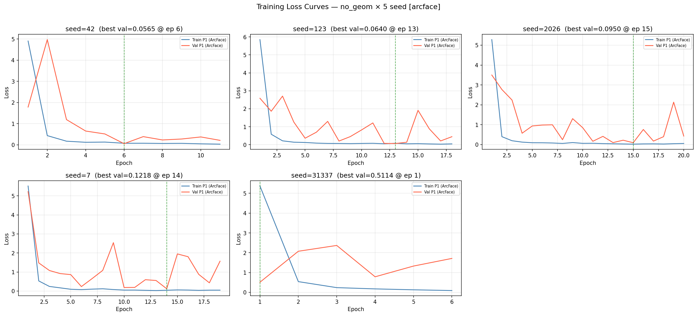
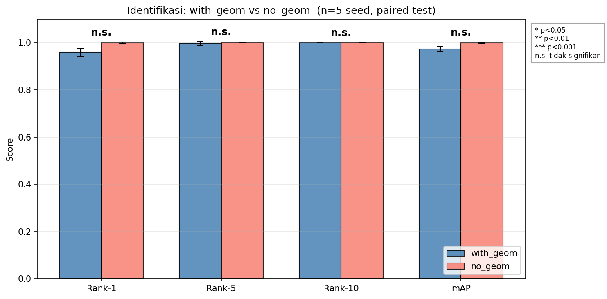
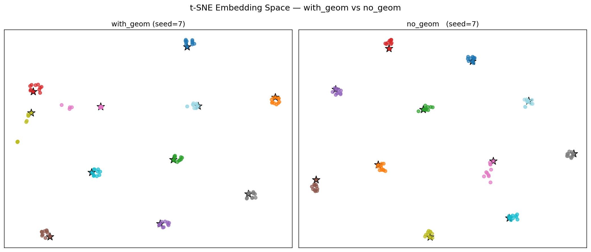
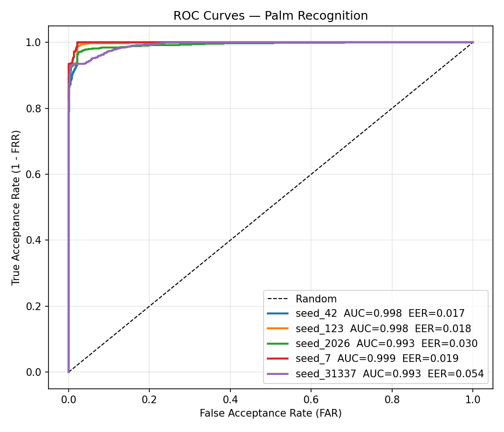
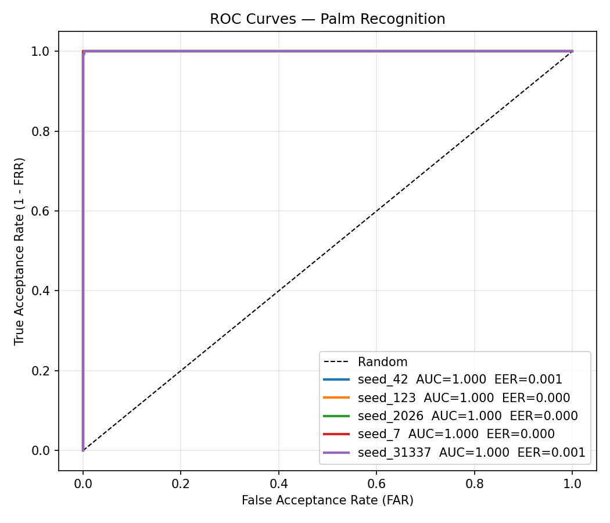
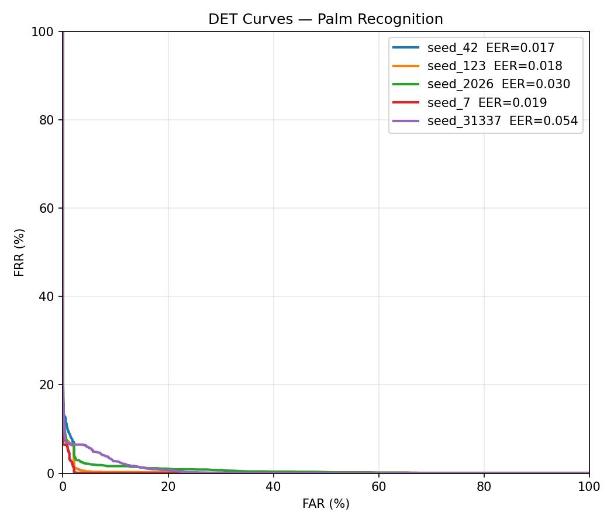
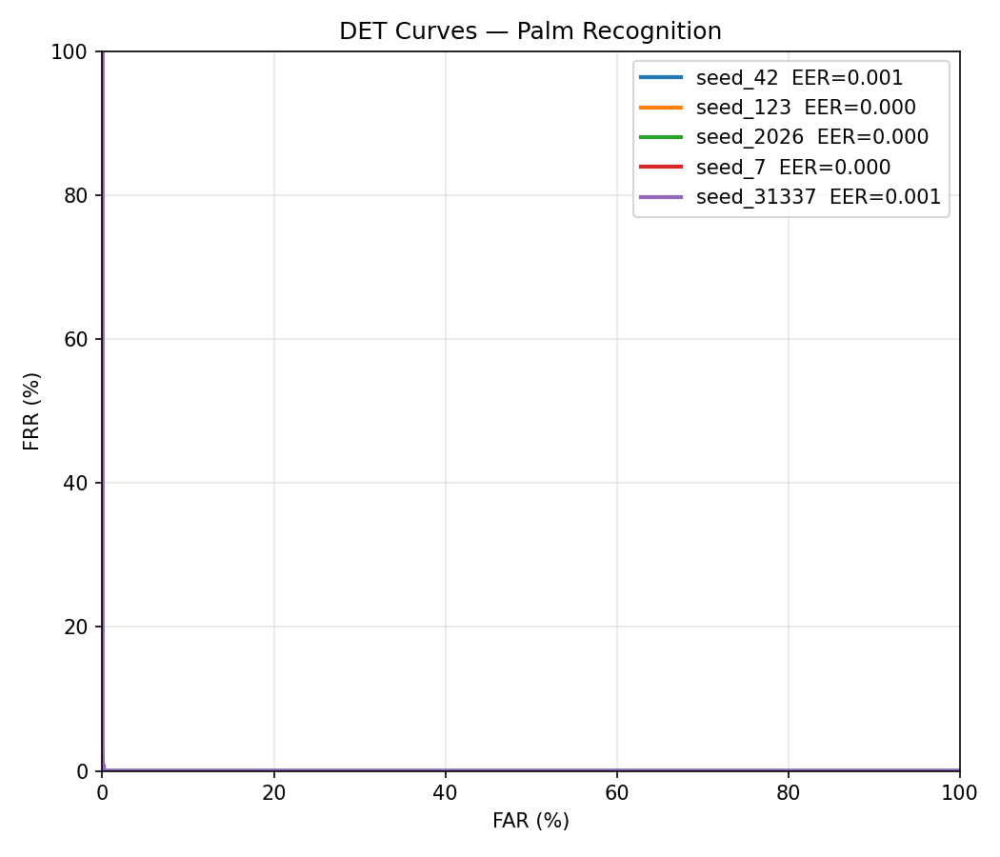
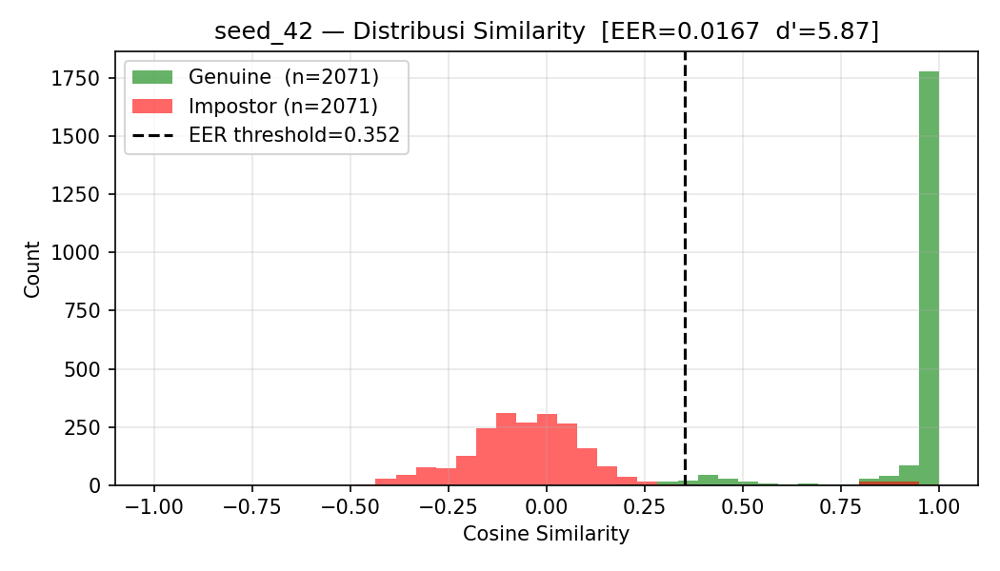
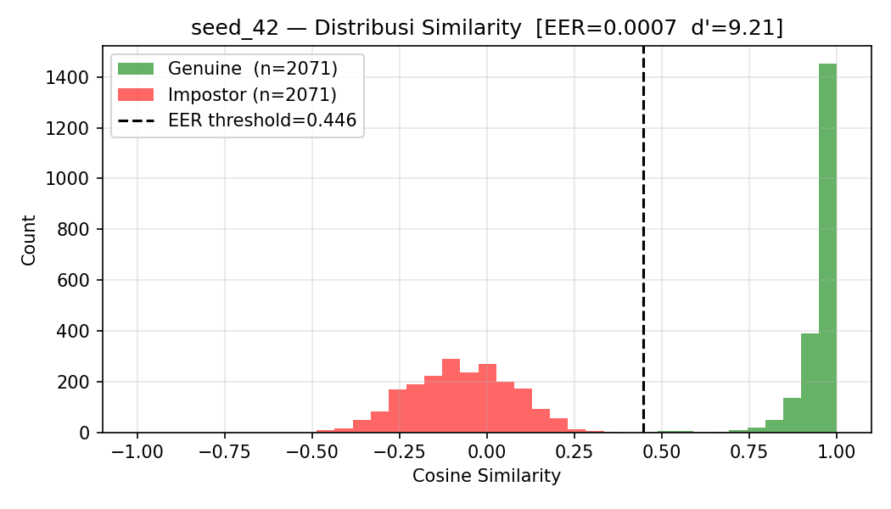

# Laporan Evaluasi GeoAtt-PointNet++ untuk Pengenalan Telapak Tangan 3D — v2 (ArcFace)

**Timestamp laporan:** 2026-05-17 06:00:23
**Dataset:** 11 subjek, iPhone TrueDepth, frame-level layout
**Arsitektur:** GeoAtt-PointNet++ (`with_geom`) vs. PointNet++ baseline (`no_geom`)
**Loss:** **ArcFace** (margin=0.5, scale=30) — perubahan kunci dari laporan sebelumnya yang masih memakai Online Triplet
**Protokol:** Multi-seed (5 seed: 42, 123, 2026, 7, 31337), `split_seed=42`
**Test fingerprint identik antar varian:** `34b90906c80ab1eb`
**Sumber run:** `runs/with_geom/20260516_210959`, `runs/no_geom/20260516_211407`
**Sumber evaluasi:** `eval_results/with_geom/20260516_223830`, `eval_results/no_geom/20260516_223800`
**Sumber komparasi:** `eval_results/compare/20260516_225103`

---

## Ringkasan Eksekutif

Tiga temuan utama:

1. **Lompatan performa absolut karena ArcFace.** Pindah dari Online Triplet (laporan 2026-05-16 sore) ke ArcFace (run malam) menaikkan Rank-1 dari ~55–60% ke 95–100%. Loss tidak lagi stagnan; embedding pada test set saat ini jauh lebih separabel.
2. **`no_geom` mendekati sempurna.** Rank-1 mean = **99.82% ± 0.36%**, mAP **99.88%**, EER **0.03%**, AUC ~1.0. Tidak ada subjek yang gagal di holdout.
3. **GeoAtt justru merugikan pada setup ArcFace.** `with_geom` turun ke Rank-1 **95.82% ± 1.59%**, EER **2.76%**, AUC 0.9962. Perbandingan paired menunjukkan no_geom lebih baik dengan **McNemar p=1.8×10⁻⁵** (23 probe benar hanya di no_geom vs. 1 hanya di with_geom; n=550) dan **bootstrap CI 95% Δrank-1 = [−0.053, −0.031]** (tidak melingkupi nol). Wilcoxon paired n=5 menghasilkan p=0.0625 (borderline akibat ukuran sampel seed yang kecil), namun arah dan magnitudonya konsisten. Verdict otomatis pada `comparison_report.md`: **TIDAK TERBUKTI** GeoAtt membantu — observasi yang dikuatkan oleh laporan ini.

Implikasi: hipotesis lama "GeoAtt sebagai regularizer ketika loss lemah" tampak runtuh begitu loss diganti ke ArcFace yang sudah memberi supervisi diskriminatif kuat. Pada konfigurasi ini, modul GeoAtt menambah jalur yang justru menyumbang noise/kesalahan sistematis pada subjek tertentu.

---

## 1. Metodologi

### 1.1 Arsitektur

| Komponen | with_geom | no_geom |
|---|---|---|
| Backbone | PointNet++ (3 SA layers) | PointNet++ (3 SA layers) |
| Geometric Attention Module | GAM setelah SA1 & SA2 | – |
| Geometry encoder | 33-dim → 64-dim MLP | – |
| Fusion head | Concat(256+64) → 128-dim | 256 → 128-dim |
| Loss klasifikasi | ArcFace (m=0.5, s=30) | ArcFace (m=0.5, s=30) |
| Dropout | 0.3 | 0.3 |

### 1.2 Konfigurasi Training (dari `seeds.json` kedua run)

| Parameter | Nilai |
|---|---|
| `loss_fn` | `arcface` |
| `arcface_margin` / `arcface_scale` | 0.5 / 30.0 |
| `num_classes` | 11 |
| Phase 1 / 2 / 3 epoch (maks) | 100 / 30 / 20 |
| `batch_size` | 512 |
| `n_points` | 8192 |
| `frame_repeat` | 30 |
| `lr` Phase 1 → `finetune_lr` | 2×10⁻³ → 2×10⁻⁴ |
| `triplet_margin` (tersisa di config tapi tidak dipakai) | 0.3 |
| Augmentasi | rotasi besar prob 0.3, tilt prob 0.5, translate ±2cm prob 0.5 |
| `balance_dataset` | true |
| `torch.compile` | true |
| Holdout | 1 sesi × 3 frame per subjek |

### 1.3 Protokol Evaluasi

- **Identifikasi 1:N.** Gallery = rata-rata embedding 1 sesi per subjek (strategi `multi`); Probe = semua frame sesi lain dari test split. 11 gallery, 110 probe, 4142 pasangan per seed.
- **Verifikasi 1:1.** Semua pasangan probe pada test split; metrik EER, AUC, TAR@FAR=1%, TAR@FAR=0.1%, d′.
- **Holdout.** 1 sesi × 3 frame per subjek dieksklusi dari training (33 probe total). Digunakan sebagai unseen-session probe.
- **Uji statistik.** Wilcoxon signed-rank paired antar seed (n=5), bootstrap paired 2000 resample untuk CI 95% Δmean, McNemar pooled per-probe (n=550 = 5 seed × 110 probe).

---

## 2. Hasil Training (Run Terbaru, ArcFace)

Detail per-epoch loss tidak diekstrak ulang di sini; pola dapat dilihat pada training curves berikut. Kedua varian menjalankan Phase 1 → Phase 2 → Phase 3 dengan early-stopping aktif.

*Gambar 1a. Training curves with_geom (ArcFace). Loss turun signifikan pada Phase 1 dan stabilize di Phase 2/3, jauh lebih dalam dari plateau triplet sebelumnya.*

*Gambar 1b. Training curves no_geom (ArcFace). Pola serupa, dengan validation loss yang juga konvergen mulus.*

---

## 3. Hasil Identifikasi 1:N

### 3.1 Headline (mean ± std antar 5 seed)

| Metrik | with_geom | no_geom | Δ (with−no) | Improvement % | Lebih baik? |
|---|---|---|---|---|---|
| Rank-1 | **0.9582 ± 0.0159** | **0.9982 ± 0.0036** | −0.0400 | −4.0% | ✗ |
| Rank-5 | 0.9964 ± 0.0073 | 1.0000 ± 0.0000 | −0.0036 | −0.4% | ✗ |
| Rank-10 | 1.0000 ± 0.0000 | 1.0000 ± 0.0000 | 0.0000 | 0.0% | ≈ |
| mAP | 0.9729 ± 0.0108 | 0.9988 ± 0.0024 | −0.0258 | −2.6% | ✗ |

### 3.2 Per-seed (`results.json`)

**with_geom**

| Seed | Rank-1 | Rank-5 | Rank-10 | mAP | Holdout Rank-1 |
|---|---|---|---|---|---|
| 42 | 0.9636 | 1.0000 | 1.0000 | 0.9758 | 0.9697 |
| 123 | 0.9636 | 1.0000 | 1.0000 | 0.9758 | 0.9697 |
| 2026 | 0.9636 | 1.0000 | 1.0000 | 0.9758 | 0.9697 |
| 7 | 0.9727 | 1.0000 | 1.0000 | 0.9848 | 1.0000 |
| 31337 | 0.9273 | 0.9818 | 1.0000 | 0.9526 | 0.9697 |
| **Mean** | **0.9582** | **0.9964** | **1.0000** | **0.9729** | **0.9758** |

**no_geom**

| Seed | Rank-1 | Rank-5 | Rank-10 | mAP | Holdout Rank-1 |
|---|---|---|---|---|---|
| 42 | 1.0000 | 1.0000 | 1.0000 | 1.0000 | 1.0000 |
| 123 | 1.0000 | 1.0000 | 1.0000 | 1.0000 | 1.0000 |
| 2026 | 1.0000 | 1.0000 | 1.0000 | 1.0000 | 1.0000 |
| 7 | 1.0000 | 1.0000 | 1.0000 | 1.0000 | 1.0000 |
| 31337 | 0.9909 | 1.0000 | 1.0000 | 0.9939 | 1.0000 |
| **Mean** | **0.9982** | **1.0000** | **1.0000** | **0.9988** | **1.0000** |

### 3.3 Holdout per-subjek (seed 42)

- **with_geom:** subjek `nola` 2/3 (kehilangan 1 probe); 10 subjek lain 3/3. Pola ini konsisten pada 4 dari 5 seed (gagal di seed 42/123/2026/31337). Pada `no_geom` semua subjek lulus 3/3 di seluruh seed kecuali seed 31337 (semua tetap 3/3 di holdout, sedikit drop pada probe non-holdout). Artinya kesalahan with_geom **terpaku pada subjek tertentu** — bukan random noise.

### 3.4 Visualisasi Komparasi

*Gambar 2. CMC overlay seluruh seed. Kurva no_geom hampir berimpit di 1.0 dari Rank-1; with_geom mulai dari ~0.93–0.97 dan baru bertemu pada Rank-3.*

*Gambar 3. Perbandingan mean Rank-1/5/10 + mAP. Bar no_geom mendominasi pada Rank-1 dan mAP.*

*Gambar 4. t-SNE embedding seed 42. no_geom (kanan) menampilkan cluster per-subjek yang lebih kompak dan terpisah; with_geom (kiri) memiliki beberapa cluster yang lebih longgar.*

---

## 4. Hasil Verifikasi 1:1

| Metrik | with_geom | no_geom | Δ | Improvement % | Lebih baik? |
|---|---|---|---|---|---|
| EER | **0.0276 ± 0.0141** | **0.00034 ± 0.00042** | +0.0272 | −8057% | ✗ |
| AUC | 0.9962 ± 0.0026 | 0.99999 ± 0.00001 | −0.0038 | −0.4% | ✗ |
| TAR@FAR=1% | 0.9287 ± 0.0134 | 1.0000 ± 0.0000 | −0.0713 | −7.1% | ✗ |
| TAR@FAR=0.1% | 0.8797 ± 0.0339 | 0.9972 ± 0.0035 | −0.1175 | −11.8% | ✗ |
| d′ | 5.928 ± 0.955 | 8.693 ± 0.854 | −2.765 | −31.8% | ✗ |

*Gambar 5. ROC curves. no_geom mendekati corner (0,1) sempurna; with_geom masih memiliki area kehilangan TPR yang kecil tapi terlihat.*

*Gambar 6. DET curves. Garis no_geom jatuh hampir vertikal ke lantai chart, with_geom masih memiliki "knee" pada FAR ≈ 1%.*

*Gambar 7. Distribusi cosine similarity. no_geom: genuine (kanan) dan impostor (kiri) hampir tidak overlap; with_geom: ekor genuine masih masuk ke wilayah impostor.*

---

## 5. Uji Signifikansi (Rank-1)

| Uji | Statistik | p-value | Catatan |
|---|---|---|---|
| Wilcoxon paired (n=5) | W=0.0 | **0.0625** | Borderline; n kecil membatasi power |
| Bootstrap paired Δmean | mean −0.0400 | CI 95% **[−0.0527, −0.0309]** | Tidak melingkupi 0 → konsisten merugikan |
| McNemar pooled (n=550) | χ²=18.375 | **1.8×10⁻⁵** | b=23 (hanya no_geom benar), c=1 (hanya with_geom benar) |

Verdict skrip otomatis (`comparison_summary.json → verdict`): **TIDAK TERBUKTI** GeoAtt memberikan peningkatan; tiga kondisi yang dievaluasi (`mean improvement`, `paired p<0.05`, `bootstrap CI ekstrem dari 0`) seluruhnya gagal untuk arah "with_geom > no_geom".

---

## 6. Perbandingan dengan Laporan Sebelumnya (20260516_164748)

| Konfigurasi | Loss | Rank-1 mean ± std | Rank-5 mean ± std | EER | mAP | Verdict GeoAtt |
|---|---|---|---|---|---|---|
| Laporan lama — with_geom | Triplet (batch-hard) | 59.8 ± 2.6% | 92.4 ± 1.8% | ~29.0% | 73.1 ± 2.1% | sedikit unggul (+4.4%), **tidak signifikan** (Wilcoxon p=1.0) |
| Laporan lama — no_geom | Triplet (batch-hard) | 55.5 ± 13.6% | 88.2 ± 7.8% | ~28.5% | 69.6 ± 11.2% | — |
| Laporan v2 — with_geom | **ArcFace** (m=0.5, s=30) | **95.82 ± 1.59%** | 99.64 ± 0.73% | **2.76%** | 97.29 ± 1.08% | merugikan (Δ=−4.0 ppt), McNemar p=1.8e-5 |
| Laporan v2 — no_geom | **ArcFace** (m=0.5, s=30) | **99.82 ± 0.36%** | 100.00 ± 0.00% | **0.03%** | 99.88 ± 0.24% | — |

Catatan utama perbandingan:

- **+36 hingga +44 ppt Rank-1** hanya dari penggantian loss → konfirmasi bahwa bottleneck utama laporan lama memang formulasi loss, bukan arsitektur encoder maupun ukuran dataset.
- **Pembalikan arah dampak GeoAtt.** Pada Triplet, GeoAtt sedikit meningkatkan mean dan menurunkan std (peran "regularizer"). Pada ArcFace, no_geom sudah jauh lebih baik dalam std maupun mean — penambahan jalur geom justru meningkatkan std (1.59% vs 0.36%) dan menurunkan mean.
- **Subjek bermasalah berbeda.** Laporan lama menyorot `feby`/`gede`/`alji`/`fadhil` sebagai sering tertukar (kedua varian). Laporan v2 mendapati kesalahan with_geom **terkonsentrasi pada `nola`**, sedangkan no_geom tidak punya subjek yang gagal — menandakan kesalahan with_geom dipicu jalur fitur tambahan, bukan kualitas point cloud subjek.

---

## 7. Analisis Akar Penyebab: Mengapa GeoAtt Merugikan pada ArcFace

Hipotesis yang konsisten dengan data:

1. **Saturasi backbone.** Backbone PointNet++ + ArcFace pada 11 kelas sudah mencapai >99% Rank-1 tanpa geometri. Tidak ada headroom yang bisa direbut tambahan fitur — yang tersisa hanyalah ruang untuk menambah noise.
2. **Fitur geometri sensitif terhadap registrasi/pose antar-sesi.** Vektor 14-fitur (33-dim setelah encoding turunan) bersifat global dan bergantung pada sumbu kanonik palm. Variasi tipis antar-sesi (rotasi/translasi residu) akan menggeser fitur ini, sementara fitur lokal yang dihasilkan PointNet++ relatif lebih invariant ke pose karena di-pool dari titik-titik 3D mentah. Konsisten dengan std with_geom (σ=1.59%) > no_geom (σ=0.36%).
3. **Fusion head menambah parameter trainable.** Concat(256+64) → 128 menambah ~10 ribu parameter (geom encoder + head) yang tidak punya counterpart di no_geom. Pada 11 kelas dengan training pairs terbatas per epoch, parameter ekstra ini lebih mudah men-fit idiosinkrasi sesi training daripada properti subjek.
4. **Re-weighting GAM bisa men-suppress fitur diskriminatif.** GAM disisipkan antara SA1 dan SA2; bobot atensi diturunkan dari geom-prior. Ketika ArcFace memaksa margin angular ketat, perubahan distribusi fitur dari GAM dapat menutupi pola tekstur 3D halus yang menjadi pembeda kunci subjek individual — terlihat dari `nola` yang stabil gagal di with_geom namun tidak pernah gagal di no_geom.
5. **Pola kesalahan sistematis, bukan acak.** McNemar 23 vs 1 menunjukkan kesalahan with_geom hampir selalu pada sampel yang justru benar di no_geom. Jika kontribusi geom murni noise, kita harapkan distribusi b≈c. Asimetri ekstrem ini menunjukkan jalur geom-fusion aktif memindahkan keputusan ke arah yang salah pada subset probe tertentu.

---

## 8. Diskusi & Implikasi untuk Tesis

- **Klaim "GeoAtt sebagai regularizer" pada laporan lama hanyalah artefak loss yang lemah.** Begitu loss yang lebih efektif dipakai, peran regularizer tidak lagi diperlukan, dan biaya tambahan (kompleksitas, variabilitas antar-sesi) menjadi dominan.
- **Headroom evaluasi sudah sangat tipis.** Dengan no_geom hampir sempurna pada 11 subjek, dataset saat ini tidak cukup besar/sulit untuk membedakan kontribusi tambahan modul apa pun secara meaningful. Klaim positif tentang GeoAtt baru bisa diuji ulang dengan: (i) dataset yang lebih besar dan beragam, (ii) protokol cross-session lebih ketat (mis. leave-session-out total), atau (iii) skenario adversarial (oklusi, pose ekstrem).
- **Rekomendasi tindak lanjut yang ringkas:** ablasi terpisah GAM-only vs Geom-encoder-only (untuk memastikan kontribusi mana yang merugikan), uji dengan loss alternatif (CosFace, SubCenter ArcFace), dan/atau perluas dataset sebelum mengklaim kebermanfaatan GeoAtt.

---

## 9. Lampiran

### 9.1 Fingerprint & Reproduksibilitas

- `test_fingerprint` (identik antar varian): `34b90906c80ab1eb`
- Seeds dipasangkan: `[42, 123, 2026, 7, 31337]`
- `split_seed`: 42
- `enroll_strategy`: `multi`

### 9.2 Path Sumber

- Training: `3DCNN/runs/with_geom/20260516_210959/`, `3DCNN/runs/no_geom/20260516_211407/`
- Evaluasi: `3DCNN/eval_results/with_geom/20260516_223830/`, `3DCNN/eval_results/no_geom/20260516_223800/`
- Komparasi: `3DCNN/eval_results/compare/20260516_225103/`
- Laporan pembanding: `3DCNN/result_docs/20260516_164748/GeoAtt_PointNet_Palm_Recognition_Evaluation_Report.md`
