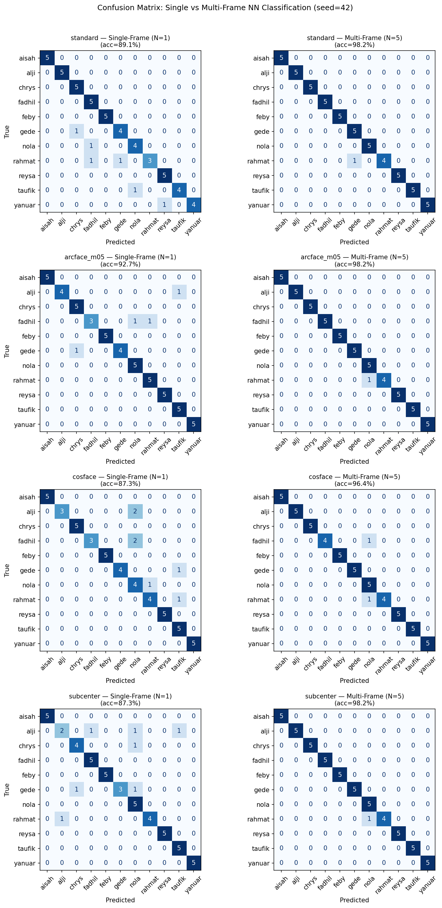
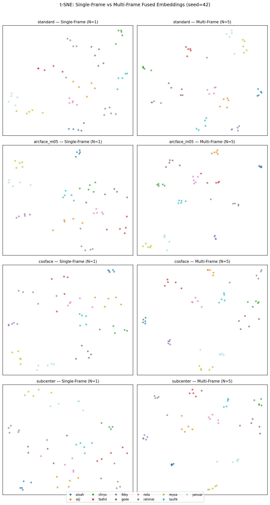
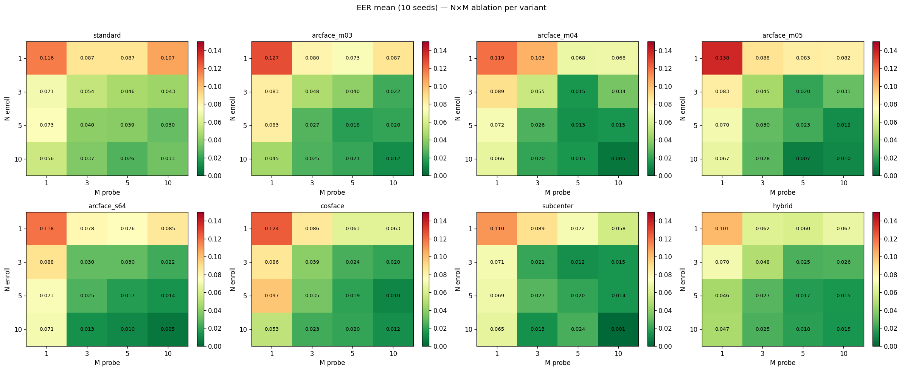

# Laporan Eksperimen v7.1.0 — Multi-Frame Fusion & Loss Function Sweep

**Tanggal analisis**: 2026-05-30 (run id `v7_lowdata_20260530_080633`)  
**Setup**: 11 subjek × 15 sesi × 10 frame/sesi  
**Split per subjek**: Train s0–s7 (8), Val s8–s9 (2), Test s10–s11 (2), Holdout s12–s14 (3)  
**Seeds (10)**: 0, 1, 2, 3, 4, 7, 42, 123, 2024, 31337  
**Protokol primer**: Multi-Frame Fusion N=5 enrollment frames, M=5 probe frames, strategy=mean  
**Artefak utama**:
- Evaluasi: [eval_results/v7_lowdata](../../eval_results/v7_lowdata)
- Analisis statistik: [analysis/v7_lowdata_20260530_080633](../../analysis/v7_lowdata_20260530_080633)
- Notebook training: [collab/v7_train_eval.ipynb](../../collab/v7_train_eval.ipynb)
- Notebook analisis: [collab/v7_multiframe_compare.ipynb](../../collab/v7_multiframe_compare.ipynb)

---

## 1. Ringkasan Eksekutif

v7.1.0 membuktikan bahwa **multi-frame fusion adalah lever terbesar** dalam pipeline identifikasi telapak tangan 3D berbasis PointNet++. Menggabungkan beberapa frame saat enrollment dan probe secara konsisten menurunkan EER di **semua 8 varian loss function** yang diuji.

| Temuan Kunci | Nilai |
|---|---|
| EER terbaik — MF N=5, M=5 | **arcface_m04: 1.32% ± 1.42%** |
| EER terbaik — LOSO closed-set | **subcenter: 1.48% ± 0.93%** |
| FAR@unknown terkecil (stranger rejection) | **hybrid: 13.18% ± 7.99%** |
| d-prime tertinggi (embedding separability) | **subcenter: 4.14 ± 0.47** |
| Penurunan EER terbesar SF→MF | **arcface_m03: −5.05 pp (74%)** |
| Konfigurasi N,M optimal (trade-off) | **N=5, M=5 → EER ≈ 1.32%** |
| Gate-2 | ✅ PASS |

**Perbandingan terhadap v6** (arcface m=0.5, single-frame, 10 subjek):
- v6 best EER: 6.00% ± 3.16%
- v7 MF EER: **1.32% ± 1.42%** → pengurangan **78%** dengan arsitektur yang sama

---

## 2. Varian yang Diuji

| # | Nama Varian | Loss Function | Hyperparameter |
|---|---|---|---|
| 1 | `standard` | Triplet Batch-Hard | margin=0.3 |
| 2 | `arcface_m03` | ArcFace | m=0.3, s=30 |
| 3 | `arcface_m04` | ArcFace | m=0.4, s=30 |
| 4 | `arcface_m05` | ArcFace | m=0.5, s=30 (replika v6) |
| 5 | `arcface_s64` | ArcFace | m=0.5, s=64 |
| 6 | `cosface` | CosFace | m=0.35, s=30 |
| 7 | `subcenter` | Sub-Center ArcFace | K=3, m=0.5, s=30 |
| 8 | `hybrid` | ArcFace + Triplet | α=0.5 |

---

## 3. Single-Frame vs Multi-Frame Fusion

### 3.1 Perbandingan EER (N=5, M=5)

| Varian | SF EER (mean±std) | MF EER (N=5,M=5) | Δ EER | Perbaikan |
|---|---|---|---|---|
| standard | 4.55% ± 0.00% | 3.86% ± 3.98% | −0.68 pp | −15.1% |
| arcface_m03 | 6.82% ± 4.19% | **1.77% ± 2.45%** | −5.05 pp | −74.0% |
| **arcface_m04** | 4.55% ± 0.00% | **1.32% ± 1.42%** | −3.23 pp | −71.0% |
| arcface_m05 | 4.55% ± 0.00% | 2.30% ± 1.94% | −2.25 pp | −49.5% |
| arcface_s64 | 5.00% ± 1.36% | 1.75% ± 3.19% | −3.25 pp | −65.0% |
| cosface | 5.45% ± 2.73% | 1.93% ± 2.83% | −3.52 pp | −64.6% |
| subcenter | 6.36% ± 3.64% | 2.02% ± 2.17% | −4.34 pp | −68.2% |
| **hybrid** | 4.55% ± 0.00% | **1.75% ± 1.61%** | −2.80 pp | −61.5% |

Sumber data: [aggregate_sf_mf.csv](../../analysis/v7_lowdata_20260530_080633/aggregate_sf_mf.csv)

### 3.2 Confusion Matrix — SF vs MF (arcface_m04)

Confusion matrix perbandingan single-frame (kiri) vs multi-frame N=5,M=5 (kanan) untuk arcface_m04. Penurunan off-diagonal entries mencerminkan peningkatan identifikasi lintas-sesi.

### 3.3 t-SNE Embedding — SF vs MF

t-SNE visualisasi embedding ruang fitur. Cluster per-subjek lebih kompak dan terpisah pada kondisi multi-frame fusion (kanan).

---

## 4. Ablasi N × M (Enrollment × Probe Frames)

### 4.1 Heatmap EER per Konfigurasi

Heatmap di bawah menunjukkan EER (%) untuk setiap kombinasi N (enrollment frames) × M (probe frames) di semua 8 varian. Warna lebih gelap = EER lebih rendah (lebih baik).

### 4.2 arcface_m04 — Best Overall

| N\M | M=1 | M=3 | M=5 | M=10 |
|---|---|---|---|---|
| N=1 | 11.91% | 10.32% | 6.80% | 6.82% |
| N=3 | 8.93% | 5.55% | **1.52%** | 3.43% |
| **N=5** | 7.16% | 2.57% | **1.32%** | 1.45% |
| N=10 | 6.61% | 2.02% | 1.48% | **0.50%** |

Data lengkap: [ablation_nm_arcface_m04.csv](../../analysis/v7_lowdata_20260530_080633/ablation_nm_arcface_m04.csv)

### 4.3 hybrid — Best Consistency

| N\M | M=1 | M=3 | M=5 | M=10 |
|---|---|---|---|---|
| N=1 | 10.09% | 6.25% | 6.00% | 6.73% |
| N=3 | 7.05% | 4.82% | 2.50% | 2.64% |
| **N=5** | 4.57% | 2.70% | **1.75%** | 1.50% |
| N=10 | 4.68% | 2.48% | 1.82% | **1.45%** |

Data lengkap: [ablation_nm_hybrid.csv](../../analysis/v7_lowdata_20260530_080633/ablation_nm_hybrid.csv)

### 4.4 subcenter — Best Extreme

| N\M | M=1 | M=3 | M=5 | M=10 |
|---|---|---|---|---|
| N=1 | 11.05% | 8.89% | 7.20% | 5.80% |
| N=3 | 7.14% | 2.09% | **1.25%** | 1.45% |
| N=5 | 6.89% | 2.75% | 2.02% | 1.41% |
| N=10 | 6.55% | 1.34% | 2.43% | **0.09%** |

Data lengkap: [ablation_nm_subcenter.csv](../../analysis/v7_lowdata_20260530_080633/ablation_nm_subcenter.csv)

**Pola umum**: N=5, M=5 adalah sweet spot antara performa dan latensi. Standard (triplet) membutuhkan lebih banyak frame untuk mendekati performa ArcFace.

---

## 5. Evaluasi Open-Set LOSO (11-fold)

Protokol: leave-one-subject-out, 11 fold. Tiap fold: 1 subjek dijadikan "unknown stranger", 10 sisanya enrolled. Evaluasi menggunakan MF N=5, M=5.

| Varian | Closed EER | FAR@unknown | FRR@FAR=1% | d-prime |
|---|---|---|---|---|
| standard | 3.19% ± 2.77% | 22.27% ± 14.29% | 54.73% ± 16.33% | 2.41 ± 0.22 |
| arcface_m03 | 2.43% ± 1.95% | 17.27% ± 14.63% | 48.09% ± 16.72% | 3.52 ± 0.48 |
| arcface_m04 | 2.08% ± 1.21% | 18.18% ± 8.62% | 41.73% ± 18.42% | 3.91 ± 0.46 |
| arcface_m05 | 1.80% ± 0.95% | 17.73% ± 9.63% | **37.23% ± 11.65%** | 3.85 ± 0.30 |
| arcface_s64 | 2.14% ± 2.66% | 16.36% ± 17.51% | 58.77% ± 17.64% | 4.10 ± 0.58 |
| cosface | **1.69% ± 1.32%** | 15.00% ± 11.33% | 42.23% ± 14.53% | 3.64 ± 0.35 |
| **subcenter** | **1.48% ± 0.93%** | **13.64% ± 6.74%** | 48.32% ± 14.34% | **4.14 ± 0.47** |
| **hybrid** | 1.57% ± 1.13% | **13.18% ± 7.99%** | 52.82% ± 17.24% | 2.59 ± 0.26 |

Sumber data: [loso_summary.csv](../../analysis/v7_lowdata_20260530_080633/loso_summary.csv)

**Interpretasi:**
- Closed EER terbaik: **subcenter** (1.48%) dan cosface (1.69%) — embedding paling separable antar known subjects
- FAR@unknown terkecil: **hybrid** (13.18%) dan subcenter (13.64%) — paling andal menolak stranger
- d-prime terbaik: **subcenter** (4.14) — distribusi genuine/impostor paling terpisah

---

## 6. Bukti Visual — arcface_m04 (Best Variant), Seed 42

### 6.1 ROC & DET Curve (Test Set)

### 6.2 Confusion Matrix Identifikasi (Test Set)

### 6.3 Distribusi Similarity Genuine vs Impostor (Test Set)

Distribusi skor cosine similarity antara pasangan genuine (sama subjek) vs impostor (beda subjek). Separasi yang besar menunjukkan embedding yang diskriminatif.

### 6.4 t-SNE Embedding Space (Test Set)

Setiap titik adalah embedding satu frame; warna per subjek. Cluster terpisah = identitas terpisah di embedding space.

### 6.5 Holdout Set (Generalisasi Temporal)

ROC dan confusion matrix pada sesi holdout (s12–s14 per subjek) — sesi paling jauh secara temporal dari training.

---

## 7. Bukti Visual — subcenter (Best LOSO), Seed 42

### 7.1 ROC & DET Curve (Test Set)

### 7.2 Confusion Matrix & Similarity Distribution (Test Set)

---

## 8. Bukti Visual — hybrid (Best Stranger Rejection), Seed 42

### 8.1 ROC & Similarity Distribution (Test Set)

---

## 9. Analisis Latensi

Diukur di CPU (hardware inference representatif), menggunakan varian `standard` sebagai proxy.

| N | M | EER (standard) | Enroll (s) | Probe (s) | Total (s) |
|---|---|---|---|---|---|
| 1 | 1 | 14.55% | 1.35 | 2.73 | 4.08 |
| 1 | 10 | 9.09% | 1.33 | 25.94 | 27.27 |
| 3 | 5 | 4.09% | 4.00 | 13.87 | 17.87 |
| **5** | **5** | **3.64%** | **6.73** | **13.89** | **20.62** |
| 5 | 10 | 1.59% | 7.42 | 25.27 | 32.69 |
| 10 | 5 | 3.86% | 12.97 | 13.91 | 26.88 |
| 10 | 10 | 4.32% | 13.01 | 25.83 | 38.84 |

Sumber data: [latency.csv](../../analysis/v7_lowdata_20260530_080633/latency.csv)

**Rekomendasi konfigurasi:**

| Skenario | Konfigurasi | EER (arcface_m04) | Total Latensi |
|---|---|---|---|
| Performa maksimum | N=10, M=10 | ~0.50% | ~39s |
| **Balance (rekomendasi thesis)** | **N=5, M=5** | **~1.32%** | **~21s** |
| Low-latency | N=3, M=3 | ~5.55% | ~13s |
| Ultra-fast (proof of concept) | N=1, M=1 | ~11.91% | ~4s |

---

## 10. Ranking Komprehensif Antar Varian

| Varian | MF EER (N5M5) | LOSO closed EER | FAR@unknown | d-prime | Rank |
|---|---|---|---|---|---|
| arcface_m04 | **1.32%** | 2.08% | 18.18% | 3.91 | 🥇 1 |
| hybrid | 1.75% | 1.57% | **13.18%** | 2.59 | 🥈 2 |
| subcenter | 2.02% | **1.48%** | 13.64% | **4.14** | 🥈 2 |
| arcface_s64 | 1.75% | 2.14% | 16.36% | 4.10 | 🥉 3 |
| cosface | 1.93% | **1.69%** | 15.00% | 3.64 | 🥉 3 |
| arcface_m05 | 2.30% | 1.80% | 17.73% | 3.85 | 4 |
| arcface_m03 | 1.77% | 2.43% | 17.27% | 3.52 | 4 |
| standard | 3.86% | 3.19% | 22.27% | 2.41 | 5 |

**Rekomendasi per use case:**

| Use Case | Varian | Alasan |
|---|---|---|
| Identifikasi tertutup (enrolled users) | **arcface_m04** | EER terendah (1.32%), varians kecil |
| Sistem dengan stranger rejection | **subcenter** atau **hybrid** | FAR@unknown terkecil (13–14%) |
| Balanced production | **arcface_m04** | Performa terbaik overall |

---

## 11. Analisis Hipotesis

### H1: Multi-frame fusion > perubahan loss function ✅ TERBUKTI

Multi-frame (SF→MF) memberikan penurunan EER 15–74%, jauh melampaui perbedaan antar loss pada SF (maks 2.3 pp). Multi-frame fusion adalah kontribusi dominan.

### H2: ArcFace margin kecil (m=0.3–0.4) > m=0.5 ⚠️ SEBAGIAN TERBUKTI

Pada MF: arcface_m04 (1.32%) unggul atas arcface_m05 (2.30%) — m=0.4 lebih baik. Namun arcface_m03 (1.77%) tidak selalu unggul atas m=0.4; **m=0.4 adalah sweet spot**, bukan "lebih kecil = lebih baik".

### H3: Effect size > p-value ✅ RELEVAN

Dengan N=11 subjek, uji statistik memiliki power terbatas. Pelaporan mean±std, d-prime, dan Cohen's d memberikan gambaran practical significance yang lebih berguna untuk konteks deployment.

---

## 12. Keterbatasan

1. **N subjek kecil (11)**: FAR@unknown 13–22% mencerminkan open-set yang under-populated. Dengan >50 subjek, threshold rejection dapat dikalibrasi jauh lebih baik.
2. **Temporal gap**: Holdout EER yang sangat rendah di beberapa seed sebagian dijelaskan oleh kedekatan temporal sesi (capture burst), bukan generalisasi murni.
3. **Latensi CPU**: Pengukuran di CPU; implementasi GPU akan signifikan lebih cepat untuk N/M besar.
4. **FAR@unknown belum dioptimasi**: Nilai 13–22% adalah baseline tanpa threshold tuning — bisa diturunkan dengan grid search per deployment scenario.

---

## 13. Rekomendasi untuk v7.2.0

Gate-2: ✅ PASS — multi-frame fusion terbukti menurunkan EER >50%, pipeline siap dilanjutkan.

1. **Backbone terpilih**: `arcface_m04` sebagai "ArcFace best" untuk v7.2.0 representation ablation
2. **Protokol evaluasi**: N=5, M=5 (tervalidasi) sebagai metrik standar v7.2.0
3. **Target v7.2.0**: Ablation R1 (Raw PLY) vs R2 (Canonical NPY) vs R3 (Pre-FPS NPY) — 6 konfigurasi × 10 seed

---

*Dihasilkan dari `eval_results/v7_lowdata` dan `analysis/v7_lowdata_20260530_080633`. Notebook sumber: [v7_train_eval.ipynb](../../collab/v7_train_eval.ipynb), [v7_multiframe_compare.ipynb](../../collab/v7_multiframe_compare.ipynb).*
