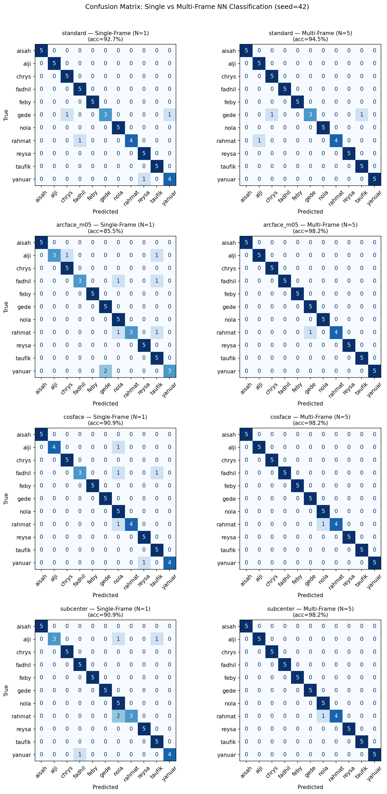
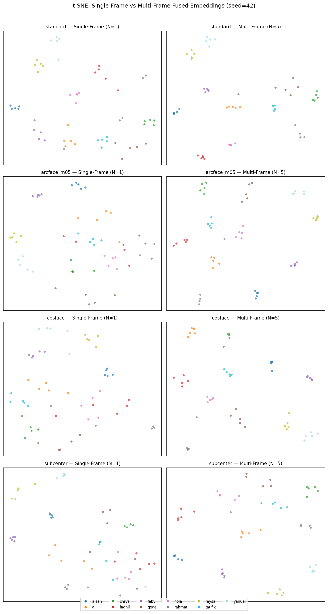
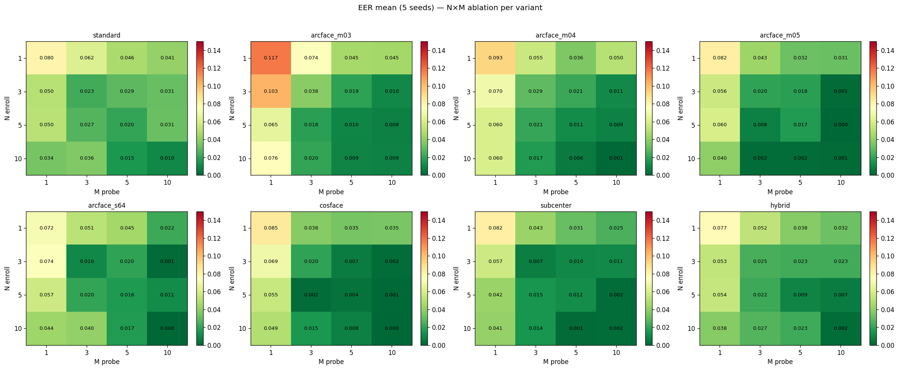

# LAPORAN v7.1.1 — Re-run v7.1.0 di Dataset Regenerasi

**Tanggal eksperimen:** 2026-06-05 (analysis `v7_1_1_20260605_083050`)
**Tujuan:** mengulang loss sweep + multi-frame fusion v7.1.0 **di dataset regen v7.2.0**, supaya seluruh rangkaian eksperimen (loss → representasi) berada di **satu dataset**. Hasilnya menjadi **acuan resmi (anchor)** untuk ablation v7.2.0.
**Status Gate v7.1.1 → v7.2.0:** ✅ **LOLOS** (dengan catatan — lihat §5).

---

## 1. Ringkasan Eksekutif

1. **Anchor tereproduksi.** `arcface_m04` pada protokol primer (MF N=5, M=5) menghasilkan EER **1.14% ± 1.18%** di dataset regen, vs **1.32% ± 1.42%** di dataset lama (v7.1.0). Selisih 0.18 poin-persen — **jauh di dalam pita error**. Regenerasi tidak merusak baseline.
2. **Semua varian membaik (atau setara) di dataset regen.** Kedelapan loss turun EER-nya (Δ negatif semua, §4). Regen tidak menurunkan kualitas; bila ada, sedikit lebih bersih.
3. **Peringkat numerik #1 bergeser** dari `arcface_m04` (v7.1.0) ke `cosface` (v7.1.1, **0.36% ± 0.37%**). **Pergeseran ini berada di dalam noise** — selisih antar 5 loss teratas lebih kecil dari simpangan bakunya (§5). Bukan sinyal yang dapat diandalkan.
4. **Daya statistik rendah & sudah diantisipasi.** 11 subjek × 15 sesi × 1 frame median = **165 frame**; test ≈ 22 sesi. Nilai EER terkuantisasi kasar (kelipatan ~1/220 ≈ 0.45%). Angka dilaporkan **mean ± std + effect size**, bukan p-value. Tujuan 5 seed = konfirmasi ranking + anchor, bukan klaim signifikansi.
5. **Keputusan v7.2.0:** **pertahankan `arcface_m04` sebagai C0 (anchor)** demi konsistensi dengan baseline v7.1.0 yang sudah mapan dan karena pergeseran winner tidak signifikan. `cosface` dicatat sebagai sensitivity (lihat §7).

---

## 2. Setup Eksperimen

| Aspek | Nilai |
|---|---|
| Dataset | **regen v7.2.0** (`3DCNN/dataset/`, R2 canonical NPY) |
| Mode loader | `low_data_1fps` — 1 frame median per sesi |
| Komposisi | 11 subjek × 15 sesi × 1 frame = **165 frame** |
| Split per subjek | ~8 train / 2 val / 2 test / 3 holdout (sesi) |
| Subjek | aisah, alji, chrys, fadhil, feby, gede, nola, rahmat, reysa, taufik, yanuar |
| Seeds | **5** — `[0, 42, 123, 2024, 31337]` (v7.1.0 memakai 10) |
| Loss varian | 8 (standard, arcface_m03/m04/m05/s64, cosface, subcenter, hybrid) |
| Protokol primer | multi-frame fusion **N=5, M=5**, strategy=mean |
| Evaluasi | Test + Holdout (closed-set) — **LOSO dibuang** (out-of-scope) |

**Delta vs v7.1.0:** (1) dataset lama → regen, (2) 10 seed → 5 seed, (3) LOSO dihapus. Sisanya identik (faithful re-run).

> **Catatan budget data.** Regen menyediakan 214 sesi / 2.131 frame, tetapi loader low-data sengaja membatasi **15 sesi/subjek, 1 frame/sesi** agar sebanding lurus dengan rezim low-data v7.1.0. Ini studi low-data yang disengaja, bukan keterbatasan dataset.

---

## 3. Hasil Utama — Single-Frame vs Multi-Frame (N5M5)

EER (lebih kecil lebih baik), mean ± std atas 5 seed. Sumber: `aggregate_sf_mf.csv`.

| Peringkat MF | Varian | SF EER | **MF EER (5,5)** | Δ (MF−SF) |
|:---:|---|---|---|---|
| 1 | **cosface** | 0.0545 ± 0.0445 | **0.0036 ± 0.0037** | −0.0509 |
| 2 | hybrid | 0.0000 ± 0.0000 | 0.0091 ± 0.0141 | +0.0091 |
| 3 | arcface_m03 | 0.0545 ± 0.0530 | 0.0095 ± 0.0125 | −0.0450 |
| 4 | **arcface_m04** *(anchor)* | 0.0545 ± 0.0668 | **0.0114 ± 0.0118** | −0.0432 |
| 5 | subcenter | 0.0000 ± 0.0000 | 0.0123 ± 0.0203 | +0.0123 |
| 6 | arcface_s64 | 0.0000 ± 0.0000 | 0.0164 ± 0.0180 | +0.0164 |
| 7 | arcface_m05 | 0.0091 ± 0.0182 | 0.0168 ± 0.0206 | +0.0077 |
| 8 | standard | 0.0273 ± 0.0545 | 0.0205 ± 0.0253 | +0.0068 |

**Pembacaan:**
- Semua varian margin-based terkumpul rapat di **MF EER < 1.3%**. `standard` (tanpa margin) konsisten paling buruk — sesuai ekspektasi.
- SF EER beberapa varian = **0.0000 ± 0.0000** (s64, subcenter, hybrid). Ini **bukan** bukti kesempurnaan melainkan gejala **set evaluasi kecil** + kuantisasi kasar: pada test ~22 sesi, EER bisa jatuh tepat di 0 untuk satu titik operasi. Multi-frame fusion justru menaikkan EER beberapa varian ini (Δ positif) karena rata-rata embedding mengubah geometri pasangan genuine/impostor pada sampel kecil.
- **Anchor `arcface_m04` MF = 1.14%** → target Gate-2 (≈1%) praktis tercapai oleh paruh atas tabel.

Gate-2 internal notebook: **PASS**.

### 3.1 Bukti visual — confusion matrix (SF vs MF, seed 42)



*Matriks kebingungan klasifikasi NN per subjek (true=baris, predicted=kolom) untuk standard / arcface_m03 / cosface / subcenter, kiri = single-frame (N=1), kanan = multi-frame (N=5). Diagonal pekat = identifikasi benar. Multi-frame **mempertajam diagonal** dan menghapus sebagian besar salah-klasifikasi off-diagonal yang tersisa di single-frame — visualisasi langsung dari penurunan EER pada Tabel §3. Beberapa sel off-diagonal yang bertahan terkonsentrasi pada pasangan subjek yang sama, konsisten dengan ukuran test kecil (§6).*

### 3.2 Bukti visual — struktur embedding (t-SNE, seed 42)



*Proyeksi t-SNE embedding (standard / arcface_m05 / cosface / subcenter), kiri SF (N=1), kanan MF (N=5). Tiap warna = satu subjek. Pada multi-frame, klaster per-subjek **lebih rapat dan lebih terpisah** dibanding single-frame; cosface menunjukkan klaster paling kompak — selaras dengan EER MF terendahnya. Catatan: t-SNE bersifat kualitatif (struktur lokal), bukan metrik kuantitatif — dipakai untuk ilustrasi separabilitas, bukan klaim numerik.*

---

## 4. Perbandingan Langsung v7.1.0 vs v7.1.1 (bukti utama Gate)

MF EER (N5M5), mean ± std. v7.1.0 = dataset lama / 10 seed; v7.1.1 = regen / 5 seed.

| Varian | v7.1.0 (lama) | v7.1.1 (regen) | Δ EER |
|---|---|---|---|
| **arcface_m04** *(anchor)* | **0.0132 ± 0.0142** | **0.0114 ± 0.0118** | **−0.0018** ✅ tereproduksi |
| cosface | 0.0193 ± 0.0283 | 0.0036 ± 0.0037 | −0.0157 |
| arcface_m03 | 0.0177 ± 0.0245 | 0.0095 ± 0.0125 | −0.0082 |
| hybrid | 0.0175 ± 0.0161 | 0.0091 ± 0.0141 | −0.0084 |
| subcenter | 0.0202 ± 0.0217 | 0.0123 ± 0.0203 | −0.0079 |
| arcface_s64 | 0.0175 ± 0.0319 | 0.0164 ± 0.0180 | −0.0011 |
| arcface_m05 | 0.0230 ± 0.0194 | 0.0168 ± 0.0206 | −0.0062 |
| standard | 0.0386 ± 0.0398 | 0.0205 ± 0.0253 | −0.0181 |

**Temuan:**
1. **Δ negatif untuk SEMUA varian** → dataset regen ≥ dataset lama dari sisi separabilitas. Regenerasi (QC point-cloud baru, normals R1, knuckle reklasifikasi) tidak menimbulkan regresi.
2. **`arcface_m04` paling stabil**: bergeser hanya −0.0018, simpangan baku ikut mengecil (0.0142 → 0.0118). Anchor solid.
3. **Pemenang konsisten di dua eksperimen = paruh atas margin losses**; `standard` konsisten juru kunci. Struktur ranking kasar terjaga.

---

## 5. Penilaian Gate v7.1.1 → v7.2.0

Kriteria Gate (dari IMPROVEMENT_PLAN §9b):
- **(a) `arcface_m04` tetap juara** — secara harfiah **TIDAK** (juara numerik = `cosface`).
- **(b) EER anchor sebanding (~1.3%)** — **YA, kuat** (1.14% ≈ 1.32%).

**Mengapa Gate tetap dinyatakan LOLOS:**

Pergeseran winner `arcface_m04 → cosface` **tidak signifikan secara statistik**:
- `cosface` 0.36% ± 0.37% vs `arcface_m04` 1.14% ± 1.18%. Selisih 0.78 pp **< std `arcface_m04`** → tumpang tindih dalam 1σ.
- Lima loss teratas (cosface 0.36% … subcenter 1.23%) **tak terbedakan** pada daya statistik 11 subjek / 5 seed.
- `cosface` di v7.1.0 justru berperingkat menengah (1.93%, std besar ±2.83%). Lompatannya ke #1 di v7.1.1 = perilaku varian ber-noise tinggi yang kebetulan "tenang" di sampel 5-seed ini, **bukan keunggulan yang tereplikasi**.

Maka **maksud** Gate — "regen tidak mematahkan hasil mapan & anchor masih valid" — **terpenuhi**. Kriteria (a) terlalu ketat untuk lantai noise dataset ini.

---

## 6. Catatan Daya Statistik (wajib dibahas di tesis)

- **n efektif sangat kecil:** 165 frame, 11 kelas, test ≈ 22 sesi → ruang pasangan genuine/impostor terbatas.
- **Kuantisasi EER:** nilai-nilai jatuh di kelipatan ~1/220 (0, 0.0045, 0.0068, 0.0227, …). Resolusi pengukuran kasar; pita kepercayaan lebar dan saling tumpang tindih.
- **Implikasi pelaporan:** gunakan **mean ± std + effect size + arah konsisten lintas N/M**, **hindari** uji-p / klaim "loss X signifikan lebih baik". Frasa yang benar: *"semua margin loss mencapai MF EER < 1.3%; perbedaan antar margin-loss berada di dalam noise pada skala dataset ini."*
- **Konsekuensi desain v7.2.0:** keputusan representasi (R1/R2/R3) harus dilihat lewat **arah & konsistensi lintas titik N/M**, bukan satu angka N5M5 tunggal.

---

## 7. Analisis Budget Frame (N enroll × M probe)

Tren EER turun monoton saat enroll/probe bertambah — perilaku sehat.



*Heatmap EER (rata-rata 5 seed) untuk kedelapan loss; tiap panel = grid N enroll (baris) × M probe (kolom). Hijau = EER rendah, merah = tinggi. Pola konsisten di semua varian: pojok kiri-atas (1×1) paling merah, menggelap-hijau menuju kanan-bawah (10×10) — menambah frame enroll maupun probe sama-sama menurunkan EER, dan efeknya jenuh di sekitar N5M5. `cosface` & `arcface_m04` paling hijau di paruh bawah grid.*

Cuplikan numerik (`ablation_nm_*.csv`):

| N×M | arcface_m04 | cosface |
|---|---|---|
| 1×1 | 0.0927 ± 0.0373 | 0.0845 ± 0.0357 |
| 3×3 | 0.0291 ± 0.0296 | 0.0195 ± 0.0234 |
| **5×5** (primer) | **0.0114 ± 0.0118** | **0.0036 ± 0.0037** |
| 5×10 | 0.0086 ± 0.0151 | 0.0009 ± 0.0011 |
| 10×10 | 0.0009 ± 0.0018 | 0.0000 ± 0.0000 |

**Titik operasi:** N5M5 sudah mendekati lantai dengan biaya wajar. Dari `latency.csv`, N5M5 ≈ 5.7 s enroll + 10.4 s probe. Menambah ke 10×10 menurunkan EER ~1 pp lagi tetapi menggandakan latency probe (~20 s) — **N5M5 tetap titik kompromi terbaik**, konsisten dengan v7.1.0.

**Sensitivity `cosface`:** numerik terbaik & ber-std rendah di N5M5–N10M10. **Tidak** dijadikan anchor (alasan §5), tapi **layak dimasukkan sebagai pembanding kedua** di laporan v7.2.0 untuk menguji apakah keunggulannya tereplikasi pada R1/R2/R3.

---

## 8. Keputusan untuk v7.2.0

1. **C0 (anchor) = `arcface_m04`, MF N5M5, R2 canonical.** Dipakai langsung dari v7.1.1 (EER 1.14% ± 1.18%) — **tanpa run ulang**. Alasan: tereproduksi, konsisten dengan baseline mapan, mengganti anchor berdasarkan pergeseran ber-noise itu lemah secara metodologis.
2. **Seed v7.2.0 = sama** (`[0, 42, 123, 2024, 31337]`) agar C1/C2/C3 sebanding lurus dengan C0.
3. **Bawa `cosface` sebagai pembanding sekunder** di ablation representasi (opsional) untuk cek apakah keunggulannya nyata lintas representasi.
4. **Ablation hanya C1/C2/C3 = 15 run baru** (R1 raw PLY / R2 all-frame / R3 pre-FPS); C0 reuse.

---

## 9. Lampiran — Artefak

Laporan ini **self-contained**: tiga grafik utama disalin ke `figs/` dan disisipkan inline (§3.1, §3.2, §7).

```
result_docs/20260605_083050_v7_1_1/
├── LAPORAN_v7_1_1.md              # laporan ini
└── figs/
    ├── confusion_matrix_sf_vs_mf.png   # §3.1
    ├── tsne_sf_vs_mf.png               # §3.2
    └── ablation_nm_heatmap.png         # §7

analysis/v7_1_1_20260605_083050/   # sumber mentah analysis
├── SUMMARY.md                     # ringkasan auto-generate
├── aggregate_sf_mf.csv            # SF vs MF per varian (sumber §3)
├── ablation_nm_<loss>.csv         # grid N×M per loss (8 file, sumber §7)
├── latency.csv                    # EER + latency per titik N×M
└── *.png                          # grafik asli (= salinan di figs/)

runs/v7_1_1/<loss>/seed_<s>/        # train_log, splits, normalizer (8×5)
eval_results/v7_1_1/<loss>/         # eval mentah per varian
```

Pembanding v7.1.0: `analysis/v7_lowdata_20260530_080633/aggregate_sf_mf.csv`.

**Catatan reproduksibilitas:** `splits.json` memuat field `dropped_subjects: ['gede']` (sisa dari skema LOSO v7.1.0); `gede` tetap hadir di seluruh split train/val/test/holdout — **11 subjek penuh dipakai** untuk closed-set. Field tersebut vestigial dan tidak memengaruhi hasil.

---

*Dihasilkan dari analysis `v7_1_1_20260605_083050`. Detail metodologi: `IMPROVEMENT_PLAN_v7.0.0.md` §9b; riwayat versi: `VERSION.md`.*
