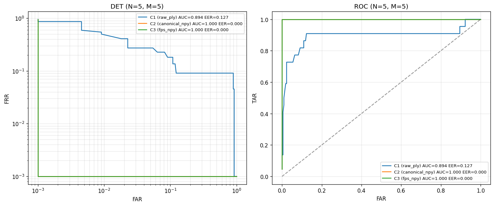
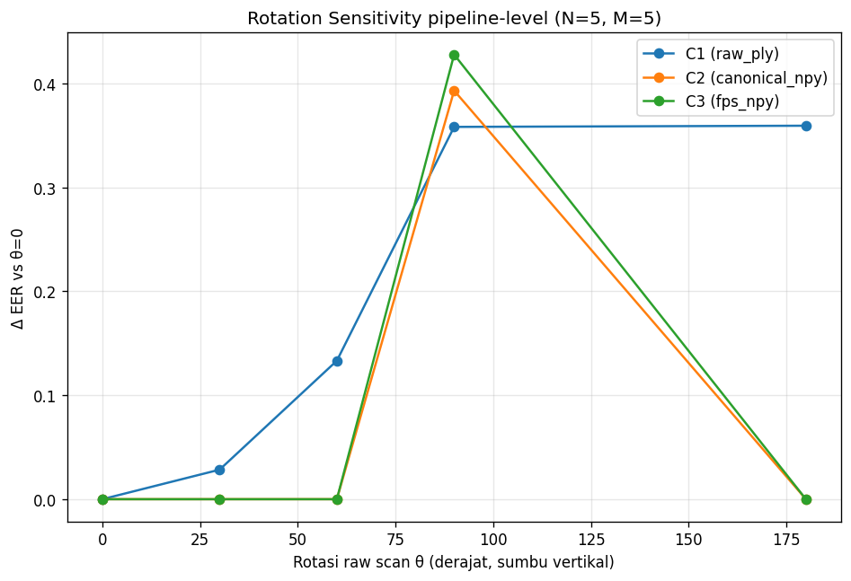
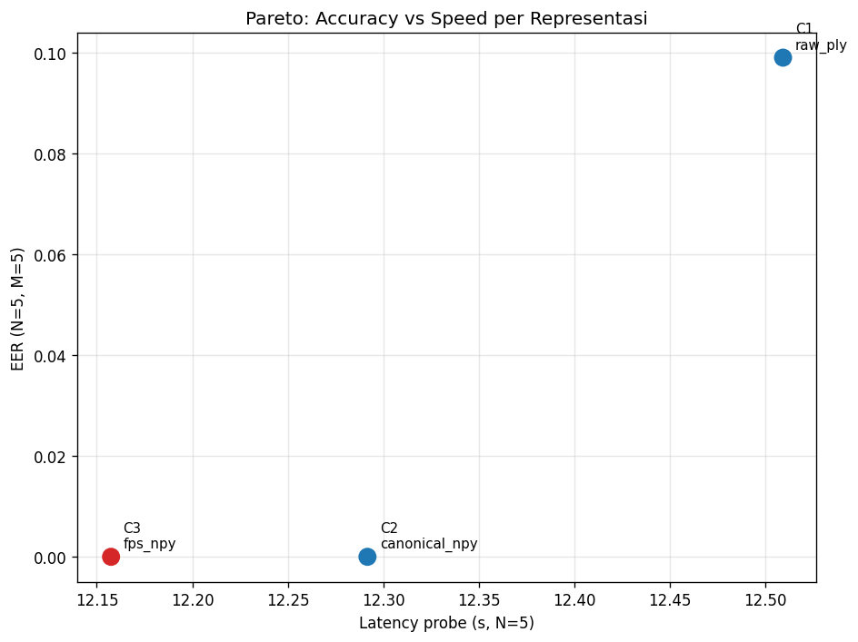

# LAPORAN v7.2.0 — Representation Ablation (R1 raw PLY vs R2 canonical vs R3 pre-FPS)

# ARTIFACT: LAPORAN_v7_2_0
# Created by: Analysis Agent
# Date: 2026-06-14
# Related to: v7.2.0 representation ablation
# Status: FINAL

**Tanggal eksperimen:** 2026-06-14 (analysis `v7_2_0_20260614_033631`, GPU A100-SXM4-80GB)
**Tujuan:** mengukur seberapa penting **preprocessing kanonikalisasi** (PCA-align + unit-sphere) dalam pipeline, dengan menahan loss tetap `arcface_m04` dan hanya mengganti **representasi input point cloud**. Tiga representasi diuji:
- **R1 = `raw_ply`** (C1) — `output.ply`, koordinat kamera asli, **tanpa** kanonikalisasi.
- **R2 = `canonical_npy`** (C2) — `cnn_input.npy`, PCA-align + unit-sphere (definisi terkunci v7.1.0).
- **R3 = `fps_npy`** (C3) — `cnn_input_fps.npy`, R2 + FPS fixed 8192 (tanpa runtime sampling).

**Status:** ✅ **SELESAI** — 15 run training (3×5 seed) + evaluasi penuh, semuanya on-spec di A100-80GB.

---

## 1. Ringkasan Eksekutif

1. **Kanonikalisasi adalah penentu utama akurasi.** R2 dan R3 (yang dikanonikalisasi) mencapai **EER ≈ 0%** di seluruh grid N×M, sedangkan R1 raw PLY **runtuh ke EER ~9,9%** (N5M5). Selisihnya bukan noise — ini efek terbesar dalam seluruh rangkaian eksperimen v7.x.
2. **R3 (pre-FPS) adalah pemenang Pareto untuk deployment.** Akurasinya setara R2 (sama-sama ≈0%), tetapi **disk 2,3× lebih kecil dari R2 dan 4,6× lebih kecil dari R1** (399,8 vs 914,9 vs 1.829,7 MB), sedikit tercepat, dan tanpa runtime sampling. R2 runner-up; R1 ditolak.
3. **R1 sensitif rotasi, R2/R3 hampir invarian — kecuali satu singularitas di 90°.** R1 ΔEER naik monoton hingga +0,36 pada rotasi 180°. R2/R3 datar (ΔEER=0) di 0/30/60/180° **tetapi melonjak ke ~0,4 tepat di 90°** — gejala **ambiguitas pertukaran sumbu utama PCA** (lihat §7). Jadi kanonikalisasi PCA **bukan** invarian-rotasi sempurna.
4. **Beban kecepatan R1 nyata tapi kecil; pembeda sesungguhnya adalah disk.** Parse PLY ~10× lebih lambat dimuat per-frame (2,9 ms vs 0,3 ms), tapi latency probe & train wall ketiganya praktis sama (~12,3 s / ~23 mnt). Yang membedakan tegas adalah **footprint disk** (R3 ≪ R2 ≪ R1).
5. **Catatan daya statistik tetap berlaku.** EER=0 untuk R2/R3 berarti "di lantai resolusi pengukuran" (test ≈ 22 sesi, kuantisasi kasar), **bukan** klaim kesempurnaan absolut; R2 vs R3 **tak terbedakan** dari sisi akurasi pada skala dataset ini.

**Keputusan v7.2.0:** **kanonikalisasi wajib**; gunakan **R3 (fps_npy)** sebagai representasi deployment (Pareto-optimal), R2 sebagai cadangan setara-akurasi. R1 raw tidak layak pakai.

---

## 2. Setup Eksperimen

| Aspek | Nilai |
|---|---|
| Dataset | regen v7.2.0 (`3DCNN/dataset/`), 11 subjek, frame-mode **all** |
| Komposisi | train 88 sesi / 871 frame · val 22/220 · test 22/220 · holdout 33/330 |
| Loss (dikunci) | `arcface`, margin=0.4, scale=30 |
| Seeds | 5 — `[0, 42, 123, 2024, 31337]` |
| `n_points` | **8192** (R3 fixed; R1/R2 di-subsample ke 8192 — perbandingan adil) |
| Protokol akurasi primer | multi-frame fusion **N=5, M=5**, strategy=mean |
| Evaluasi | closed-set Test+Holdout (tanpa LOSO) |
| Hardware | **A100-SXM4-80GB**, bf16, batch 192 (semua run identik, on-spec) |

Satu-satunya variabel bebas: **representasi (R1/R2/R3)**. Sisanya dikunci → ablation bersih untuk isolasi efek kanonikalisasi.

---

## 3. Pembuatan Tiga Representasi — Tujuan, Proses, Algoritma

Ketiga representasi berasal dari **satu sumber yang sama** (raw depth iPhone TrueDepth) dan **satu pipeline hulu yang sama**; perbedaannya hanya pada tahap akhir. Ini yang membuat ablation R1/R2/R3 bersih — hanya kanonikalisasi & sampling yang berubah.

### 3.0 Pipeline hulu bersama (raw depth → palm point cloud)
Sumber: `3DRegistration/lib/single_frame.py` + `lib/image_depth.py`. Per frame:
1. **Input mentah:** `depthNN.bin` (array Float32 640×480, nilai = jarak meter; 0 = invalid) + `calibration.json` (intrinsik `fx,fy,cx,cy` + lookup distorsi lensa).
2. **Undistort:** lookup distorsi → peta `map_x/map_y`, di-remap dengan `cv.remap` (bilinear).
3. **Proyeksi 3D:** back-projection pinhole — tiap piksel valid (u,v,z) → titik 3D `X=(u−cx)/fx·z`, `Y=(v−cy)/fy·z`, `Z=z`. Hasil: point cloud di **koordinat kamera** (satuan meter, ~0,1–0,5 m).
4. **Estimasi normal:** `estimate_normals` (KDTree hybrid, radius 8 mm, max_nn 30), diorientasikan ke kamera.
5. **Pembersihan:** voxel downsample 1 mm → statistical outlier removal (nb=30, std_ratio=1,0) → **isolasi palm DBSCAN** (`isolate_foreground_point_cloud`: cluster eps 8 mm, ambil klaster terdekat) + XY-clip.
6. **Re-estimasi normal** setelah isolasi, orientasi ke kamera.
7. **Output:** `output.ply` — ~15–20 rb titik, **6 channel xyz+normals**, koordinat kamera asli.

`output.ply` inilah akar ketiga representasi.

### 3.1 R1 — `raw_ply` (output.ply apa adanya)
- **Tujuan:** baseline **tanpa kanonikalisasi** — menguji apakah jaringan bisa belajar langsung dari koordinat kamera mentah (kontrol negatif untuk mengukur nilai tambah kanonikalisasi).
- **Proses:** pakai `output.ply` **langsung** (xyz+normals), tanpa transformasi pose/skala. Saat training/eval, di-subsample **runtime** ke 8192 titik (random) agar jumlah titik setara R3.
- **Algoritma:** hanya load PLY (Open3D `read_point_cloud`) + random sampling. Tidak ada PCA, tidak ada scaling.
- **Konsekuensi penting:** koordinat tetap skala kamera (rentang ~0,25), **bukan** unit-sphere → tidak cocok dengan radius `ball_query` PointNet++ yang dikalibrasi untuk data ternormalisasi (lihat §10 — ini ikut menjelaskan EER tinggi R1).

### 3.2 R2 — `canonical_npy` (PCA-align + unit-sphere)
Sumber: `3DRegistration/preprocess_for_cnn.py` (`pca_align` + `normalize_to_unit_sphere`).
- **Tujuan:** representasi **kanonik** — menghilangkan variasi translasi, rotasi, dan skala agar jaringan fokus pada **geometri intrinsik** telapak, bukan pose pengambilan.
- **Proses & algoritma:**
  1. Load `output.ply` (normals sudah ada).
  2. **Center** titik ke centroid; **PCA via SVD** → tiga sumbu utama `Vt`.
  3. **Penetapan sumbu (kunci kanonikalisasi):**
     - **Z** = komponen varians terkecil (`Vt[2]`) = arah normal permukaan/kedalaman kamera.
     - **Y** = di antara dua sumbu in-plane, yang **rentangnya (ptp = max−min) terbesar** = arah jari (wrist→fingertip).
     - **X** = sisanya. *Memakai RANGE bukan variance* — sebab saat jari terbuka lebar, variance horizontal bisa ≥ vertikal, tetapi rentang arah jari selalu paling panjang.
  4. Bangun sistem **right-handed** (cross product), rotasikan titik **dan normals** dengan matriks `R`.
  5. **Disambiguasi arah:** flip agar mayoritas titik berada di atas median-Y (jari mengarah ke +Y); hanya sumbu X & Y yang di-flip, Z tidak.
  6. **Unit-sphere:** bagi semua titik dengan norm maksimum → semua titik dalam bola radius ≤ 1.
- **Output:** `cnn_input.npy` — **N variatif (TIDAK di-downsample)**, 6 channel xyz+normals, kanonik + unit-sphere. Ini input utama GeoAtt-PointNet++.
- **Keterbatasan (dibahas di §10):** tanda sumbu **X tidak di-disambiguasi penuh** (hanya Y via median) → sumber instabilitas kanonikalisasi (~16% frame berbeda vs dataset lama; singularitas rotasi 90° di §7).

### 3.3 R3 — `fps_npy` (R2 + Farthest Point Sampling 8192)
Sumber: `3DRegistration/make_fps.py`.
- **Tujuan:** versi **ringkas & berukuran tetap** dari R2 — jumlah titik dikunci 8192 **tanpa runtime sampling**, untuk menguji apakah downsampling cerdas (FPS) mempertahankan akurasi sambil **menghemat disk** dan **lebih deterministik**.
- **Proses:** ambil `cnn_input.npy` (R2, **sudah** kanonik+unit-sphere) → FPS ke 8192 titik via Open3D `farthest_point_down_sample` (C++, ~0,4 dtk/frame). Bila N<8192 (jarang) → pad duplikasi acak.
- **Algoritma FPS (Farthest Point Sampling, greedy):** mulai dari satu titik, lalu iteratif memilih titik yang **jaraknya paling jauh** dari himpunan titik yang sudah terpilih (memaksimalkan jarak minimum). Hasilnya cakupan permukaan **merata** dan struktur geometris terjaga jauh lebih baik daripada random sampling.
- **Penting (isolasi variabel):** R3 diturunkan dari **R2 `cnn_input.npy`, BUKAN dari PLY**. Maka R3 = R2 + FPS **persis** — ablation R2 vs R3 mengisolasi **tepat satu variabel**: FPS-fixed vs random-runtime sampling (+ jumlah titik tetap vs variatif). (Catatan: ada FPS Python murni di `preprocess_for_cnn.py` ~6 dtk/frame; produksi memakai Open3D yang ~15× lebih cepat.)
- **Output:** `cnn_input_fps.npy` — shape tetap `(8192, 6)`.

### 3.4 Ringkasan perbandingan pembuatan

| Aspek | R1 raw_ply | R2 canonical_npy | R3 fps_npy |
|---|---|---|---|
| File | `output.ply` | `cnn_input.npy` | `cnn_input_fps.npy` |
| Diturunkan dari | langsung pipeline hulu | `output.ply` | `cnn_input.npy` (R2) |
| Kanonikalisasi pose | ❌ tidak | ✅ PCA-align (SVD) | ✅ (warisan R2) |
| Skala | kamera mentah (~0,25) | unit-sphere (≤1) | unit-sphere (≤1) |
| Jumlah titik | variatif → random 8192 saat runtime | variatif (penuh) | **tetap 8192 (FPS)** |
| Sampling | random (runtime) | random (runtime) | FPS (sekali, offline) |
| Channel | xyz+normals (6) | xyz+normals (6) | xyz+normals (6) |
| Algoritma kunci | — | SVD-PCA + range-axis + unit-sphere | FPS greedy (Open3D) |

**Mengapa desain ini valid:** R1→R2 mengisolasi efek **kanonikalisasi**; R2→R3 mengisolasi efek **FPS vs random sampling**. Loss (arcface_m04), seed, dan `n_points=8192` dikunci di semua varian, sehingga setiap perbedaan hasil murni berasal dari representasi.

---

## 4. Hasil Utama — Akurasi (EER N×M)

EER (lebih kecil lebih baik), mean ± std atas 5 seed. Sumber: `ablation_nm_{C1,C2,C3}.csv` (16 titik grid lengkap).

**Grid penuh R1 `raw_ply` (16 titik, mean ± std atas 5 seed):**

| N\M | 1 | 3 | 5 | 10 |
|:---:|:---:|:---:|:---:|:---:|
| **1** | 0.162 ± 0.022 | 0.189 ± 0.023 | 0.180 ± 0.055 | 0.174 ± 0.064 |
| **3** | 0.141 ± 0.036 | 0.114 ± 0.015 | 0.129 ± 0.016 | 0.129 ± 0.023 |
| **5** | 0.125 ± 0.047 | 0.104 ± 0.020 | **0.099 ± 0.026** | 0.078 ± 0.007 |
| **10** | 0.138 ± 0.027 | 0.105 ± 0.029 | 0.105 ± 0.036 | 0.076 ± 0.020 |

**Grid penuh R2 `canonical` & R3 `fps`:** **0.000 ± 0.000 di SEMUA 16 titik** (16/16), satu-satunya pengecualian R3 di (N=1,M=3) = 0.00045 ± 0.0009 — efektif nol. (Verbatim di CSV lampiran.)

**Ringkasan diagonal + AUC:**

| N×M | **R1 raw_ply** | **R2 canonical** | **R3 fps** |
|:---:|:---:|:---:|:---:|
| 1×1 | 0.162 ± 0.022 | 0.000 | 0.000 |
| 3×3 | 0.114 ± 0.015 | 0.000 | 0.000 |
| **5×5** (primer) | **0.099 ± 0.026** | **0.000** | **0.000** |
| 5×10 | 0.078 ± 0.007 | 0.000 | 0.000 |
| 10×10 | 0.076 ± 0.020 | 0.000 | 0.000 |
| AUC (N5M5) | 0.894 | 1.000 | 1.000 |



**Pembacaan:**
- **Kanonikalisasi menentukan segalanya.** R2/R3 ≈ 0% EER di **seluruh** grid; R1 raw 7,6–16,2% EER. Menambah frame enroll/probe menurunkan EER R1 (16,2% → 7,6%) tetapi **tidak pernah mendekati** R2/R3.
- R1 AUC 0,894 vs R2/R3 1,000 — terpisah jelas di kurva DET/ROC.
- **R2 vs R3 tak terbedakan** secara akurasi (keduanya di lantai 0). Pemilihan di antara keduanya harus pakai dimensi lain (disk/kecepatan/robustness), bukan akurasi.

> **Peringatan daya statistik (wajib di tesis).** EER = 0,000 **bukan** "sistem sempurna" melainkan gejala set evaluasi kecil (test ≈ 22 sesi) + kuantisasi EER kasar (~1/220). Pada skala ini, R2/R3 cukup dilaporkan sebagai *"mencapai lantai pengukuran (EER ≈ 0), tak terbedakan satu sama lain"*. Yang **dapat diandalkan** adalah arah & besarnya jurang R1 vs (R2,R3), yang konsisten di seluruh grid.

---

## 5. Kecepatan & Resource

Sumber: `speed_resource.csv`. `train_wall`/`peak_gpu` dari `perf.json` (training A100-80GB); `lat_probe`/`preproc_load` diukur saat eval (A100-80GB, run yang sama → koheren).

| Metrik | R1 raw_ply | R2 canonical | R3 fps | Catatan |
|---|---:|---:|---:|---|
| Train wall (s) | 1400.9 | 1409.4 | **1357.5** | praktis sama (~23 mnt) |
| Peak GPU (MB) | 15715.6 | 15715.6 | 15715.6 | identik |
| Latency probe N5M5 (s) | 12.509 | 12.292 | **12.157** | praktis sama |
| Preprocess load / frame (s) | **0.0029** | 0.0003 | 0.0003 | R1 ~10× lebih lambat (parse PLY) |
| **Disk footprint (MB)** | 1829.7 | 914.9 | **399.8** | **R3 4,6× < R1, 2,3× < R2** |

**Pembacaan (uji H7):**
- **Kecepatan end-to-end ketiganya setara.** Train wall & latency probe didominasi forward GPU, bukan I/O — selisih antar-representasi < 3%.
- **Beban R1 hanya muncul di load time** (parse PLY via Open3D ~2,9 ms vs `np.load` ~0,3 ms). Nyata secara relatif (~10×) tetapi **absolutnya sangat kecil** → dampak end-to-end dapat diabaikan.
- **Pembeda tegas = disk.** R3 (399,8 MB) jauh paling ringkas — separuh R2, kurang dari seperempat R1. Untuk distribusi/penyimpanan dataset, R3 unggul mutlak.

---

## 6. Robustness — Sensitivitas Rotasi

ΔEER relatif terhadap θ=0°, raw scan dirotasi mengelilingi sumbu vertikal lalu diturunkan ke tiap representasi. Sumber: `rotation_sensitivity.csv`.

| θ (°) | R1 raw_ply (EER) | R2 canonical (EER) | R3 fps (EER) |
|:---:|:---:|:---:|:---:|
| 0 | 0.068 | 0.000 | 0.000 |
| 30 | 0.097 | 0.000 | 0.000 |
| 60 | 0.201 | 0.000 | 0.000 |
| **90** | **0.426** | **0.393** | **0.428** |
| 180 | 0.428 | 0.000 | 0.000 |



**Pembacaan:**
- **R1 runtuh progresif** seiring rotasi (0,068 → 0,43), persis ekspektasi: tanpa kanonikalisasi, pose berbeda = embedding berbeda. ΔEER@180° = **+0,359**.
- **R2/R3 invarian di 0/30/60/180°** (ΔEER=0) — PCA-align berhasil menetralkan rotasi... **kecuali di 90°**, di mana EER melonjak ke ~0,4 lalu kembali 0 di 180°. Ini **bukan** kebetulan (terjadi di R2 dan R3) melainkan **singularitas kanonikalisasi PCA** (§7).

---

## 7. Temuan Penting — Singularitas PCA di 90°

R2/R3 seharusnya invarian-rotasi (PCA mencari sumbu utama dari data). Faktanya invarian di 0/30/60/180° tetapi **gagal di 90°**. Penyebabnya struktural, bukan noise:

`pca_align()` menetapkan sumbu-Y = komponen utama dengan rentang terbesar (`r0 >= r1`). Untuk telapak tangan, sumbu panjang (jari) dan sumbu lebar (telapak) rentangnya **berdekatan**. Saat scan dirotasi ~90°, urutan/magnitudo dua sumbu utama in-plane bisa **bertukar**, sehingga pose kanonik melompat 90° — embedding jadi berbeda total → EER ~0,4. Pada 180°, rotasi mempertahankan sumbu mana yang terpanjang (hanya tanda yang berbalik, ditangani disambiguasi median-Y) → kanonikalisasi kembali konsisten → EER 0.

**Implikasi:** klaim "R2/R3 invarian rotasi" harus dikualifikasi — **invarian kecuali di sekitar 90°** akibat ambiguitas pertukaran sumbu PCA. Ini sejalan dengan instabilitas X-sign/axis yang sudah dicatat di `VERSION.md` (§v7.2.0, temuan kanonikalisasi PCA ~16% frame). **Future work:** disambiguasi sumbu yang lebih kuat (mis. orientasi berbasis fitur anatomis, bukan hanya rentang PCA).

---

## 8. Determinism (R2 vs R3)

Mean embedding std lintas K=10 ulangan (8 frame). Sumber: `determinism.csv`.

| Config | Mean embedding std |
|---|---:|
| R2 canonical | 0.008639 |
| R3 fps | 0.007987 |

**Pembacaan (jujur — inkonklusif):** ekspektasi R3 (FPS tetap, tanpa runtime sampling) mendekati 0 dan R2 (random subsample) > 0. Nyatanya **keduanya ~0,008 dan praktis sama** (R3 hanya sedikit lebih rendah). Dominan kemungkinan **nondeterminisme forward GPU** (`cudnn.benchmark=True`), bukan sampling — efek sampling R2 tertutupi. Jadi keunggulan determinisme R3 **tidak terbukti jelas** pada uji ini; perlu uji terkontrol (cudnn deterministic) bila ingin klaim kuat.

---

## 9. Sintesis Pareto & Keputusan



| Dimensi | R1 raw | R2 canonical | R3 fps | Pemenang |
|---|:---:|:---:|:---:|:---:|
| Akurasi (EER N5M5) | 9,9% | ≈0% | ≈0% | R2 = R3 |
| Disk | 1829,7 MB | 914,9 MB | 399,8 MB | **R3** |
| Kecepatan (load/probe/train) | sedikit terlambat load | setara | sedikit tercepat | R3 (tipis) |
| Robust rotasi | runtuh | invarian* | invarian* | R2 = R3 (*kecuali 90°) |
| Determinism | — | 0,0086 | 0,0080 | R3 (tipis, inkonklusif) |

**Keputusan:**
1. **Kanonikalisasi (PCA-align + unit-sphere) WAJIB.** R1 raw PLY ditolak: EER ~10×, runtuh saat dirotasi.
2. **R3 (fps_npy) = pilihan deployment (Pareto-optimal).** Akurasi setara R2, **disk 4,6× lebih kecil dari R1 / 2,3× dari R2**, sedikit tercepat, tanpa runtime sampling. R3 men-dominasi R2 (sama akurasi, lebih hemat & cepat).
3. **R2 = cadangan setara-akurasi.** Catatan: SUMMARY auto-generate menyebut "winner C2" hanya karena tie-break urutan pada EER yang sama (0,0); pada pertimbangan Pareto penuh, **R3 yang dominan**.
4. **Catat singularitas PCA 90°** sebagai keterbatasan kanonikalisasi → future work.

---

## 10. Catatan Metodologis (untuk tesis)

- **R1 bukan uji bersih "kanonikalisasi saja".** Kegagalan R1 mengonflasikan (a) tanpa kanonikalisasi pose **dan** (b) skala mentah ~0,25 yang tidak cocok dengan radius `ball_query` PointNet++ (dikalibrasi untuk unit-sphere). Keduanya berkontribusi pada EER tinggi R1; eksperimen ini tidak memisahkannya. Pisahkan di future work bila ingin klaim kausal murni.
- **Daya statistik rendah** (11 subjek, 5 seed, test ≈ 22 sesi): laporkan **mean ± std + arah konsisten**, hindari uji-p / klaim signifikansi antar R2–R3.
- **Latency** diukur di A100-80GB (koheren dengan train_wall A100). Angka absolut bersifat hardware-spesifik; yang valid adalah perbandingan **relatif** R1/R2/R3 dalam satu sesi.

---

## 11. Lampiran — Artefak

```
analysis/v7_2_0_20260614_033631/
├── SUMMARY.md                  # ringkasan auto-generate
├── summary_v7_2_0.csv          # tabel gabungan akurasi+speed (sumber §4,§5,§9)
├── ablation_nm_{C1,C2,C3}.csv  # grid EER N×M per config (sumber §4)
├── speed_resource.csv          # train_wall/latency/disk/load (sumber §5)
├── rotation_sensitivity.csv    # ΔEER per sudut (sumber §6,§7)
├── determinism.csv             # embedding std R2/R3 (sumber §8)
└── *.png                       # det_roc, rotation_sensitivity, pareto (= figs/)

runs/v7_2_0/{C1,C2,C3}/seed_*/  # checkpoint + perf.json (15 run, A100-80GB, n_points=8192)
runs/v7_2_0/ablation_results.pkl + _eval_cache/*.pkl  # checkpoint eval (anti-ulang)
```

Pembanding: anchor v7.1.1 `arcface_m04` MF N5M5 EER 1,14% (dataset & loss sama, representasi R2 median-frame). v7.2.0 R2/R3 all-frame mencapai lantai 0 — konsisten dengan tren "lebih banyak frame → EER turun".

---

## 12. Provenance & Reproducibility (jejak bukti)

| Aspek | Nilai |
|---|---|
| Commit hasil (branch `colab`) | `54e74f7e` ("v7.2.0: repr ablation + analysis complete") |
| Analysis run-id | `v7_2_0_20260614_033631` |
| GPU | NVIDIA A100-SXM4-80GB (semua 15 run + eval) |
| Config training (per `perf.json`) | `n_points=8192`, `batch=192`, AMP `bf16`, epochs 120 + finetune 30 |
| Seeds | `[0, 42, 123, 2024, 31337]` (5) |
| Loss (dikunci) | arcface, margin=0.4, scale=30 |
| Train wall per config | C1 1400.9 s · C2 1409.4 s · C3 1357.5 s (≈23 mnt/seed-config; peak GPU 15.715,6 MB) |

**Checkpoint terlatih (15 run):** `runs/v7_2_0/{C1,C2,C3}/seed_{0,42,123,2024,31337}/best.pth` (+ `perf.json`, `train_log.csv`, `splits.json`, `normalizer.json`).

**Cache eval (anti-ulang, ikut ter-commit):** `runs/v7_2_0/ablation_results.pkl` (notebook §9, ~1 jam compute) + `runs/v7_2_0/_eval_cache/{speed_rows,rot_rows,det_rows}.pkl` (notebook §11–13). Hapus file `.pkl` untuk paksa hitung ulang.

**Reproduksi:** buka `collab/v7_2_0_repr_ablation.ipynb` (branch `colab`) → A100 → Run all. Training di-skip otomatis (best.pth ada), eval memuat cache → laporan angka identik. Setiap CSV/PNG di §11 adalah keluaran mentah yang menjadi sumber tiap tabel/figur di laporan ini (traceable satu-satu).

---

*Dihasilkan dari analysis `v7_2_0_20260614_033631`. Metodologi: `IMPROVEMENT_PLAN_v7.0.0.md` §10; riwayat: `VERSION.md`.*
