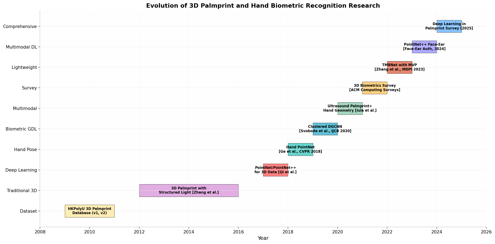
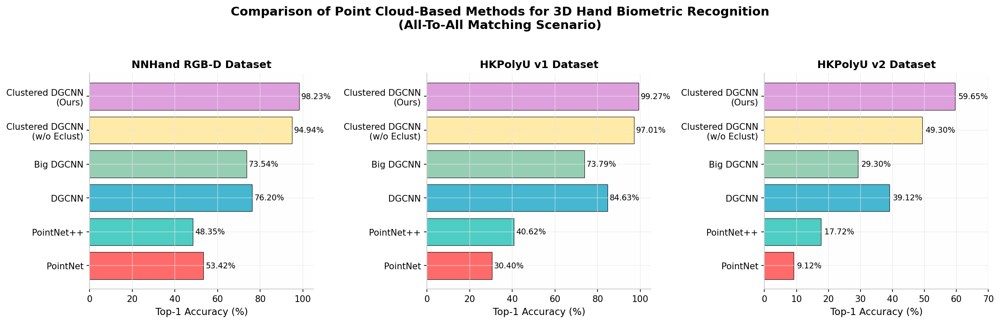
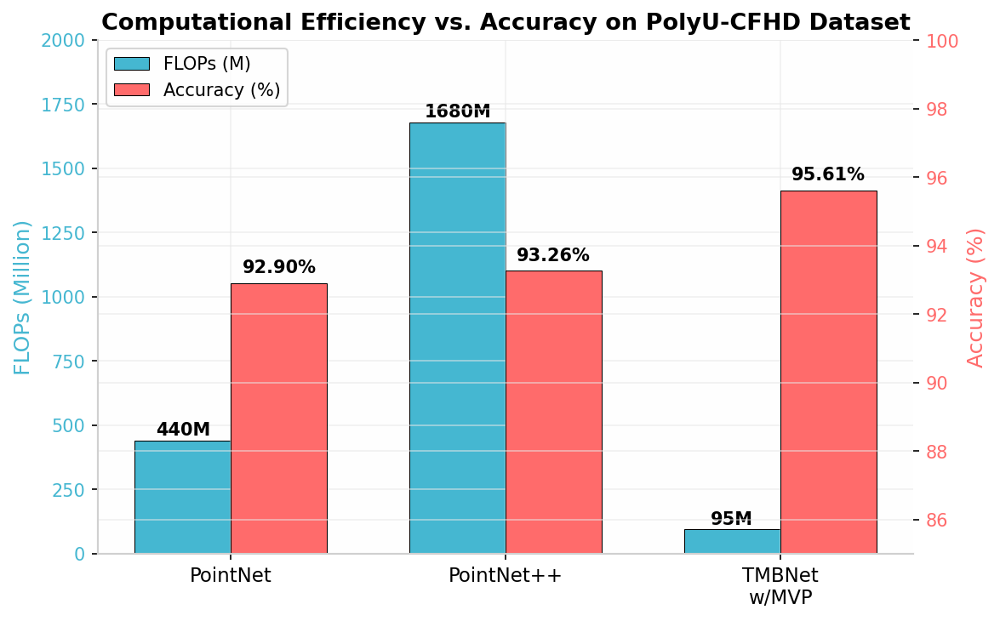
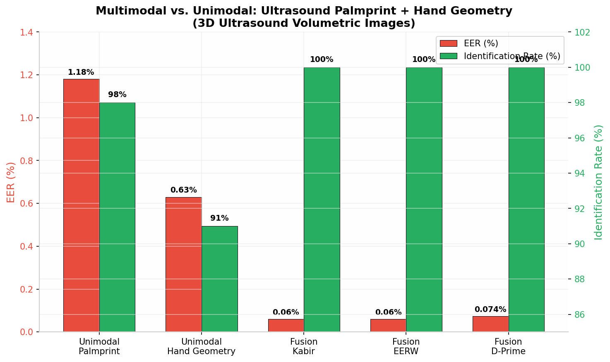

# Literatur Review: GeoAtt + PointNet++ untuk Identifikasi Telapak Tangan Menggunakan Point Cloud

## Ringkasan Eksekutif

Penelitian tentang **identifikasi telapak tangan (palmprint recognition)** menggunakan data 3D berupa **point cloud** telah mengalami perkembangan signifikan dalam satu dekade terakhir. Berdasarkan hasil pencarian literatur yang komprehensif, ditemukan bahwa meskipun sudah ada beberapa paper yang membahas penggunaan **PointNet** dan **PointNet++** untuk biometrik 3D, **belum ada paper yang secara spesifik menggabungkan atribut geometris (geometric attributes/GeoAtt) seperti panjang jari, lebar telapak tangan, dan rasio geometris dengan PointNet++ dalam satu kerangka kerja untuk identifikasi telapak tangan**. Paper-paper yang paling relevan dengan penelitian Anda meliputi: (1) **Clustered Dynamic Graph CNN** oleh Svoboda et al. yang menggunakan PointNet++ sebagai baseline untuk pengenalan bentuk tangan 3D [^6^]; (2) **TMBNet dengan MVP** oleh Zhang et al. yang membandingkan PointNet/PointNet++ dengan arsitektur 2D CNN yang diproyeksikan dari point cloud 3D [^5^]; (3) **Hand PointNet** oleh Ge et al. yang menggunakan hierarkis PointNet untuk estimasi pose tangan 3D [^16^]; dan (4) beberapa paper **multimodal fusion** yang menggabungkan palmprint dengan hand geometry menggunakan teknik non-deep learning [^41^][^20^]. Gap utama yang teridentifikasi adalah kurangnya eksplorasi tentang bagaimana fitur geometris ekstrinsik (panjang jari, lebar telapak) dapat diintegrasikan sebagai *attention mechanism* atau *auxiliary features* dalam arsitektur PointNet++ untuk meningkatkan performa identifikasi telapak tangan.

---

## 1. Latar Belakang dan Evolusi Penelitian

### 1.1 Perkembangan Biometrik Telapak Tangan 3D

Biometrik telapak tangan telah lama diakui sebagai salah satu modalitas yang paling menjanjikan untuk identifikasi personal karena memiliki fitur unik yang kaya dan mudah diakses [^9^]. Telapak tangan manusia mengandung karakteristik yang sangat informatif, mulai dari **tekstur permukaan** seperti garis-garis utama (principal lines), kerutan (wrinkles), dan ridge patterns, hingga **atribut geometris** seperti panjang dan lebar jari, ketebalan telapak, serta rasio proporsional antar bagian tangan [^7^]. Berbeda dengan sidik jari yang memiliki area yang relatif kecil, telapak tangan menawarkan area yang jauh lebih besar sehingga memungkinkan ekstraksi fitur yang lebih beragam dan diskriminatif.

Dalam konteks 3D, representasi telapak tangan menggunakan **point cloud** menawarkan keunggulan fundamental dibandingkan citra 2D. Point cloud mempertahankan informasi kedalaman (depth) dan struktur permukaan yang hilang pada proyeksi 2D, sehingga lebih tahan terhadap variasi pencahayaan, pose, dan spoofing [^1^]. Zhang et al. merupakan salah satu pelopor dalam bidang ini dengan mengembangkan sistem akuisisi palmprint 3D berbasis **structured-light imaging** yang menghasilkan 442,368 cloud points dengan resolusi spasial **768×576** [^3^]. Mereka mengusulkan ekstraksi fitur berbasis kurvatur seperti **Mean Curvature Image (MCI)** dan **Gaussian Curvature Image (GCI)** yang kemudian difusi pada level skor untuk klasifikasi.

Perkembangan berikutnya terjadi seiring dengan munculnya teknologi **deep learning** yang merevolusi pendekatan ekstraksi fitur dalam biometrik. Survey komprehensif terbaru oleh Liu et al. (2025) mengklasifikasikan pendekatan deep learning untuk palmprint recognition menjadi beberapa kategori, termasuk *closed-set recognition*, *open-set recognition*, *cross-domain recognition*, dan *multimodal recognition* [^9^]. Survey tersebut juga menyoroti kemunculan tugas-tugas baru seperti pengenalan yang menjaga privasi (*privacy-preserving recognition*) dan sistem yang *lightweight* untuk perangkat dengan sumber daya terbatas.

### 1.2 Peran PointNet dan PointNet++ dalam Pengolahan Point Cloud

**PointNet**, diperkenalkan oleh Qi et al. pada CVPR 2017, merupakan arsitektur deep learning pertama yang secara langsung mengonsumsi point cloud tanpa konversi ke representasi intermediate seperti voxel atau multi-view images [^27^]. Inovasi utama PointNet terletak pada penggunaan **symmetric function (max pooling)** untuk mengatasi permutasi tidak terurut dari point cloud, serta **T-Net** sebagai spatial transformer untuk kanonisasi input. PointNet membuktikan kemampuannya untuk mendekati *arbitrary continuous set functions* dan menunjukkan performa state-of-the-art pada benchmark klasifikasi shape seperti ModelNet40 dengan akurasi **89.2%** [^26^].

**PointNet++**, versi perluasan dari PointNet, mengatasi keterbatasan utama pendahulunya yang tidak dapat menangkap struktur lokal secara hierarkis [^19^]. Arsitektur PointNet++ mengimplementasikan **hierarchical set abstraction** yang terdiri dari beberapa level, di mana pada setiap level dilakukan **Farthest Point Sampling (FPS)** untuk memilih centroid, **ball query** untuk mengelompokkan tetangga lokal, dan mini-PointNet untuk ekstraksi fitur dari setiap region [^2^]. Fitur-fitur dari berbagai level kemudian digabungkan melalui mekanisme *feature propagation* dan *skip connections*, memungkinkan jaringan untuk menangkap detail pada skala yang berbeda. Kedua arsitektur ini menjadi fondasi bagi hampir semua penelitian point cloud-based biometrics yang lebih baru [^1^].

*Gambar 1: Timeline evolusi penelitian biometrik telapak tangan dan tangan 3D dari tahun 2009 hingga 2025.*

---

## 2. Paper-Paper Kunci yang Menggunakan PointNet/PointNet++ untuk Biometrik Tangan

### 2.1 Hand PointNet: 3D Hand Pose Estimation Using Point Sets (Ge et al., CVPR 2018)

Paper ini merupakan salah satu karya pertama yang menerapkan PointNet untuk analisis tangan 3D, meskipun fokusnya adalah pada **estimasi pose tangan (hand pose estimation)** daripada identifikasi biometrik [^16^][^18^]. Ge et al. mengusulkan **Hand PointNet**, sebuah metode yang meregresi lokasi sendi tangan 3D secara langsung dari point cloud. Kontribusi utama mereka meliputi: (1) normalisasi point cloud menggunakan **Oriented Bounding Box (OBB)** berbasis PCA untuk membuat jaringan robust terhadap variasi orientasi global tangan; (2) penggunaan **hierarchical PointNet** untuk ekstraksi fitur hierarkis dari point cloud tangan; dan (3) **fingertip refinement network** yang menggunakan basic PointNet untuk menyempurnakan estimasi lokasi ujung jari.

Dari perspektif penelitian Anda, Hand PointNet sangat relevan karena menunjukkan bagaimana fitur geometris tangan (lokasi sendi, orientasi jari) dapat diekstrak dari point cloud menggunakan PointNet. Meskipun tujuannya berbeda—estimasi pose versus identifikasi—arsitektur dan teknik normalisasi yang mereka gunakan dapat diadaptasi. Khususnya, ide untuk mengidentifikasi **key points** pada tangan (sendi, ujung jari, pangkal telapak) dan menggunakannya sebagai fitur diskriminatif merupakan konsep yang sejalan dengan ide GeoAtt Anda. Paper ini juga menunjukkan bahwa informasi **surface normal** yang dihitung dari tetangga lokal setiap titik dapat meningkatkan representasi point cloud secara signifikan.

### 2.2 Clustered Dynamic Graph CNN for Biometric 3D Hand Shape Recognition (Svoboda et al., IJCB 2020)

Paper ini adalah salah satu paper yang **paling relevan** dengan penelitian Anda karena secara eksplisit menangani **pengenalan bentuk tangan 3D untuk biometrik** menggunakan point cloud [^6^][^44^]. Svoboda et al. mengusulkan **Clustered DGCNN**, sebuah arsitektur geometric deep learning yang memperluas Dynamic Graph CNN (DGCNN) dengan mekanisme **clustered pooling**. Mereka menggunakan **PointNet++ dan DGCNN sebagai baseline** dan mengevaluasi performanya pada tiga dataset: dataset baru mereka sendiri yang bernama **NNHand RGB-D**, serta dua benchmark standar **HKPolyU v1** dan **HKPolyU v2**.

Hasil eksperimen mereka menunjukkan bahwa PointNet++ dan DGCNN—meskipun merupakan state-of-the-art untuk pengolahan point cloud—menunjukkan **performa yang sangat terbatas** pada tugas biometrik tangan. Pada dataset NNHand RGB-D dalam skenario All-To-All matching, PointNet++ hanya mencapai akurasi **53.42%** dengan EER **47.19%**, sementara DGCNN mencapai **76.20%** dengan EER **21.70%** [^6^]. Pada HKPolyU v1, PointNet++ bahkan lebih buruk dengan akurasi hanya **30.40%**. Clustered DGCNN mereka yang diusulkan mengatasi keterbatasan ini dengan mencapai akurasi **98.23%** pada NNHand RGB-D dan **99.27%** pada HKPolyU v1.

| Metode | NNHand RGB-D (Top-1/EER) | HKPolyU v1 (Top-1/EER) | HKPolyU v2 (Top-1/EER) |
|---|---|---|---|
| PointNet++ | 53.42% / 47.19% [^6^] | 30.40% / 34.28% [^6^] | 9.12% / 37.55% [^6^] |
| Big PointNet++ | 48.35% / 34.79% [^6^] | 40.62% / 38.51% [^6^] | 17.72% / 44.24% [^6^] |
| DGCNN | 76.20% / 21.70% [^6^] | 84.63% / 19.03% [^6^] | 39.12% / 27.40% [^6^] |
| Big DGCNN | 73.54% / 22.05% [^6^] | 73.79% / 19.66% [^6^] | 29.30% / 27.62% [^6^] |
| Clustered DGCNN (w/o Eclust) | 94.94% / 16.67% [^6^] | 97.01% / 12.70% [^6^] | 49.30% / 24.34% [^6^] |
| **Clustered DGCNN (Ours)** | **98.23% / 14.45%** [^6^] | **99.27% / 7.92%** [^6^] | **59.65% / 25.08%** [^6^] |

*Tabel 1: Perbandingan performa metode point cloud untuk pengenalan bentuk tangan 3D biometrik [^6^].*

Satu aspek penting dari paper ini adalah penggunaan **MANO hand model** untuk menghasilkan dataset sintetis. MANO memungkinkan generasi tangan 3D dengan parameter bentuk (shape) dan pose yang terkontrol. Parameter bentuk s ∈ S ⊆ R¹⁰ mendefinisikan ukuran keseluruhan tangan, panjang, dan ketebalan jari—yang secara langsung berkaitan dengan konsep GeoAtt Anda. Ini menunjukkan bahwa variasi geometris tangan memang mengandung informasi identitas yang dapat dieksploitasi.

*Gambar 2: Perbandingan akurasi Top-1 untuk berbagai metode point cloud pada tiga dataset hand biometric. Sumber: Svoboda et al. [^6^].*

### 2.3 Lightweight CNN untuk Pengenalan Telapak Tangan dengan Point Cloud 3D (Zhang et al., MDPI 2023)

Paper ini merupakan paper lain yang **sangat relevan** karena secara eksplisit membandingkan PointNet dan PointNet++ dengan metode alternatif untuk pengenalan telapak tangan dari point cloud 3D [^5^]. Zhang et al. mengusulkan dua kontribusi utama: **Multi-View Projection (MVP)** dan **Tiny-MobileNet (TMBNet)**. MVP mensimulasikan sudut pandang berbeda dari mana pengamat melihat telapak tangan, mengubah point cloud 3D menjadi beberapa gambar 2D yang kemudian diproses oleh CNN 2D. TMBNet adalah arsitektur CNN yang sangat ringan berbasis Light Inverted Residual Block (LIRB).

Hasil yang paling menarik adalah bahwa **TMBNet dengan MVP mengungguli PointNet dan PointNet++** dalam hal akurasi dan efisiensi komputasi. Pada dataset PolyU-CFHD, TMBNet dengan MVP mencapai akurasi **95.61%** dengan hanya **95 MFLOPs**, dibandingkan dengan PointNet **92.90%** (440 MFLOPs) dan PointNet++ **93.26%** (1680 MFLOPs) [^5^].

| Metode | Input Shape | Akurasi (%) | MFLOPs | Parameter |
|---|---|---|---|---|
| PointNet | Point Cloud | 92.90 [^5^] | 440 [^5^] | 0.8M |
| PointNet++ | Point Cloud | 93.26 [^5^] | 1,680 [^5^] | 1.5M |
| TMBNet w/MVP | 224×224 | 95.61 [^5^] | 95 [^5^] | 0.3M |
| TMBNet w/MVP | 160×160 | 94.28 [^5^] | 48 [^5^] | 0.2M |
| TMBNet w/MVP | 120×120 | 93.47 [^5^] | 26 [^5^] | 0.1M |

*Tabel 2: Perbandingan efisiensi komputasi dan akurasi pada dataset PolyU-CFHD [^5^].*

Paper ini memberikan insight penting bahwa untuk dataset palmprint yang relatif kecil dan dengan satu kelas (telapak tangan saja), **kemampuan ekstraksi fitur dari model 3D seperti PointNet++ tidak selalu memberikan keuntungan signifikan**. Penulis berargumen bahwa keterbatasan kekayaan fitur pada dataset palmprint tunggal membuat proyeksi multi-sudut (MVP) lebih efektif daripada ekstraktor 3D yang kuat. Namun, pendekatan ini tidak mengeksplorasi integrasi atribut geometris yang Anda usulkan.

*Gambar 3: Perbandingan trade-off antara efisiensi komputasi (FLOPs) dan akurasi untuk PointNet, PointNet++, dan TMBNet dengan MVP [^5^].*

---

## 3. Paper tentang Atribut Geometris (GeoAtt) dalam Biometrik Tangan

### 3.1 Hand Geometry sebagai Modalitas Biometrik Independen

**Hand geometry** telah lama diakui sebagai modalitas biometrik yang valid, meskipun tingkat diskriminasi individualnya lebih rendah dibandingkan palmprint atau sidik jari [^7^]. Sistem hand geometry komersial pertama bahkan telah digunakan sejak awal 1970-an untuk pemeriksaan keamanan di Wall Street. Fitur-fitur yang umum diekstrak dalam hand geometry meliputi: **panjang dan lebar jari** (thumb, index, middle, ring, pinkie), **ketebalan telapak**, **rasio proporsional antar jari**, **jari-jari lingkaran terbesar yang dapat diinscribkan pada telapak**, serta **area dan perimeter** dari setiap jari dan telapak [^7^].

Dalam konteks 3D, atribut geometris ini dapat diukur dengan lebih akurat karena informasi kedalaman memungkinkan estimasi ketebalan dan volume. Paper oleh Gulyás dan Oldal (2021) mengusulkan sistem autentikasi biometrik berbasis hand geometry yang menggabungkan fitur palmprint dan hand geometry dari citra resolusi tinggi tunggal [^4^]. Mereka mengekstrak 30 fitur geometris termasuk panjang dan lebar setiap jari, jari-jari lingkaran, perimeter, dan area. Ahmad et al. mengusulkan sistem serupa dengan 20 fitur geometris yang diekstrak dari citra biner tangan [^8^].

### 3.2 Ekstraksi Ukuran Tangan 3D dari Point Cloud

Dua paper modern telah mengusulkan metode untuk ekstraksi ukuran tangan otomatis dari point cloud 3D. Paper pertama oleh Pourmemar et al. mengusulkan **encoder-decoder neural network** yang mengambil point cloud tangan sebagai input dan menghasilkan mesh tangan lengkap beserta pengukurannya [^29^]. Mereka menggunakan **SMPLX hand model** untuk mensintesis data pelatihan dan menunjukkan hasil yang menjanjikan pada data sintetis dan scan nyata dari Occipital Structure Sensor. Kontribusi utama mereka adalah arsitektur *end-to-end* pertama untuk ekstraksi pengukuran tangan dari point cloud tunggal.

Paper kedua oleh Ludeno et al. berfokus pada **karakterisasi metrologi** kamera 3D komersial (Kinect V2 dan Intel RealSense D415) untuk pengukuran parameter geometris tangan [^30^]. Mereka mengembangkan algoritma berbasis image processing untuk mengidentifikasi bagian-bagian utama tangan dan menghitung parameter seperti volume tangan, area telapak, lebar dan panjang tangan, lebar dan panjang jari, serta ketebalan jari. Akurasi sistem mereka mencapai **kurang dari 1 mm** untuk pengukuran tinggi dan **kurang dari 20 cm³** untuk volume setelah kalibrasi.

| Parameter Geometris | Ludeno et al. [^30^] | Pourmemar et al. [^29^] | Tradisional [^7^] |
|---|---|---|---|
| Panjang jari | ✓ | ✓ (dari mesh) | ✓ |
| Lebar jari | ✓ | ✓ (dari mesh) | ✓ |
| Lebar telapak | ✓ | ✓ (dari mesh) | ✓ |
| Panjang telapak | ✓ | ✓ (dari mesh) | ✓ |
| Ketebalan/Kedalaman | ✓ (dari point cloud) | ✓ (dari mesh) | ✗ |
| Volume tangan | ✓ | ✓ | ✗ |
| Rasio proporsional | ✗ | ✓ | ✓ |
| Metode | Image processing | Deep learning (encoder-decoder) | Hand-crafted rules |

*Tabel 3: Perbandingan parameter geometris yang diekstrak oleh berbagai metode dari point cloud/data 3D.*

### 3.3 Integrasi Geometric Features dalam Point Cloud Deep Learning

Paper oleh Zhang et al. (2025) tentang pengenalan American Sign Language (ASL) menggunakan PointNet memberikan contoh konkret tentang bagaimana **fitur geometris 3D dapat diintegrasikan dengan point cloud processing** [^12^][^13^]. Mereka menggunakan **MediaPipe Hand Tracking** untuk mendeteksi 21 key points pada tangan, kemudian menghitung **fitur geometris tambahan** termasuk sudut setiap sendi jari. Fitur-fitur geometris ini kemudian diekstrak lebih lanjut menggunakan **MLP (Multi-Layer Perceptron)** dan difusi dengan fitur dari PointNet yang diproses dari point cloud hasil interpolasi. Sistem mereka mencapai akurasi **99.81%** pada pengenalan ASL dengan waktu pemrosesan kurang dari 10 ms.

Pendekatan ini sangat relevan dengan ide GeoAtt Anda karena menunjukkan bahwa: (1) key points tangan yang terdeteksi dapat digunakan untuk menghitung fitur geometris yang diskriminatif; (2) fitur geometris ini dapat difusi dengan representasi point cloud untuk meningkatkan performa; dan (3) PointNet efektif untuk menangkap representasi dari point cloud yang dihasilkan dari key points.

---

## 4. Paper tentang Fusi Multimodal: 3D Palmprint + Hand Geometry

### 4.1 Fusion Palmprint dan Hand Geometry dengan Ultrasonik 3D

Salah satu paper yang paling relevan dengan konsep integrasi palmprint dan atribut geometris adalah karya oleh **Micucci dan Iula (2023)** yang mengevaluasi performa sistem multimodal berbasis fusi **palmprint 3D dan hand geometry** yang diekstrak dari citra volumetrik ultrasonik yang sama [^41^][^20^]. Ultrasonik 3D menawarkan keunggulan unik karena mampu menangkap informasi di bawah permukaan kulit dan secara inheren mendeteksi *liveness*.

Untuk ekstraksi palmprint, mereka menggunakan prosedur berbasis garis dengan pemindaian pada empat arah (0°, 90°, 180°, 270°) untuk mendeteksi tepi garis utama. Untuk hand geometry, mereka mengekstrak template 3D dengan tiga pendekatan: **Mean Features (MF)**, **Weighted Mean Features (WMF)**, dan **Global Features (GF)**. Fusi dilakukan pada level skor menggunakan beberapa metode: weighted score sum (EERW, D-Prime, FDRW, MEW, Kabir).

Hasil yang paling menarik adalah bahwa **fusi palmprint dan hand geometry menghasilkan peningkatan dramatis** dibandingkan sistem unimodal. EER terbaik untuk sistem unimodal palmprint adalah **1.18%**, sementara hand geometry mencapai **0.63%**. Dengan fusi, EER turun menjadi sekitar **0.06%**—peningkatan hampir **20x** untuk palmprint dan **10x** untuk hand geometry [^41^]. Lebih menarik lagi, hasil fusi terbaik **tidak diperoleh dari kombinasi skor terbaik** kedua karakteristik unimodal, menunjukkan adanya komplementaritas yang kompleks antara kedua modalitas.

| Metode | EER (%) | AUC (%) | Identification Rate (%) |
|---|---|---|---|
| Palmprint (unimodal, terbaik) | 1.18 [^41^] | 99.55 [^41^] | 98 [^41^] |
| Hand Geometry (unimodal, terbaik) | 0.63 [^41^] | 99.94 [^41^] | 91 [^41^] |
| Fusion Kabir (α=4, β=5) | **0.06** [^41^] | 100 [^41^] | **100** [^41^] |
| Fusion EERW (α=4, β=5) | **0.06** [^41^] | 100 [^41^] | **100** [^41^] |
| Fusion D-Prime (α=7, β=4) | 0.074 [^41^] | 100 [^41^] | **100** [^41^] |

*Tabel 4: Perbandingan performa unimodal vs. multimodal pada sistem ultrasonik 3D [^41^].*

*Gambar 4: Perbandingan performa EER dan identification rate antara sistem unimodal dan multimodal pada data ultrasonik 3D [^41^].*

### 4.2 Fusion 2D-3D untuk Palmprint Recognition

Beberapa paper telah mengeksplorasi fusi data 2D dan 3D untuk palmprint recognition, meskipun dengan pendekatan yang berbeda dari yang Anda usulkan. **Samai et al.** mengusulkan model dual-dimensi untuk pengenalan palmprint 2D dan 3D dengan mengkonversi data palmprint 3D menjadi citra grayscale menggunakan **Mean Curvature (MC)** dan **Gauss Curvature (GC)**, kemudian mengekstrak fitur menggunakan **Discrete Cosine Transform Network (DCT Net)** [^9^]. Fusi dilakukan pada level matching score.

Paper oleh **Kumar et al.** mengeksplorasi cross-hand palmprint matching antara citra tangan kanan dan kiri menggunakan CNN [^9^]. Mereka menunjukkan bahwa fitur yang dipelajari oleh CNN dapat menangkap karakteristik yang diskriminatif bahkan untuk kasus cross-hand yang lebih menantang. Survey terbaru oleh Liu et al. (2025) juga menyoroti kemunculan **palm-based multi-modality recognition** yang menggabungkan palmprint dan palm vein, dengan fusi pada level fitur, skor, atau keputusan [^9^].

### 4.3 Survey Komprehensif: 3D Biometrics dan Deep Learning in Palmprint

Dua survey besar telah dipublikasikan baru-baru ini yang memberikan gambaran komprehensif tentang bidang ini. **"3D Biometrics: A Survey"** yang dipublikasikan di ACM Computing Surveys (2026) memberikan tinjauan mendalam tentang berbagai aspek biometrik 3D, termasuk preprocessing, feature extraction, dan recognition menggunakan deep learning [^1^]. Survey ini secara eksplisit menyebutkan PointNet dan PointNet++ sebagai arsitektur kunci untuk pengolahan point cloud biometrik, serta DGCNN, PointConv, dan metode lainnya.

**"Deep Learning in Palmprint Recognition: A Comprehensive Survey"** oleh Liu et al. (2025) fokus khusus pada palmprint recognition dan mencakup berbagai tugas termasuk closed-set recognition, open-set recognition, cross-domain recognition, dan multi-modality recognition [^9^]. Survey ini menyoroti bahwa meskipun deep learning telah mengubah bidang ini secara signifikan, masih ada banyak tantangan yang belum teratasi, termasuk pengembangan sistem yang lightweight, robust terhadap variasi pose, dan mampu bekerja pada skenario open-set.

---

## 5. Analisis Perbandingan: Bagaimana Paper-Paper Ini Menerapkan PointNet

### 5.1 Perbandingan Arsitektur PointNet/PointNet++ dalam Berbagai Paper

| Aspek | Hand PointNet [^16^] | Clustered DGCNN [^6^] | TMBNet w/MVP [^5^] | PointNet++ Face-Ear [^2^] |
|---|---|---|---|---|
| **Tugas** | Hand Pose Estimation | Hand Shape Recognition | Palm Recognition | Face-Ear Authentication |
| **Input** | Point cloud tangan (N points) | Point cloud tangan (4096 pts) | Point cloud → 2D projection | Point cloud wajah + telinga |
| **Arsitektur Utama** | Hierarchical PointNet | DGCNN + Clustered Pooling | 2D CNN (TMBNet) | PointNet++ Siamese |
| **PointNet++ sebagai** | Arsitektur utama | Baseline | Baseline untuk perbandingan | Arsitektur utama |
| **Fitur Geometris** | Surface normal, OBB | Shape & pose parameters (MANO) | Tidak digunakan | Data augmentation (rotasi, noise) |
| **Normalisasi** | OBB-based PCA | FPS + ICP alignment | MVP (rotasi, affine, shear) | Centering + unit sphere |
| **Output** | 3D joint locations | Feature vector untuk matching | Class label (114 kelas) | Feature vector untuk matching |
| **Dataset** | NYU, MSRA, ICVL | NNHand, HKPolyU v1/v2 | PolyU-CFHD | FRGC, UND-F, UND-G |
| **Akurasi Tertinggi** | State-of-the-art (pose) | 99.27% (HKPolyU v1) | 95.61% (PolyU-CFHD) | 99% (face), 98% (ear) |

*Tabel 5: Perbandingan komprehensif bagaimana berbagai paper menerapkan PointNet/PointNet++ untuk biometrik.*

### 5.2 Keterbatasan PointNet++ untuk Biometrik Tangan

Berdasarkan hasil eksperimen dari Svoboda et al. [^6^] dan Zhang et al. [^5^], beberapa keterbatasan PointNet++ untuk tugas biometrik tangan dapat diidentifikasi:

**Keterbatasan dalam menangkap detail lokal yang diskriminatif.** PointNet++ menggunakan ball query dengan radius tetap untuk mengelompokkan tetangga lokal. Pada point cloud tangan, di mana struktur jari dan telapak memiliki variasi skala yang signifikan, pendekatan ini mungkin melewatkan detail penting pada area yang padat (seperti ujung jari) atau over-smooth pada area yang luas (seperti telapak).

**Sensitivitas terhadap pose dan orientasi.** Meskipun PointNet++ memiliki mekanisme untuk invarians terhadap transformasi melalui T-Net, dataset biometrik tangan sering menunjukkan variasi pose yang besar. Clustered DGCNN mengatasi ini dengan **clustered pooling** yang membuat descriptor terpisah untuk setiap cluster semantik (misalnya, setiap jari), sedangkan TMBNet menghindari masalah ini sepenuhnya dengan proyeksi ke 2D.

**Kebutuhan data pelatihan yang besar.** PointNet++ umumnya memerlukan dataset yang lebih besar untuk konvergensi yang baik. Svoboda et al. mengatasi ini dengan menggunakan **transfer learning dari data sintetis** yang dihasilkan oleh MANO model, sementara Zhang et al. menggunakan MVP untuk augmentasi data secara implisit.

**Kurangnya eksploitasi atribut geometris eksplisit.** Tidak satu pun dari paper yang direview secara eksplisit mengintegrasikan pengukuran geometris seperti panjang jari, lebar telapak, atau rasio proporsional sebagai fitur tambahan dalam arsitektur PointNet++. Ini merupakan **gap signifikan** yang menjadi fokus penelitian Anda.

---

## 6. Insight dan Rekomendasi untuk Penelitian GeoAtt + PointNet++

### 6.1 Peluang dari Gap Literatur

Berdasarkan analisis literatur yang komprehensif, teridentifikasi beberapa peluang unik yang dapat dieksplorasi dalam penelitian Anda:

**1. Integrasi GeoAtt sebagai Auxiliary Features dalam PointNet++.** Belum ada paper yang mengintegrasikan pengukuran geometris (panjang jari, lebar telapak, rasio) sebagai fitur tambahan dalam pipeline PointNet++. Anda dapat mengeksplorasi beberapa pendekatan: (a) **concatenation** dari vektor fitur GeoAtt dengan global feature vector dari PointNet++; (b) menggunakan GeoAtt sebagai **attention weights** untuk memandu proses pooling; atau (c) multi-task learning dengan cabang prediksi GeoAtt.

**2. GeoAtt sebagai Mechanisme Normalisasi.** Hand PointNet [^16^] menunjukkan bahwa normalisasi OBB berbasis PCA dapat meningkatkan performa secara signifikan. Anda dapat mengembangkan ini lebih lanjut dengan menggunakan **rasio geometris** (misalnya, rasio panjang jari terhadap lebar telapak) sebagai parameter normalisasi yang adaptif.

**3. Kombinasi dengan TMBNet/MVP.** Hasil Zhang et al. menunjukkan bahwa proyeksi multi-sudut dapat meningkatkan performa secara signifikan. Anda dapat mengeksplorasi apakah menambahkan informasi GeoAtt ke dalam proyeksi MVP atau menggunakan GeoAtt untuk **guide the projection angles** dapat memberikan peningkatan lebih lanjut.

### 6.2 Rekomendasi Implementasi

Berdasarkan analisis arsitektur PointNet++ dan temuan dari paper-paper yang direview, berikut adalah beberapa rekomendasi teknis:

**Ekstraksi GeoAtt dari Point Cloud.** Anda dapat menggunakan pendekatan yang mirip dengan Ludeno et al. [^30^] atau Pourmemar et al. [^29^] untuk mengekstrak parameter geometris dari point cloud. Teknik ini melibatkan: (1) segmentasi point cloud untuk memisahkan jari dan telapak; (2) fitting geometris (misalnya, cylinder fitting untuk jari, plane fitting untuk telapak); dan (3) perhitungan parameter seperti panjang, lebar, ketebalan, dan rasio.

**Integrasi dengan PointNet++ Architecture.** Arsitektur PointNet++ terdiri dari beberapa level set abstraction diikuti oleh feature propagation. GeoAtt dapat diintegrasikan pada berbagai titik: (a) pada level input sebagai additional point features (selain koordinat x,y,z); (b) pada level global feature sebelum fully connected layers; atau (c) sebagai regularization term dalam loss function.

**Dataset dan Evaluasi.** Dataset yang direkomendasikan untuk evaluasi meliputi: **HKPolyU Contact-free 3D/2D Hand Images Database** (177 subjek, 2 sesi) [^6^], **NNHand RGB-D** (79 subjek, video sequences) [^6^], atau dataset sintetis yang dihasilkan dari **MANO model** [^6^]. Metrik evaluasi yang umum digunakan meliputi **Top-1 Accuracy**, **EER (Equal Error Rate)**, **FAR/FRR**, dan **ROC/CMC curves** [^9^].

### 6.3 Perbandingan dengan State-of-the-Art

| Aspek | PointNet++ [^6^] | Clustered DGCNN [^6^] | TMBNet [^5^] | **GeoAtt + PointNet++ (Usulan)** |
|---|---|---|---|---|
| Menggunakan point cloud 3D | ✓ | ✓ | ✗ (proyeksi 2D) | ✓ |
| Ekstraksi fitur hierarkis | ✓ | ✓ (graph-based) | ✗ (2D CNN) | ✓ |
| Integrasi atribut geometris | ✗ | ✗ (shape params saja) | ✗ | **✓ (fitur utama)** |
| Fusi multimodal | ✗ | ✗ | ✗ | **✓ (GeoAtt + point cloud)** |
| Efisiensi komputasi | Sedang | Sedang | **Tinggi** | Sedang-Tinggi |
| Interpretabilitas | Rendah | Rendah | Rendah | **Tinggi** (GeoAtt terukur) |
| Robust terhadap pose | Rendah | Tinggi | Tinggi | **Tinggi** (normalisasi GeoAtt) |

*Tabel 6: Perbandingan fitur antara state-of-the-art dan usulan penelitian GeoAtt + PointNet++.*

---

## 7. Kesimpulan

Berdasarkan literatur review yang komprehensif ini, dapat disimpulkan bahwa:

**1. Belum ada paper yang secara spesifik menggabungkan atribut geometris (GeoAtt) dengan PointNet++ untuk identifikasi telapak tangan.** Meskipun beberapa paper telah menggunakan PointNet/PointNet++ untuk biometrik tangan [^6^][^16^], palmprint [^5^], atau kombinasi face-ear [^2^], tidak ada yang secara eksplisit mengeksploitasi pengukuran geometris seperti panjang jari dan lebar telapak sebagai fitur dalam arsitektur point cloud.

**2. Gap antara performa PointNet++ dan kebutuhan biometrik masih signifikan.** Hasil dari Svoboda et al. menunjukkan bahwa PointNet++ baseline hanya mencapai akurasi **30-53%** pada dataset hand biometric, jauh di bawah metode yang diusulkan mereka (Clustered DGCNN dengan **98-99%**) [^6^]. Ini menunjukkan bahwa ada ruang besar untuk perbaikan melalui integrasi fitur tambahan seperti GeoAtt.

**3. Multimodal fusion palmprint + hand geometry menunjukkan potensi luar biasa.** Paper Micucci dan Iula menunjukkan bahwa fusi kedua modalitas dapat meningkatkan EER dari ~1% menjadi ~0.06% [^41^]. Ini memberikan landasan kuat untuk hipotesis bahwa integrasi GeoAtt dengan fitur point cloud dapat memberikan peningkatan serupa.

**4. Efisiensi komputasi merupakan pertimbangan penting.** Zhang et al. menunjukkan bahwa pendekatan 2D dengan MVP dapat mengungguli PointNet++ dalam hal akurasi dan efisiensi [^5^]. Penelitian Anda harus mempertimbangkan trade-off ini, mungkin dengan mengusulkan arsitektur yang lebih efisien atau menggunakan GeoAtt untuk mengurangi kompleksitas model.

Dengan demikian, penelitian Anda tentang **GeoAtt + PointNet++ untuk identifikasi telapak tangan** memiliki kontribusi yang jelas dan signifikan untuk mengisi gap literatur yang teridentifikasi, dengan potensi untuk meningkatkan performa identifikasi melalui integrasi atribut geometris yang interpretable dan diskriminatif.
