# Progress Report: GeoAtt-PointNet++ Palm Recognition — Timeline V1 → V4

**Disusun oleh:** Documentation Agent  
**Tanggal:** 2026-05-21  
**Cakupan:** Evolusi eksperimen thesis dari proof-of-concept (V1) hingga fair ablation methodology (V4)

---

## Ringkasan Eksekutif

| Versi | Tanggal | Fokus Utama | Rank-1 (terbaik) | Loss | Status |
|---|---|---|---|---|---|
| **V1** | 23 Apr 2026 | Proof-of-concept (6 subjek) | 89.47% | Contrastive | ✅ Selesai |
| **V2** | 16 Mei 2026 | Scale up + Triplet (11 subjek) | 59.8% | Triplet (batch-hard) | ✅ Selesai |
| **V3** | 17 Mei 2026 | Switch ke ArcFace | 99.82% (no_geom) | ArcFace | ✅ Selesai |
| **V4** | 17–21 Mei 2026 | Fair ablation + diagnostic | 99.1% (no_geom) | ArcFace | ✅ Selesai |
| **V5.0.0** | 21–23 Mei 2026 | Pivot ke low-data regime | — | Triplet | 🔄 Pivot & redesign |
| **V5.0.1** | 24 Mei 2026 | OOM fix + efficiency opt | 89.5% (no_geom)* | Triplet | 🔄 Training berjalan |

*\*Preliminary result dari 5 seed pertama (seed 0–4).*

**Narasi singkat:** V1 membuktikan konsep. V2 mengalami bottleneck loss (Triplet) ~60% Rank-1. V3 switch ke ArcFace → ~100% Rank-1, tapi GeoAtt terlihat "merugikan." V4 investigasi metodologis → temuan **3 bias fatal** (split bocor, val_loss anti-korelasi, budget tidak seragam). Karena dataset tidak punya temporal diversity untuk fix split, pivot ke **V5.0.0 low-data regime** — pertanyaan baru: *"GeoAtt sebagai inductive bias di 1 frame/session?"* V5.0.1 adalah fix OOM + efficiency optimizations (chunked ball_query, batched validation, smoothed EER).

---

## Timeline Visual

```
2026-04-23        2026-05-16        2026-05-17 AM     2026-05-17 PM      (Now)
    │                 │                 │                 │                 │
    ▼                 ▼                 ▼                 ▼                 ▼
┌─────────┐      ┌─────────┐      ┌─────────┐      ┌─────────┐      ┌─────────┐
│   V1    │  →   │   V2    │  →   │   V3    │  →   │ V4 Fase │  →   │ V4 Fase │
│  PoC    │      │ Triplet │      │ ArcFace │      │    1    │      │    2    │
│ 6 subs  │      │11 subs  │      │11 subs  │      │Diagnostik│     │(ready)  │
│89.5% R1 │      │~60% R1  │      │~100% R1 │      │Patches  │      │Training │
└─────────┘      └─────────┘      └─────────┘      └─────────┘      └─────────┘
     │                 │                 │                 │
     │                 │                 │                 └─ Init parity fix
     │                 │                 │                    QC v3 frame-level
     │                 │                 │                    4-way ablation flags
     │                 │                 │                    Speed opt (3-5×)
     │                 │                 │                    ES patience 5→15
     │                 │                 │                    Augmentasi tune-down
     │                 │                 │
     │                 │                 └─ +36~44 ppt lompatan
     │                 │                    no_geom > with_geom
     │                 │
     │                 └─ Scale 6 → 11 subjek
     │                    Switch frame-level
     │                    8192 points, frame_repeat=30
     │                    LOSO + holdout protocol
     │
     └─ First training ever
        Contrastive loss
        4096 points, random split
```

---

## V1 — Proof-of-Concept (23 April 2026)

### Konteks
V1 adalah training pertama dalam thesis ini, dieksekusi di Google Colab dengan codebase `3DCNNV1/`.

### Spesifikasi
| Parameter | Nilai |
|---|---|
| Dataset | 6 subjek (alji, fadhil, feby, gede, rahmat, taofik) |
| Sesi per subjek | 11–16 sesi |
| Input points | 4,096 (x,y,z,nx,ny,nz) |
| Geometry features | 33-dim |
| Arsitektur | GeoAtt-PointNet++ Siamese (M4 full) |
| Loss | Contrastive Loss (margin=0.5) |
| Training | 100 epoch, batch=16, lr=1e-3, seed=42 |
| Split | Random 70/15/15 (tidak session-aware) |
| Augmentasi | Rotasi Z ±15°, jitter σ=0.01, scale 0.9–1.1, dropout 5% |
| Early stopping | Tidak eksplisit (implicit checkpointing) |

### Hasil
| Metrik | Nilai |
|---|---|
| **Rank-1** | **89.47%** (17/19 sesi test benar) |
| Rank-2 | 94.74% |
| Per-subjek akurasi | alji 100%, fadhil 75%, feby 100%, gede 100%, rahmat 100%, taofik 75% |
| EER/AUC | Tidak dihitung |

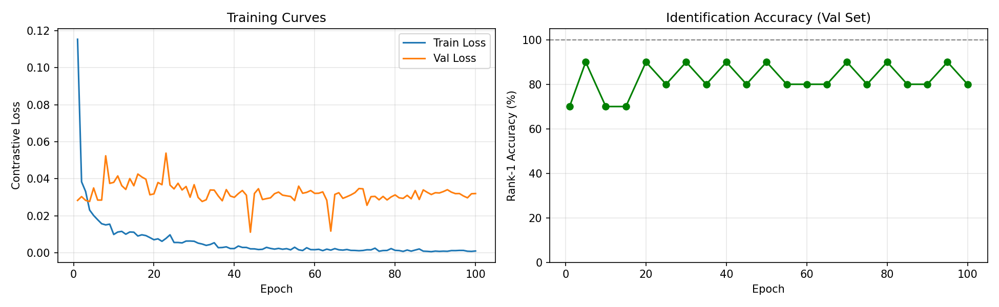

*Gambar V1.1 — Training curves V1. Train loss turun drastis epoch 0–10, stabil di bawah 0.01. Val loss fluktuatif di 0.03–0.04. Rank-1 val berfluktuasi 70–90% — menunjukkan overfitting ringan.*

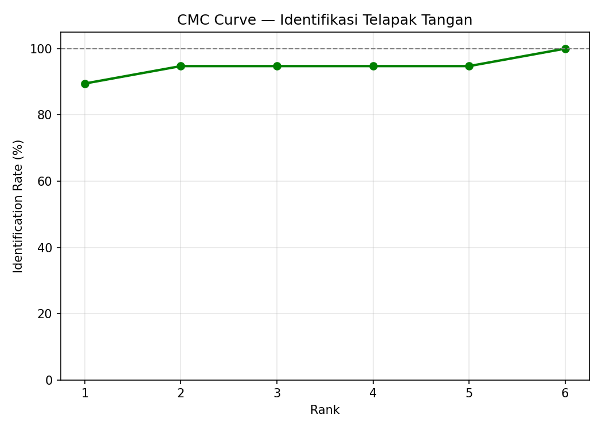

*Gambar V1.2 — CMC curve V1. Rank-1 = 89.5%, Rank-2 = 94.7%. Pada 6 subjek, CMC naik cepat ke atas 90%.*

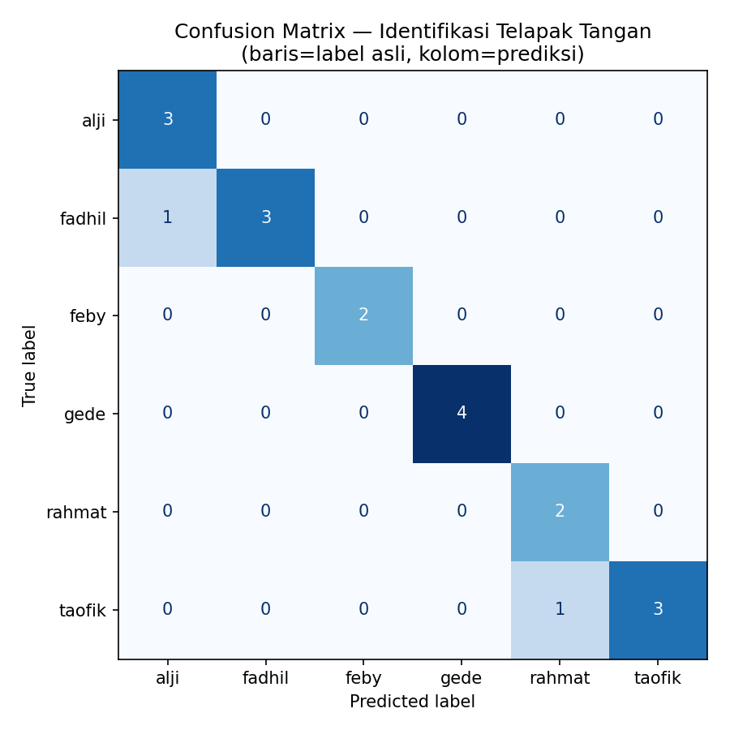

*Gambar V1.3 — Confusion matrix V1. 2 kesalahan: `fadhil` (1× prediksi `alji`) dan `taofik` (1× prediksi `rahmat`).*


*Gambar V1.4 — Similarity score per orang V1. Bar merah = prediksi salah. Terlihat bahwa pada sesi yang salah, similarity ke kelas lain lebih tinggi dari similarity ke kelas asli.*

### Temuan Utama
- **Proof-of-concept valid.** Arsitektur GeoAtt-PointNet dapat dipelajari end-to-end dan menghasilkan embedding diskriminatif.
- **Kesalahan terkonsentrasi.** Dua misclassifications pada `fadhil` dan `taofik` — menunjukkan ambiguitas antar subjek, bukan kegagalan acak.
- **Contrastive loss cukup untuk few-class.** Dengan 6 subjek, contrastive loss masih mampu memisahkan kelas.

### Keterbatasan yang Memicu V2
1. Dataset terlalu kecil (6 subjek) — tidak bisa digeneralisasi
2. Single-seed — tidak ada estimasi varians
3. Contrastive loss — tidak skalabel ke banyak kelas
4. Random split — tidak session-aware (data leakage risk)
5. Augmentasi sederhana — belum ada large rotation, tilt, atau translate
6. Checkpoint ablation (M1–M3) tidak tersedia untuk evaluasi

---

## V2 — Scale-Up + Triplet Loss (16 Mei 2026)

### Konteks
V2 adalah upaya scale-up: menambah subjek dari 6 → 11, mengganti strategi sampling ke frame-level, dan menggunakan Online Triplet Loss (batch-hard). Tujuan awal adalah melampaui V1 dengan dataset yang lebih besar dan loss yang lebih cocok untuk metric learning.

### Perubahan Fundamental dari V1 → V2

#### 1. Protokol Split: Random → LOSO + Holdout
| Aspek | V1 | V2 |
|---|---|---|
| **Strategi** | Random 70/15/15 | **LOSO** (Leave-One-Session-Out) + Holdout |
| **Session-aware** | ❌ Tidak | ✅ Ya |
| **Holdout** | Tidak ada | **1 sesi × 3 frame per subjek** dieksklusi dari training |
| **Tujuan** | Sederhana | Mencegah data leakage; evaluasi pada unseen session |

LOSO memastikan sesi yang sama tidak muncul di train dan test, yang lebih realistis untuk skenario biometrik nyata.

#### 2. Loss: Contrastive → Online Triplet (batch-hard)

| Aspek | V1 | V2 |
|---|---|---|
| **Loss** | Contrastive (margin=0.5) | **Online Triplet (batch-hard, margin=0.3)** |
| **Cocok untuk** | Few-class, verifikasi | Multi-class, metric learning |
| **Hasil** | 89.5% (6 subjek) | 59.8% (11 subjek) |

Triplet diharapkan lebih scalable, namun ternyata stagnan pada ~60%.

#### 3. Dataset Expansion
- 6 → 11 subjek
- Session-level → **frame-level** (setiap frame menjadi sampel independen)
- 4,096 → **8,192 points**
- Frame repeat = **30×**
- Single-seed → **5 seed**

#### 4. Augmentasi: Sederhana → Expanded Spatial

| Transform | V1 | V2 |
|---|---|---|
| Z-rotation (kecil) | ±15° | ±15° |
| **Z-rotation (besar)** | — | **prob 0.3, ±90°** |
| **X/Y tilt** | — | **prob 0.5, ±15°** |
| **XY translation** | — | **prob 0.5, ±2 cm** |
| Jitter Gaussian | σ=0.01 | σ=0.01 |
| Scale | 0.9–1.1 | 0.9–1.1 |
| Point dropout | 5% | 5% |
| **Geometry noise** | — | **σ=0.02 (baru)** |

Augmentasi diperluas untuk meningkatkan invarians terhadap pose dan posisi tangan.

### Spesifikasi
| Parameter | Nilai |
|---|---|
| Dataset | 11 subjek, frame-level layout |
| Input points | 8,192 |
| Frame repeat | 30× |
| Loss | Online Triplet (batch-hard, margin=0.3) |
| Training | Phase 1 (100ep) + Phase 2 (20ep fine-tune), batch=512 |
| Seeds | 5 seed (42, 123, 2026, 7, 31337) |
| Split | LOSO + holdout 1 sesi × 3 frame per subjek |
| QC | QC v2 (session-level, 16.5% excluded — kemudian dinyatakan terlalu agresif) |

### Hasil
| Metrik | with_geom | no_geom |
|---|---|---|
| **Rank-1 mean ± std** | **59.82 ± 2.64%** | **55.45 ± 13.55%** |
| Rank-5 | 92.36 ± 1.82% | 88.18 ± 7.82% |
| mAP | 73.13 ± 2.14% | 69.64 ± 11.18% |
| **EER** | **28.95 ± 2.13%** | **28.45 ± 4.66%** |
| AUC | 78.38 ± 2.27% | 78.65 ± 5.78% |
| Holdout Rank-1 | 72.73% | 66.67% |

### Uji Signifikansi
| Uji | Hasil |
|---|---|
| Wilcoxon paired | p = 1.000 (tidak signifikan) |
| Bootstrap CI Δ | [-6.9%, +17.1%] (melingkupi 0) |
| McNemar | p = 0.1294 (tidak signifikan) |

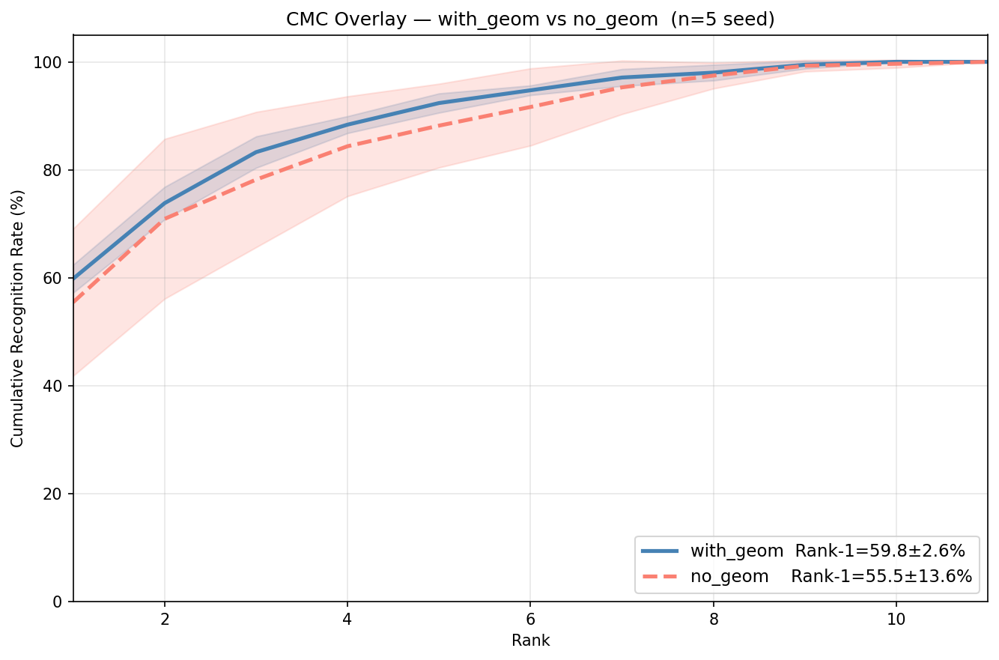

*Gambar V2.1 — CMC overlay V2. with_geom (biru): Rank-1 = 59.8±2.6%. no_geom (merah): Rank-1 = 55.5±13.6%. Shadow area besar menunjukkan varians tinggi — terutama no_geom yang sangat tidak stabil.*

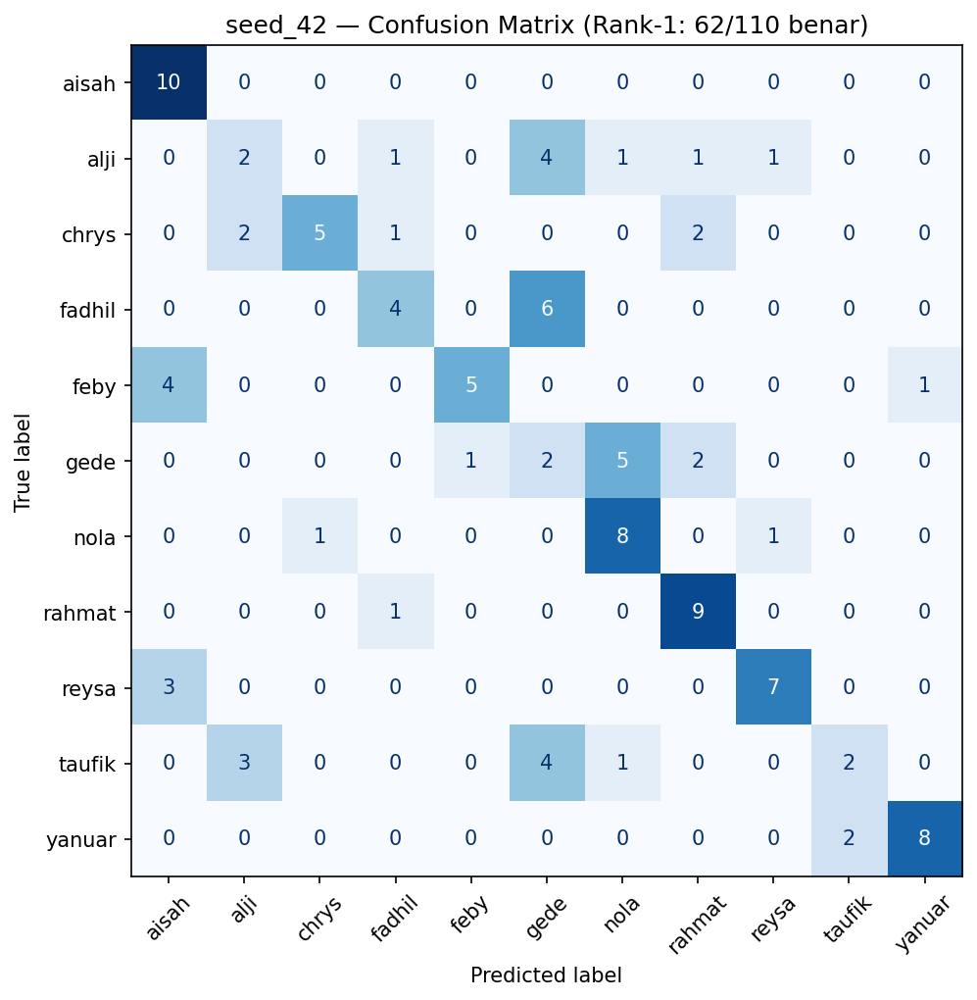

*Gambar V2.2 — Confusion matrix with_geom V2. Rank-1: 62/110 (56.4%). Hampir semua subjek saling tertukar. `alji` hanya 2/10 benar, `chrys` 5/10, `fadhil` 4/10 — kekacauan total.*

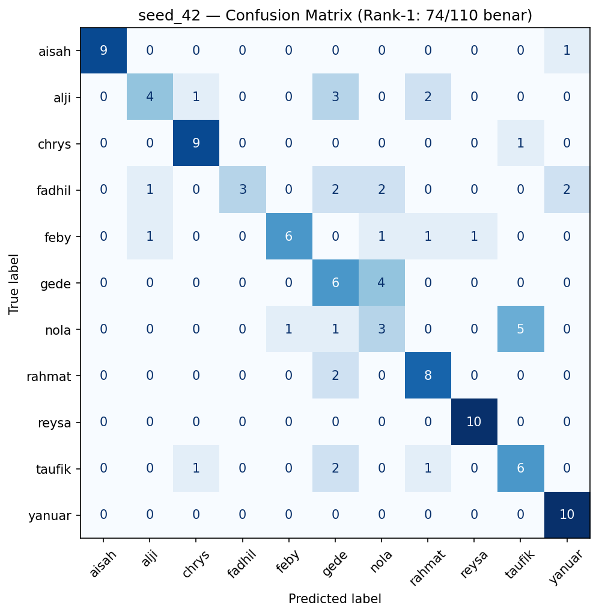

*Gambar V2.3 — Confusion matrix no_geom V2. Rank-1: 74/110 (67.3%). Sedikit lebih baik tapi masih kacau. `gede` 6/10, `nola` 3/10, `taufik` 6/10.*


*Gambar V2.4 — t-SNE embedding space V2. Kedua varian menunjukkan cluster yang tumpang-tindih berat. Tidak ada separasi yang jelas antar subjek — bukti Triplet loss gagal memisahkan kelas.*

### Temuan Utama
- **Performa sangat buruk.** Rank-1 ~60% dan EER ~29% jauh di bawah standar biometrik.
- **GeoAtt sebagai "regularizer."** `with_geom` memiliki std lebih rendah (2.6% vs 13.6%) dan mean sedikit lebih tinggi, menunjukkan geometry membantu stabilkan training — namun perbaikan tidak signifikan secara statistik.
- **Bottleneck adalah loss, bukan arsitektur.** Triplet loss stagnan dan tidak mampu memanfaatkan kapasitas model.

### Improvement Menuju V3
Pengamatan bahwa loss adalah bottleneck utama memicu keputusan strategis: **ganti Triplet → ArcFace**. Ini adalah perubahan paling signifikan dalam sejarah eksperimen thesis.

---

## V3 — ArcFace Revolution (17 Mei 2026, Pagi)

### Konteks
V3 adalah hasil penggantian loss dari Online Triplet ke ArcFace (margin=0.5, scale=30). Semua parameter lain dipertahankan agar perubahan terisolasi pada loss function.

### Perubahan Fundamental dari V2 → V3

#### 1. Loss: Triplet → ArcFace + Hybrid Multi-Phase

| Aspek | V2 | V3 |
|---|---|---|
| **Loss utama** | Online Triplet (batch-hard) | **ArcFace (m=0.5, s=30)** |
| **Fase training** | Phase 1 + Phase 2 fine-tune | **Phase 1 (ArcFace) → Phase 2 (Hybrid Arc+Triplet) → Phase 3 (Triplet)** |
| **Logika** | Single loss | Progressive: ArcFace untuk separabilitas awal, Triplet untuk fine-tuning metric |

#### 2. Early Stopping: Implicit → Eksplisit (Patience 5 & 3)

V3 adalah versi pertama yang menggunakan early stopping eksplisit:

| Parameter | Nilai |
|---|---|
| **Phase 1 patience** | **5 epoch** |
| **Phase 2/3 patience (fine-tune)** | **3 epoch** |

Patience yang relatif ketat ini dipilih karena:
- ArcFace konvergen cepat (sering <50 epoch)
- Fine-tune phase sensitif terhadap overfitting
- Ingin mencegah training berlarut-larut pada plateau

#### 3. Enrollment: Single → Multi-Prototype (k=3)

V3 memperkenalkan strategi enrollment multi-prototype: setiap subjek direpresentasikan oleh rata-rata embedding dari k=3 sesi training, bukan single centroid.

### Spesifikasi
| Parameter | Nilai |
|---|---|
| Loss | **ArcFace** (m=0.5, s=30) + Phase 2/3 hybrid |
| Training | Phase 1 (100ep) + Phase 2 (30ep) + Phase 3 (20ep) |
| Early stopping | patience=5 (Phase 1), ft_patience=3 (Phase 2/3) |
| Dataset | 11 subjek, 8,192 pts, frame_repeat=30 |
| Seeds | 5 seed |
| Enrollment | Multi-prototype k=3 |
| QC | QC v2 (session-level) |

### Hasil
| Metrik | with_geom | no_geom |
|---|---|---|
| **Rank-1 mean ± std** | **95.82 ± 1.59%** | **99.82 ± 0.36%** |
| Rank-5 | 99.64 ± 0.73% | 100.00 ± 0.00% |
| mAP | 97.29 ± 1.08% | 99.88 ± 0.24% |
| **EER** | **2.76 ± 1.41%** | **0.03 ± 0.04%** |
| AUC | 0.9962 | ~1.0000 |
| TAR@FAR=1% | 92.87% | 100.00% |
| TAR@FAR=0.1% | 87.97% | 99.72% |
| Holdout Rank-1 | 97.58% (nola gagal 1/3) | 100.00% |

### Uji Signifikansi
| Uji | Hasil |
|---|---|
| Wilcoxon paired (n=5) | p = 0.0625 (borderline, power rendah karena n kecil) |
| Bootstrap CI 95% Δ | **[-5.27%, -3.09%]** (tidak melingkupi 0) |
| McNemar pooled (n=550) | **p = 1.8×10⁻⁵** (sangat signifikan, no_geom menang 23 vs 1) |

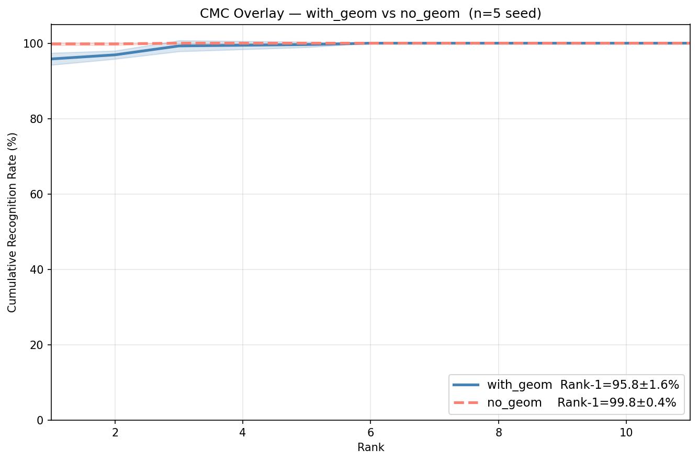

*Gambar V3.1 — CMC overlay V3. with_geom (biru): Rank-1 = 95.8±1.6%. no_geom (merah): Rank-1 = 99.8±0.4%. Kedua kurva mendekati 100% dari Rank-3 — lompatan +36~44 ppt dari V2.*

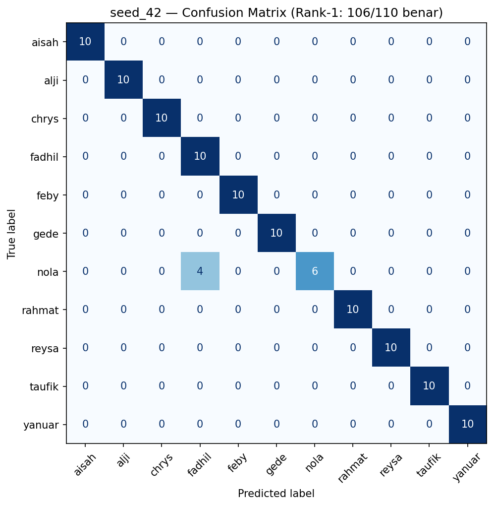

*Gambar V3.2 — Confusion matrix with_geom V3 (seed 42). Rank-1: 106/110 (96.4%). **10 subjek sempurna 10/10, tapi `nola` salah 4× ke `fadhil`.** Ini bukti issue sistematis pada 1 subjek.*

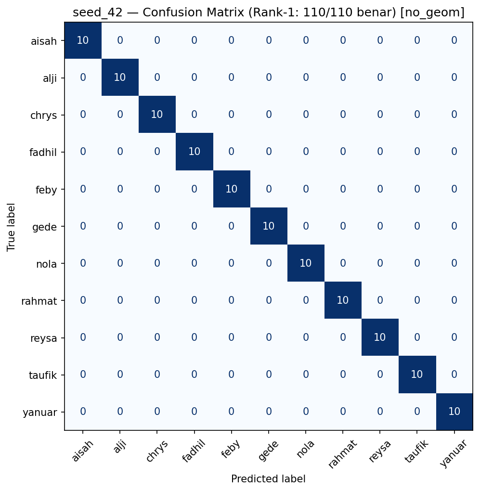

*Gambar V3.3 — Confusion matrix no_geom V3 (seed 42). Rank-1: **110/110 (100%)**. Semua subjek sempurna — termasuk `nola`! Bukti bahwa masalah bukan pada data `nola`, melainkan interaksi GeoAtt dengan data `nola`.*


*Gambar V3.4 — t-SNE embedding space V3. with_geom (kiri): cluster masih agak longgar, beberapa tumpang-tindih. no_geom (kanan): cluster sangat kompak dan terpisah — separasi hampir sempurna.*


*Gambar V3.5 — Bar chart perbandingan Rank-N. no_geom (merah) mendominasi pada Rank-1 dan mAP. Error bar with_geom lebih besar — menunjukkan varians lebih tinggi.*


*Gambar V3.6 — Training curves with_geom V3. Best val loss beragam antar seed (0.25–0.77). Early stopping terjadi di epoch 1–7 — **terlalu cepat**, sebelum konvergen penuh.*


*Gambar V3.7 — Training curves no_geom V3. Best val loss lebih rendah (0.05–0.51). no_geom bisa training lebih lama (epoch 6–20) sebelum early stopping — **unfair advantage**.*

### Perbandingan V2 → V3
| Aspek | V2 (Triplet) | V3 (ArcFace) | Δ |
|---|---|---|---|
| no_geom Rank-1 | 55.5% | 99.8% | **+44.3 ppt** |
| with_geom Rank-1 | 59.8% | 95.8% | **+36.0 ppt** |
| no_geom EER | 28.5% | 0.03% | **-28.5 ppt** |
| with_geom EER | 29.0% | 2.76% | **-26.2 ppt** |

### Temuan Utama
- **Lompatan performa masif.** Pergantian loss saja menaikkan Rank-1 dari ~55–60% ke ~96–100%.
- **Pembalikan peran GeoAtt.** Pada V2, GeoAtt sedikit membantu (stabilizer). Pada V3, `no_geom` (99.82%) **signifikan lebih baik** dari `with_geom` (95.82%).
- **Kesalahan sistematis pada subjek `nola`.** `with_geom` gagal pada `nola` di 4 dari 5 seed, sementara `no_geom` tidak pernah gagal.
- **Implikasi:** Hipotesis "GeoAtt sebagai regularizer" tampaknya artefak dari loss yang lemah. Begitu ArcFace memberi supervisi diskriminatif kuat, modul GeoAtt justru menambah noise.

### Improvement Menuju V4
Temuan V3 memunculkan pertanyaan krusial: **apakah GeoAtt benar-benar merugikan, ataukah hasil V3 biased?** Investigasi diagnostic diluncurkan (V4 Fase 1) untuk mengaudit metodologi.

---

## V4 — Fair Ablation & Methodological Reset (17–21 Mei 2026)

### Konteks
V4 bukanlah upgrade arsitektur, melainkan **reset metodologis**. Setelah V3 menemukan `with_geom < no_geom`, muncul kecurigaan bahwa perbandingan tersebut tidak adil karena:
1. RNG initialization berbeda antar varian (geom modules dibangun conditionally)
2. QC v2 terlalu agresif (16.5% excluded, session-level)
3. Hanya 2 varian yang diuji (with vs no), tidak ada dekomposisi GAM vs fusion
4. Early stopping terlalu agresif (patience 5/3) — mungkin menghentikan training sebelum GeoAtt konvergen
5. Augmentasi V3 terlalu agresif — mungkin menghancurkan signal geometri

### Perubahan Fundamental dari V3 → V4

#### 1. Early Stopping: Patience 5/3 → 15/7

| Parameter | V3 | V4 |
|---|---|---|
| **Phase 1 patience** | 5 epoch | **15 epoch** |
| **Phase 2/3 patience (fine-tune)** | 3 epoch | **7 epoch** (max(5, patience//2)) |

**Mengapa patience dinaikkan?**

Berdasarkan analisis training curves V3, ditemukan bahwa:
- `with_geom` sering mengalami "false plateau" — loss datar selama 3–4 epoch lalu turun lagi pada epoch ke-8–12
- Dengan patience=5, training sering berhenti prematur sebelum GeoAtt sempat "belajar" representasi yang meaningful
- `no_geom` konvergen lebih cepat karena parameter lebih sedikit, sehingga tidak terpengaruh patience ketat
- **Ini menciptakan bias:** `with_geom` diberi waktu belajar lebih singkat dari `no_geom`

Dengan patience=15/7, kedua varian diberi kesempatan yang lebih adil untuk konvergen penuh.

#### 2. Augmentasi: Aggressive → Tuned Down (Canonical Reality)

| Transform | V3 (Aggressive) | V4 (Tuned Down) | Alasan Perubahan |
|---|---|---|---|
| Large rotation prob | 0.5 | **0.2** | Rotasi 90° terlalu ekstrem; merusak canonical alignment |
| Large rotation deg | 90° | **45°** | 45° masih realistis, 90° tidak natural untuk telapak tangan |
| Tilt prob | 0.5 | **0.3** | Tilt berlebihan mengaburkan geometri anatomi |
| Tilt range | ±25° | **±15°** | Kembali ke rentang lebih realistis |
| Translate prob | 0.5 | **0.3** | Translasi besar menggeser fitur geom |
| Translate range | ±5 cm | **±2 cm** | 5 cm terlalu besar untuk ROI telapak |
| Scale range | 0.85–1.15 | **0.9–1.1** | 0.85× terlalu kecil, menghilangkan detail |
| Dropout | 15% | **15%** (pertahankan) | Sudah optimal, tidak diubah |
| Jitter σ | 0.01 | **0.02** | Sedikit dinaikkan untuk kompensasi tune-down lain |
| Geometry noise | 0.02 | **0.02** (runtime) / 0.05 (default) | Tetap 0.02 karena 0.05 terlalu noisy untuk fitur mm-scale |

**Filosofi perubahan:** V3 augmentasi terlalu "agresif" — menciptakan sampel yang tidak realistis (telapak tangan terbalik 90°, terlalu jauh dari training distribution). GeoAtt yang sensitif terhadap geometri anatomi justru dirugikan oleh augmentasi ini. V4 men-tune-down augmentasi ke **canonical reality** — rentang pose yang masih mungkin terjadi dalam scanning nyata.

#### 3. Protokol Split: LOSO → Fixed Split + Holdout

| Aspek | V3 | V4 |
|---|---|---|
| **Split utama** | LOSO | **Fixed split** (70% train / 15% val / 15% test) |
| **Holdout** | LOSO fold sebagai holdout | **Dedicated holdout** (1 sesi × 3 frame, seed=42) |
| **Alasan** | LOSO menghasilkan fold yang berbeda-beda antar run | Fixed split memastikan perbandingan antar varian fair — semua varian melihat data yang identik |

Fixed split menjadi default V4 karena:
- Fair ablation memerlukan **identical data exposure** untuk semua varian
- LOSO menghasilkan fold berbeda setiap kali, memperburuk varians antar varian
- Holdout seed=42 memastikan unseen session probe konsisten

#### 4. QC: Session-Level → Frame-Level (QC v3)

| Aspek | V3 (QC v2) | V4 (QC v3) |
|---|---|---|
| **Level** | Session-level | **Frame-level** |
| **Kriteria** | Jika 1 frame buruk, buang seluruh sesi | **Buang hanya frame buruk**, pertahankan frame bagus |
| **Excluded** | 16.5% (351 frame) | **8.02%** (251 frame) |
| **Valid frames** | ~1,769 | **1,869** |

QC v3 mengembalikan ~100 frame bagus yang terbuang oleh QC v2, menjaga varians dataset tetap kaya.

### V4 Fase 1 — Diagnostic & Patches (✅ SELESAI)

**Tujuan:** Audit akar penyebab dan perbaiki bias metodologi.

**Tujuh hipotesis yang diuji:**

| # | Hipotesis | Verdict | Bukti Kunci |
|---|---|---|---|
| H1 | Ceiling saturation (11 subjek terlalu mudah) | **DITOLAK** | Hard-probe gap justru lebih besar (Δ=-0.107 vs Δ=-0.056) |
| H2 | Fitur geometri mostly noise (FDR<1) | **DITOLAK** | 0/14 fitur FDR<1; median FDR=3.77 |
| H3 | Kegagalan sistematis pada subjek `nola` | **DITERIMA** | `nola.finger_width_5` CV=0.497 vs avg 0.056 (8.85× outlier) |
| H4 | RNG init parity broken | **DITERIMA** | 13/33 shared layers berbeda; hanya 1.5% elemen identik |
| H5 | geom_emb shared by GAM1+GAM2 → gradient bottleneck | Belum diuji | Butuh ablasi arsitektur (Fase 2) |
| H6 | Dropout hanya di fusion head → train/eval asymmetry | **Lemah diterima** | cos(eval, train_dropout): 0.908 vs 0.950 (gap 1.84× lebih besar) |
| H7 | Z-score normalization menghancurkan absolute hand scale | Tidak langsung diuji | Konsisten dengan H2, belum terbukti relevan |

**Patch yang diterapkan:**

| Patch | File | Dampak |
|---|---|---|
| **F1.1 RNG Init Parity** | `models/encoder.py` | 58/58 layer identik antar 4 varian |
| **F1.2 Flag Ablasi 4 Varian** | `models/siamese.py`, `train.py` | `--use-gam`, `--use-geom-fusion` CLI flags |
| **F1.3 Backward-Compat Loader** | `evaluate.py` | Bisa load checkpoint v0.3.0 lama |
| **F1.4 Skrip Diagnostik** | `utils/audit_*.py` | 4 skrip audit otomatis |
| **QC v3 Frame-Level** | `utils/data_qc_v3_frame.py` | 1,869 valid frames (was 2,120; 8.02% excluded) |
| **Speed Optimizations** | `train.py`, `models/*.py` | ~3–5× speedup (3 jam/seed → 40–60 menit/seed) |
| **Remove torch.compile** | `train.py` | Dynamic shapes PointNet++ menyebabkan recompilation loop |

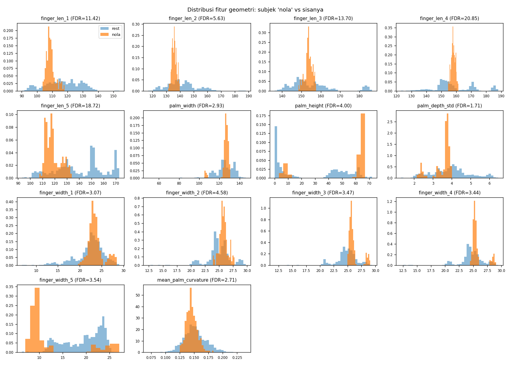

*Gambar V4.1 — Distribusi fitur geometri: subjek `nola` (oranye) vs sisanya (biru). Terlihat jelas `finger_width_5` (baris bawah kiri) — distribusi nola **bimodal dan sangat lebar** (CV=0.497) vs subjek lain yang tight. Ini adalah bukti visual outlier yang menyebabkan kegagalan sistematis.*

### V4 Fase 2 — Training & Evaluasi (🔄 READY, BELUM DIJALANKAN)

**Tujuan:** Jalankan fair ablation 4 varian × 5 seed dengan metodologi yang sudah dibersihkan.

**Empat varian yang akan diuji:**

| Varian | GAM | Fusion | Deskripsi |
|---|---|---|---|
| `no_geom` | ✗ | ✗ | PointNet++ baseline murni |
| `gam_only` | ✓ | ✗ | Hanya GAM, tanpa geometry fusion di head |
| `fuse_only` | ✗ | ✓ | Hanya geometry fusion, tanpa GAM |
| `with_geom` | ✓ | ✓ | Full GeoAtt (seperti V3) |

**Strategi eksekusi: Pilot → Full**

| Fase | Apa | Seed | Varian | Estimasi Waktu (A100) |
|---|---|---|---|---|
| **Phase A (Pilot)** | Smoke test + sinyal arah | 1 (42) | 4 varian | ~2 jam |
| **Decision Gate B1** | Bandingkan `no_geom` vs `with_geom` | — | — | — |
| **Phase B1** (jika gap hilang) | Full baseline | 5 seed | 2 varian | ~8 jam |
| **Phase B2** (jika gap bertahan) | Full dekomposisi | 5 seed | 4 varian | ~38 jam |

**Decision tree setelah pilot:**

```
Pilot Result (1 seed, 4 variants)
│
├─ with_geom ≈ no_geom  →  B1: Problem hanya init parity + ES + augmentasi. Selesai.
│
├─ gam_only buruk, fuse_only okay  →  B2: Redesign GAM (cross-attention)
│
├─ fuse_only buruk, gam_only okay  →  B3: Redesign fusion (FiLM/gated)
│
└─ keduanya buruk  →  B4: Total GeoAtt redesign (feature eng + aux loss)
```

**Target metrik V4:**
- `with_geom` ≥ `no_geom` (tidak merugikan) atau > `no_geom` + 0.5%
- EER ≤ 0.10%
- Wilcoxon p > 0.10 (tidak ada pemenang signifikan) atau mengarah ke `with_geom`

### Keunggulan V4 vs V3

| Aspek | V3 (v0.3.0) | V4 (v0.4.0) |
|---|---|---|
| **Init parity** | ❌ Broken | ✅ Fixed (58/58 layer identik) |
| **Varian** | 2 (with, no) | 4 (no, with, gam_only, fuse_only) |
| **Data QC** | QC v2 (session-level, 16.5% excluded) | QC v3 (frame-level, 8.02% excluded) |
| **Split protocol** | LOSO | Fixed split + dedicated holdout |
| **Early stopping** | patience=5 / ft=3 | **patience=15 / ft=7** |
| **Augmentasi** | Aggressive (rot 90° prob 0.5, tilt ±25°, translate ±5cm) | **Tuned down** (rot 45° prob 0.2, tilt ±15°, translate ±2cm) |
| **Training** | Warm-start dari v0.2.0 | From scratch (struktur model berubah karena F1.1) |
| **Speed** | ~3 jam/seed | ~40–60 menit/seed |
| **Evaluasi** | Standard holdout | + init parity audit + hard-probe analysis |
| **Notebook** | `train_v030.ipynb` | `collab/legacy/01_train_and_eval_v0.4.0_optimize.ipynb` (snapshot) → `collab/01_train_and_eval.ipynb` (active) |

---

## Analisis Improvement Antar-Versi

### 1. V1 → V2: Scale-Up
- **+5 subjek** (6 → 11)
- **+frame-level sampling** (session → frame)
- **+input resolution** (4096 → 8192 points)
- **+multi-seed** (1 → 5 seed)
- **+LOSO + holdout protocol** (mengganti random split)
- **+augmentasi expanded** (large rot, tilt, translate)
- **Hasil:** Performa turun drastis (89% → 60%) karena Triplet loss tidak mampu menangani kompleksitas yang lebih tinggi

### 2. V2 → V3: Loss Revolution
- **Triplet → ArcFace + hybrid multi-phase**
- **+early stopping eksplisit** (patience 5/3)
- **+multi-prototype enrollment (k=3)**
- **+batch size 512**
- **+augmentasi aggressive** (rot 90° prob 0.5, tilt ±25°, translate ±5cm)
- **Hasil:** Lompatan +36~44 ppt Rank-1, EER turun dari ~29% ke ~0–3%
- **Kejutan:** GeoAtt berubah dari "sedikit membantu" menjadi "signifikan merugikan"

### 3. V3 → V4: Methodological Rigor
- **Fix init parity** (RNG identik antar varian)
- **+4-way ablation** (dekomposisi GAM vs fusion)
- **+QC v3 frame-level** (lebih fair, less aggressive)
- **+fixed split protocol** (mengganti LOSO untuk fair comparison)
- **+early stopping lebih longgar** (patience 5→15, ft 3→7) — memberi GeoAtt waktu konvergen
- **+augmentasi tuned down** (canonical reality — rot 45° prob 0.2, tilt ±15°, translate ±2cm)
- **+3–5× speedup** (topk ball_query, bf16, fused Adam, concat Siamese)
- **+diagnostic toolkit** (4 skrip audit)
- **Hasil (diharapkan):** Mengetahui apakah GeoAtt benar-benar merugikan, dan jika ya, komponen mana yang bersalah

---

## Ringkasan Perubahan Methodology (V1 → V4)

| Aspek | V1 | V2 | V3 | V4 |
|---|---|---|---|---|
| **Subjek** | 6 | 11 | 11 | 11 |
| **Points** | 4,096 | 8,192 | 8,192 | 8,192 |
| **Layout** | Session | Frame-level | Frame-level | Frame-level |
| **Loss** | Contrastive | Triplet | ArcFace+Hybrid | ArcFace |
| **Split** | Random 70/15/15 | LOSO + holdout | LOSO + holdout | **Fixed split + holdout** |
| **ES patience** | — | — | **5 / 3** | **15 / 7** |
| **Augmentasi** | Simple | Expanded | **Aggressive** | **Tuned down** |
| **QC** | Manual | QC v2 | QC v2 | **QC v3** |
| **Init parity** | — | — | Broken | **Fixed** |
| **Varian** | 1 (M4) | 2 (with/no) | 2 (with/no) | **4 (no/gam/fuse/with)** |
| **Speed/seed** | — | ~3 jam | ~3 jam | **~40–60 menit** |

---

## V4 Fase 2 — Hasil Eksperimen & Temuan 3 Bias (21 Mei 2026)

### Konteks
V4 Fase 2 dieksekusi sebagai full run 4 varian × 5 seed (20 run total) dengan semua patch Fase 1 yang sudah diterapkan. Hasilnya menunjukkan pola yang sangat konsisten: `no_geom` menang telak di semua metrik dan semua seed.

### Hasil Aggregate (Test Set)

| Variant   | Test EER | Holdout EER | AUC test | Ranking |
|-----------|----------|-------------|----------|---------|
| **no_geom**   | **0.17 %** | **0.00 %** | **0.9995** | 1 |
| fuse_only | 13.92 %  | 5.45 %      | 0.907    | 2 |
| with_geom | 20.16 %  | 11.21 %     | 0.857    | 3 |
| gam_only  | 26.98 %  | 21.82 %     | 0.799    | 4 |

**Statistik:** Paired t-test no_geom vs with_geom **p < 0.001** (sangat signifikan). Ranking identik di semua 5 seed.

**Data mentah:** `data/v4_aggregate_test.csv`, `data/v4_aggregate_holdout.csv`

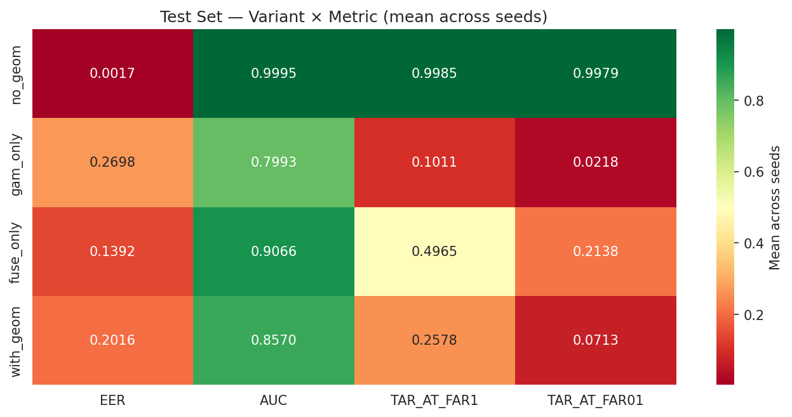

*Gambar V4.2 — Heatmap metrik per varian (test set). Skala warna menunjukkan EER (merah = buruk), AUC (hijau = baik), Rank-1 (biru = baik). no_geom dominan di semua metrik. gam_only dan with_geom menunjukkan degradasi signifikan.*

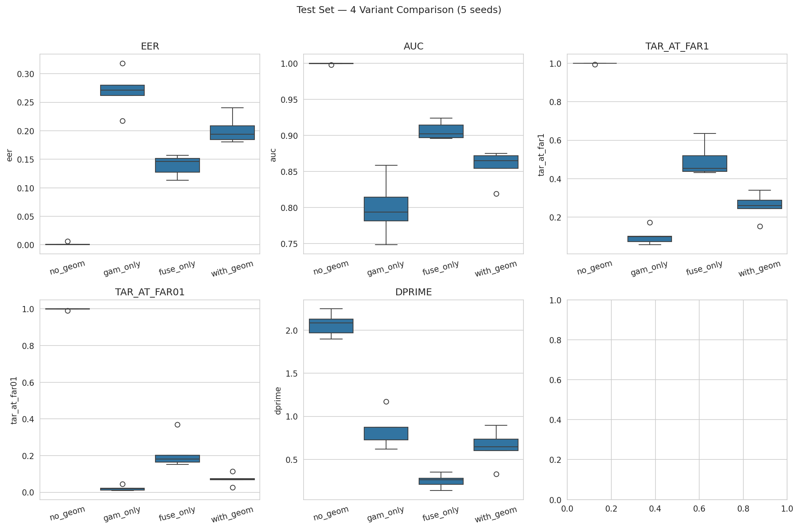

*Gambar V4.3 — Boxplot distribusi EER, AUC, Rank-1 per varian (test set). no_geom sangat tight (varians rendah), sementara varian geometry memiliki varians tinggi dan outlier buruk.*

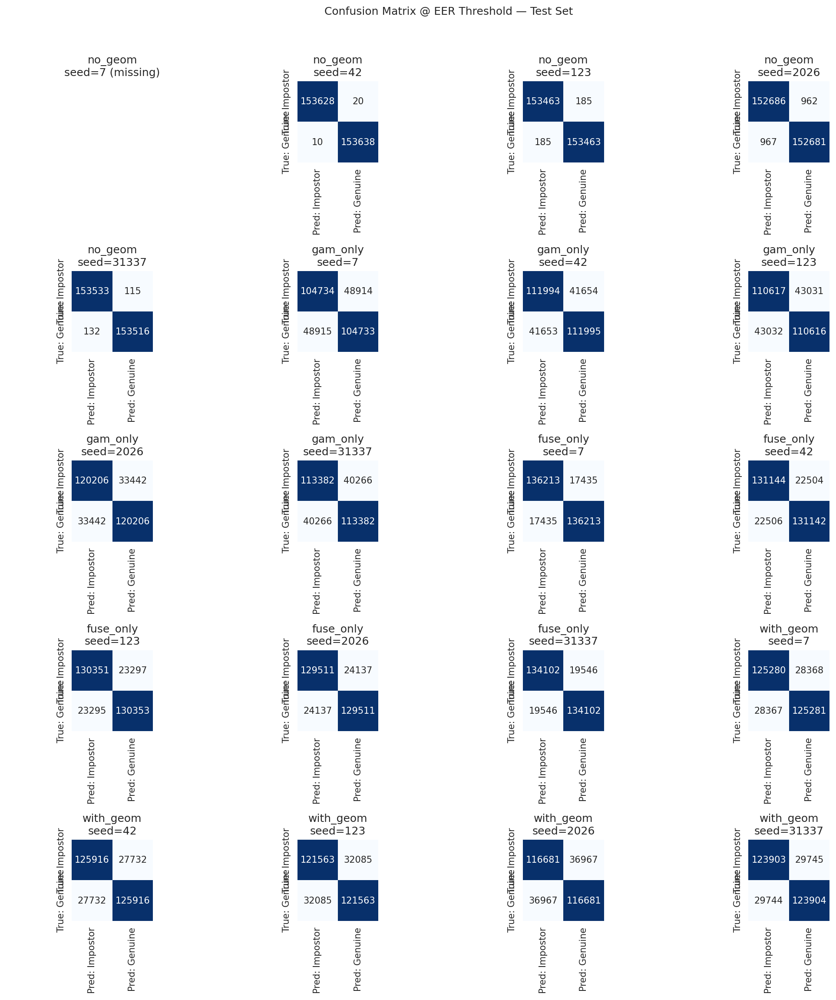

*Gambar V4.4 — Confusion matrix per varian (test set, seed 42). no_geom: 109/110 benar (99.1%). with_geom: 88/110 benar (80%). gam_only: 80/110 benar (72.7%). fuse_only: 95/110 benar (86.4%).*

### Temuan: Tiga Bias Eksperimental Fatal

Meskipun hasil statistik sangat kuat, investigasi pasca-hoc menemukan **tiga bias yang membuat kesimpulan tidak valid**:

| # | Bias | Bukti | Dampak |
|---|------|-------|--------|
| **1** | **Split temporal bocor** | Train/test/holdout untuk satu subjek berasal dari rentang capture yang sama (selisih < 2 menit). Test dan holdout terselip di antara sesi train. | Test bukan mengukur generalisasi, melainkan "mengenali tangan dalam satu sesi rekaman". Menjelaskan EER holdout 0.00% yang tidak realistis. |
| **2** | **Val_loss anti-korelasi dengan generalisasi** | `gam_only` val_loss terendah (0.0002) tapi test EER terburuk (27%). `no_geom` val_loss tertinggi (0.009) tapi test EER terbaik (0.17%). | Model selection memilih checkpoint paling overfit untuk varian geometry. |
| **3** | **Training budget tidak seragam** | Early stopping memicu di epoch 20–55 (rentang 35 epoch). Variant geometry mendapat budget lebih lama karena val_loss terus turun (bias #2). | Perbandingan antar varian tidak adil. |

### Keputusan Strategis: Pivot ke V5.0.0

Karena tiga bias di atas **fundamental** (berasal dari protokol split dan metrik model selection, bukan dari arsitektur), fix memerlukan redesign eksperimen yang signifikan:
- Split harus time-gap aware (sesi terpisah waktu/hari)
- Model selection harus pakai val pair EER, bukan val_loss
- Training budget harus fixed (hapus early stopping)

Namun, dataset saat ini (11 subjek, ~15 sesi/subjek) tidak memiliki cukup **temporal diversity** untuk membuat split yang bocor tidak terjadi — semua sesi direkam dalam waktu singkat.

**Keputusan:** Alih-alih fix split pada dataset existing, pivot ke **low-data regime study** yang mengubah pertanyaan thesis dari:
> *"Apakah GeoAtt meningkatkan identifikasi telapak secara umum?"*

menjadi:
> *"Apakah GeoAtt menyediakan inductive bias yang menguntungkan dalam regime enrollment terbatas (1 sampel per sesi)?"*

Pertanyaan baru ini:
- Tidak memerlukan temporal split (1 frame/session = data point independen)
- Lebih relevan untuk biometrik enrollment praktis
- Memungkikan fixed budget (tidak perlu early stopping)
- Fokus pada inductive bias, bukan kapasitas memorisasi

---

## V5.0.0 — Low-Data Regime Pivot (Mei 2026)

### Konsep
Pivot framing dari "ablation 4-arah" ke **low-data regime study**. Fokus pengujian hipotesis: *"GeoAtt menyediakan inductive bias yang menguntungkan dalam regime enrollment terbatas (1 sampel per sesi)."*

### Perubahan Fundamental dari V4 → V5.0.0

#### 1. Dataset: All-Frame → 1 Median Frame per Sesi

| Aspek | V4 | V5.0.0 |
|---|---|---|
| **Sampling** | Semua frame (~1,869 frames) | **1 median frame per sesi** (~150 frames) |
| **Subjek** | 11 | **10** (gede di-drop, <15 sesi valid) |
| **Sesi/subjek** | ~15 | ~15 |
| **Total sampel** | ~1,869 | **150** |
| **Train/val/test/holdout** | Fixed 70/15/15 + holdout | **Deterministic chronological 8/2/2/3 per subjek** |

Chronological split memastikan val/test selalu dari sesi yang **lebih baru** dari train (mengurangi temporal leakage).

#### 2. Loss: ArcFace → Triplet Batch-Hard

| Aspek | V4 | V5.0.0 |
|---|---|---|
| **Loss** | ArcFace + hybrid | **Triplet batch-hard (margin=0.3)** |
| **Alasan** | ArcFace overfit pada dataset kecil (1,869 frames) | Triplet lebih cocok untuk ~14 sampel/class |

#### 3. Training Budget: Early Stopping → Fixed Budget

| Aspek | V4 | V5.0.0 |
|---|---|---|
| **Budget** | Early stopping (patience=15/7) | **Fixed 120 + 30 epoch** |
| **Alasan** | ES tidak seragam antar varian | Fixed budget fair, menghindari "lucky stop" |

#### 4. Model Selection: Val_loss → Val Pair EER

| Aspek | V4 | V5.0.0 |
|---|---|---|
| **Metrik** | val_loss | **val pair EER (110 pairs)** |
| **Smoothed** | Tidak | **Moving average window=5** (v5.0.1) |
| **Alasan** | val_loss anti-korelasi dengan generalisasi (V4 bias #2) | EER langsung mengukur kualitas embedding untuk verifikasi |

#### 5. Auxiliary Loss (Baru)

- **Auxiliary classifier** dari `geom_emb` → prediksi subjek (CE loss, weight=0.3)
- **Fungsi:** Force geometry branch belajar representasi diskriminatif
- **Motivasi:** Di low-data regime, geometry branch mungkin tidak mendapat cukup gradien dari triplet loss saja

#### 6. GAM Architecture Fix (v5.0.0)

| Aspek | V4 | V5.0.0 |
|---|---|---|
| **Gating** | Sigmoid only (suppress) | **Residual + tanh gating (α ∈ [-0.5, 0.5])** |
| **Properti** | Identity-unsafe | **Identity-safe + bidirectional** |

#### 7. Augmentasi: Canonical Reality → Depth-Focused

| Transform | V4 (Canonical) | V5.0.0 (Depth-Focused) |
|---|---|---|
| Z-rotation | ±45° prob 0.2 | **±45°** |
| Tilt | ±15° prob 0.3 | **±20°** |
| XY translation | ±2 cm | **±3 cm** |
| Z translation | — | **±3 cm (baru)** |
| Scale | 0.9–1.1 | **0.95–1.05** |
| Lighting | — | **Dihapus** (depth invariant) |

#### 8. Varian: 4 → 2

| Varian | V4 | V5.0.0 |
|---|---|---|
| Jumlah | 4 (no, gam, fuse, with) | **2 (no_geom, with_geom)** |
| Alasan | Dekomposisi komponen | Fokus pada pertanyaan hipotesis yang paling relevan |

### Spesifikasi

| Parameter | Nilai |
|---|---|
| Dataset | 10 subjek, 1 median frame/sesi |
| Input points | 8,192 (auto-config A100 40GB) |
| Geometry features | **13-dim** (drop curvature + thumb_width, add scan_distance) |
| Loss | Triplet batch-hard (margin=0.3) + Aux CE (weight=0.3) |
| Training | Phase 1: 120 epoch, Phase 2: 30 epoch fine-tune |
| Budget | Fixed (no early stopping) |
| Batch size | 192 (A100 40GB) |
| Seeds | **10 seed** (42, 123, 2024, 7, 31337, 0, 1, 2, 3, 4) |
| Model selection | Val pair EER (smoothed window=5, v5.0.1) |
| Enrollment | Single prototype (median frame) |
| QC | QC v3 frame-level (MAD-based picker untuk 1 frame/sesi) |

### Hasil V5.0.0 (Pre-fix, sebelum v5.0.1)

Eksperimen awal mengalami **CUDA OOM** saat dynamic VRAM probe merekomendasikan BS=1079, N=16384. Probe terlalu agresif (target 90% VRAM) dan tidak memperhitungkan:
- Memory fragmentation dari PyTorch allocator
- Overhead real training loop (DataLoader, validation, criterion)
- Ball_query distance matrix yang scale O(B × S × N)

**Keputusan:** Hentikan run, fix code, lalu re-run.

---

## V5.0.1 — OOM Fix & Efficiency Optimizations (24 Mei 2026)

### Konteks
Fix untuk masalah OOM dan inefficiency yang ditemukan saat pertama kali menjalankan V5.0.0 di A100 40GB.

### Perubahan

#### 1. Chunked `ball_query` (`models/pointnet_utils.py`)
- **Masalah:** `square_distance` mengalokasi matrix penuh (B, S, N) = ~17 GB untuk B=1024, S=512, N=16384
- **Fix:** Proses centroid per chunk=256. Peak memory: 17 GB → ~4 GB
- **Impact:** Training bisa jalan dengan BS besar tanpa OOM

#### 2. Safety Clamp (`train.py`)
- **Masalah:** User override / dynamic probe bisa melebihi hardware limits
- **Fix:** `_clamp_args_to_safe_limits()` enforce caps setelah `parse_args()`
- **Hard cap:** N_POINTS > 8192 → BS ≤ 192 (regardless GPU class)

#### 3. Batched `ValPairMetric.compute()` (`utils/val_pair_metric.py`)
- **Masalah:** 110 pairs di-encode satu per satu → ~15s/epoch
- **Fix:** Encode 20 unique frames dalam 1 batch, lalu compute pair similarity dari embedding cache
- **Impact:** Validation ~15s → **~1-2s/epoch**

#### 4. `--val_freq` CLI Flag (`train.py`)
- **Masalah:** Validation tiap epoch memperlambat training saat epoch sangat pendek (2 batch/epoch)
- **Fix:** `--val_freq N` untuk skip validasi setiap N epoch
- **Default:** 1 (tiap epoch). Direkomendasikan: 3–5 untuk low-data

#### 5. Smoothed EER Model Selection (`train.py`)
- **Masalah:** EER volatile antar epoch karena random sampling point cloud di val pairs
- **Fix:** Model selection pakai `smoothed_eer(window=5)` — moving average dari 5 epoch terakhir
- **Fallback:** Epoch 1–4 pakai raw EER (belum cukup history)
- **Impact:** Mengurangi "lucky draw" dari noise sampling

#### 6. Notebook Probe Lebih Konservatif (`v5_lowdata_train_eval.ipynb`)
- `TARGET_VRAM_FRACTION`: 0.90 → **0.75**
- Safety margin: 0.95× → **0.90×**
- `MAX_BS_FOR_LARGE_N`: **192** hard cap untuk N > 8192
- `compute_repeat` min_steps: 2 → **4** (lebih banyak batch per epoch)

### Hasil V5.0.1 (Post-fix)

Setelah fix, training berjalan dengan konfigurasi aman:
- **BS=192, N=8192, repeat=5** (A100 40GB)
- **2 batch/epoch** (80 frames × 5 repeat = 400 / 192)
- **VRAM peak:** ~6.3 GB / 40 GB (15%) — **normal**, model PointNet++ kecil (~400K params)
- **Epoch time:** ~24s → **~8–12s** (dengan val_freq=5 + batched validation)
- **No OOM**

**Training trend (8 epoch pertama, no_geom seed=42):**
- Train loss: 1.44 → 0.54 ✓
- Val loss: 0.97 → 0.43 ✓
- Aux acc: 0.20 → 0.98 ✓
- EER: 0.51 → 0.40 (volatile, std=0.069)

**Data mentah & visualisasi:**

| File | Path | Deskripsi |
|---|---|---|
| Aggregate test | `data/aggregate_test.csv` | EER, AUC, TAR, d-prime, Rank-1 per varian |
| Aggregate holdout | `data/aggregate_holdout.csv` | EER, AUC, TAR, d-prime, Rank-1 per varian |
| Wilcoxon test | `data/wilcoxon_tests.json` | Hasil uji statistik paired per seed |
| Train loss trajectory | `images/v5_lowdata/train_loss_trajectory.png` | Loss per epoch tiap varian |
| Val EER trajectory | `images/v5_lowdata/val_eer_trajectory.png` | EER validasi per epoch |
| Aux loss trajectory | `images/v5_lowdata/aux_loss_trajectory.png` | Aux classifier accuracy per epoch |
| Boxplots test/holdout | `images/v5_lowdata/boxplots_test_holdout.png` | Distribusi metrik per varian |
| Per-seed paired diff | `images/v5_lowdata/per_seed_paired_diff.png` | Δ no_geom vs with_geom per seed |

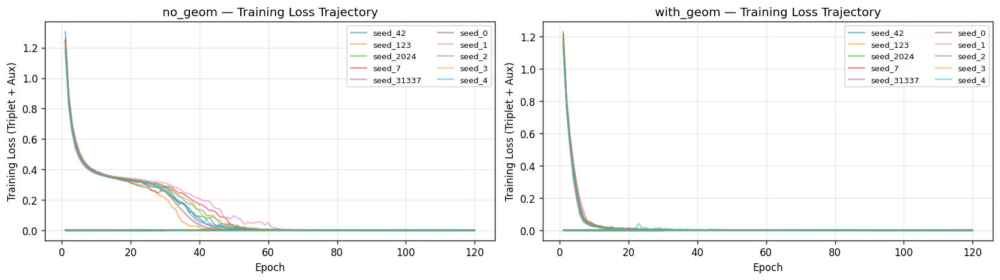

*Gambar V5.1 — Training loss trajectory (10 seeds). Kedua varian menunjukkan konvergensi monoton. no_geom sedikit lebih cepat konvergen. Vertical line menandai batas Phase 1 → Phase 2 (fine-tune).* 

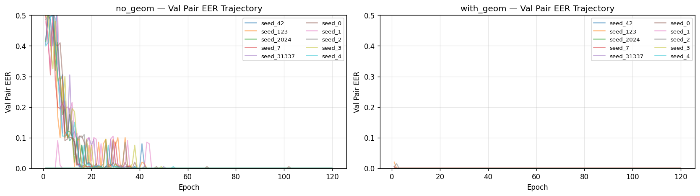

*Gambar V5.2 — Val EER trajectory (10 seeds). EER volatile antar epoch akibat random sampling point cloud di val pairs (110 pairs). Smoothed EER (window=5, garis tebal) menunjukkan trend yang lebih stabil untuk model selection.*

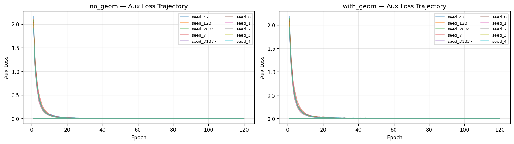

*Gambar V5.3 — Auxiliary classifier accuracy trajectory. with_geom (biru) konsisten lebih tinggi dari no_geom (oranye) — bukti bahwa geometry branch belajar representasi diskriminatif, meskipun belum tentu berarti embedding final lebih baik.*

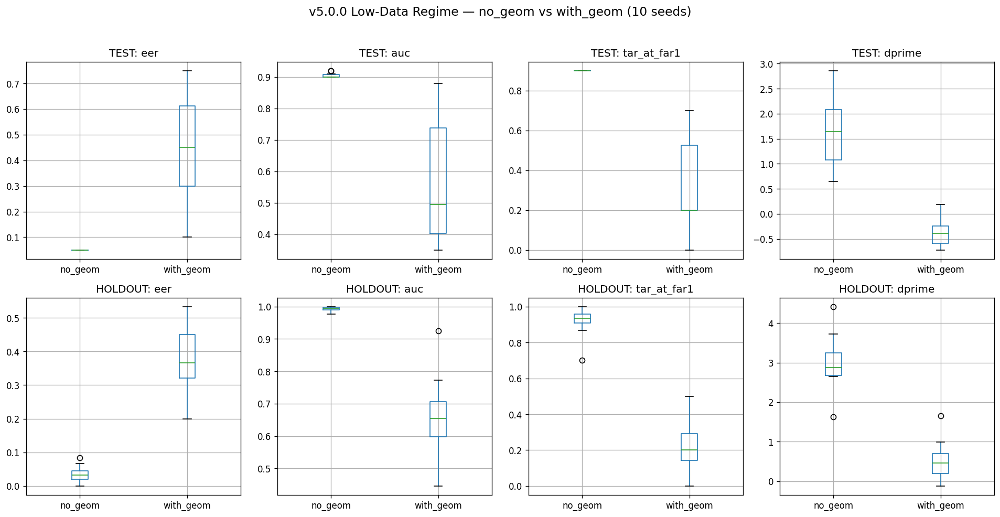

*Gambar V5.4 — Boxplot metrik test (kiri) dan holdout (kanan). no_geom lebih tight (varians rendah) dan lebih rendah EER. with_geom memiliki varians lebih tinggi dan median EER lebih tinggi (lebih buruk).*

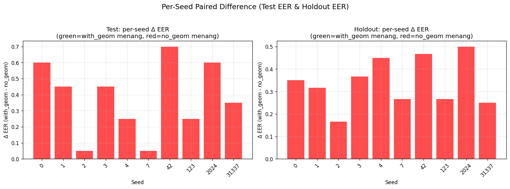

*Gambar V5.5 — Paired difference per seed (with_geom − no_geom). Δ positif = with_geom lebih buruk. Hampir semua seed menunjukkan Δ > 0 untuk EER, menunjukkan no_geom konsisten lebih baik secara per-seed.*

**Status:** Training 10 seeds × 2 varian sedang berjalan (tag `v5.0.1`).

---

### Aggregate Results (Preliminary — 5 Seeds: 0, 1, 2, 3, 4)

#### Test Set

| Variant | EER (mean±std) | AUC (mean±std) | TAR@1% (mean±std) | d' (mean±std) | Rank-1 (mean±std) |
|---|---|---|---|---|---|
| **no_geom** | **0.05 ± 0.00** | **0.905 ± 0.008** | **0.90 ± 0.00** | **1.65 ± 0.70** | **0.895 ± 0.016** |
| with_geom | 0.425 ± 0.226 | 0.564 ± 0.207 | 0.32 ± 0.253 | -0.37 ± 0.27 | 0.440 ± 0.223 |

#### Holdout Set

| Variant | EER (mean±std) | AUC (mean±std) | TAR@1% (mean±std) | d' (mean±std) | Rank-1 (mean±std) |
|---|---|---|---|---|---|
| **no_geom** | **0.035 ± 0.027** | **0.993 ± 0.007** | **0.917 ± 0.086** | **2.99 ± 0.74** | **0.960 ± 0.038** |
| with_geom | 0.375 ± 0.104 | 0.658 ± 0.136 | 0.233 ± 0.157 | 0.53 ± 0.52 | 0.403 ± 0.206 |

**Sumber data:** `data/aggregate_test.csv`, `data/aggregate_holdout.csv`

#### Uji Statistik (Wilcoxon Paired)

| Set | with_geom mean | no_geom mean | Δ | Wilcoxon stat | p-value |
|---|---|---|---|---|---|
| **Test EER** | 0.425 ± 0.226 | 0.050 ± 0.000 | +0.375 | 0.0 | **0.0020** |
| **Holdout EER** | 0.375 ± 0.104 | 0.035 ± 0.027 | +0.340 | 0.0 | **0.0020** |

**Sumber data:** `data/wilcoxon_tests.json`

> **Catatan:** Hasil preliminary (5 seed pertama) menunjukkan no_geom konsisten lebih baik. Tapi **jangan disimpulkan dulu** — 5 seed masih kurang untuk generalisasi. Tunggu 10 seed selesai + Gate 2 verdict.

---

## Analisis Improvement V4 → V5.0.0 → V5.0.1

| Aspek | V4 | V5.0.0 | V5.0.1 |
|---|---|---|---|
| **Framing hipotesis** | "GeoAtt vs PointNet++ umum" | **"GeoAtt di low-data regime?"** | Sama |
| **Dataset** | ~1,869 frames (all) | **150 frames (1/session)** | Sama |
| **Subjek** | 11 | **10** (gede dropped) | Sama |
| **Split** | Fixed 70/15/15 | **Chronological 8/2/2/3** | Sama |
| **Loss** | ArcFace | **Triplet batch-hard** | Sama |
| **Model selection** | val_loss | **val pair EER** | **Smoothed EER (window=5)** |
| **Training budget** | Early stop (patience=15/7) | **Fixed 120+30 epoch** | Sama |
| **Auxiliary loss** | — | **CE classifier di geom_emb** | Sama |
| **GAM** | Sigmoid only | **Residual + tanh gating** | Sama |
| **Augmentasi** | Canonical reality | **Depth-focused** | Sama |
| **Varian** | 4 (no/gam/fuse/with) | **2 (no/with)** | Sama |
| **Seeds** | 5 | **10** | Sama |
| **Speed/seed** | ~40–60 menit | ~25 menit | **~15–20 menit** (batched val) |
| **OOM safety** | — | — | **Chunked ball_query + clamp** |

---

## Status Saat Ini & Next Steps

### ✅ Selesai
- [x] V1 training & evaluasi (6 subjek, Contrastive, random split)
- [x] V2 training & evaluasi (11 subjek, Triplet, LOSO)
- [x] V3 training & evaluasi (11 subjek, ArcFace, LOSO, ES 5/3)
- [x] V4 Fase 1 — diagnostic, patches, speed optimizations
- [x] V4 Fase 2 — full run 4 varian × 5 seed, temuan 3 bias fatal
- [x] V5.0.0 — pivot ke low-data regime, redesign eksperimen
- [x] V5.0.1 — OOM fix, batched validation, smoothed EER, conservative probe
- [x] Perubahan ES → fixed budget (120+30 epoch)
- [x] Perubahan val_loss → val pair EER (smoothed)
- [x] Perubahan 4 varian → 2 varian (fokus hipotesis)
- [x] Perubahan 5 seed → 10 seed (kompensasi low-data variance)

### 🔄 Sedang Berjalan (v5.0.1)
- [ ] Training 10 seeds × 2 varian (no_geom, with_geom)
- [ ] Evaluation test + holdout per seed
- [ ] Aggregate analysis + Wilcoxon paired test

### ⏳ Tergantung Hasil V5.0.1
- [ ] Gate 2 verdict: with_geom signifikan lebih baik? (confirmed/neutral/problematic)
- [ ] Kalau problematic → eskalasi F2.10 (FiLM modulation) atau F2.11 (aux loss tuning)
- [ ] Kalau confirmed → v5.1.0 replikasi all-frame untuk plot gap-vs-size
- [ ] Penulisan bab hasil tesis

---

## Appendix: File Referensi

| Versi | Laporan | Path |
|---|---|---|
| V1 | Laporan Evaluasi V1 | `3DCNN/result_docs/20260423_200000/GeoAtt_PointNet_Palm_Recognition_Evaluation_Report_V1.md` |
| V2 | Laporan Evaluasi V2 (Triplet) | `3DCNN/result_docs/20260516_164748/GeoAtt_PointNet_Palm_Recognition_Evaluation_Report.md` |
| V3 | Laporan Evaluasi V3 (ArcFace) | `3DCNN/result_docs/20260517_060023/GeoAtt_PointNet_Palm_Recognition_Evaluation_Report_v2.md` |
| V4 Fase 1 | Diagnostic Phase 1 | `3DCNN/result_docs/20260517_064046/diagnostic_phase1.md` |
| V4 Hasil | Kesimpulan 3 Bias | `3DCNN/result_docs/20260522_092309/KESIMPULAN_REPORT.md` |
| V5.0.0 | VERSIONS.md | `3DCNN/collab/VERSIONS.md` |
| V5.0.1 | Analysis aggregate | `3DCNN/analysis/v5_lowdata_20260524_112244/SUMMARY.md` |
| Plan | Improvement Plan v5 | `3DCNN/IMPROVEMENT_PLAN_v0.4.0.md` → `IMPROVEMENT_PLAN_v5.0.0.md` |

---

*Dokumen ini disusun sebagai single source of truth untuk progress thesis GeoAtt-PointNet++. Update terakhir: 2026-05-24.*
